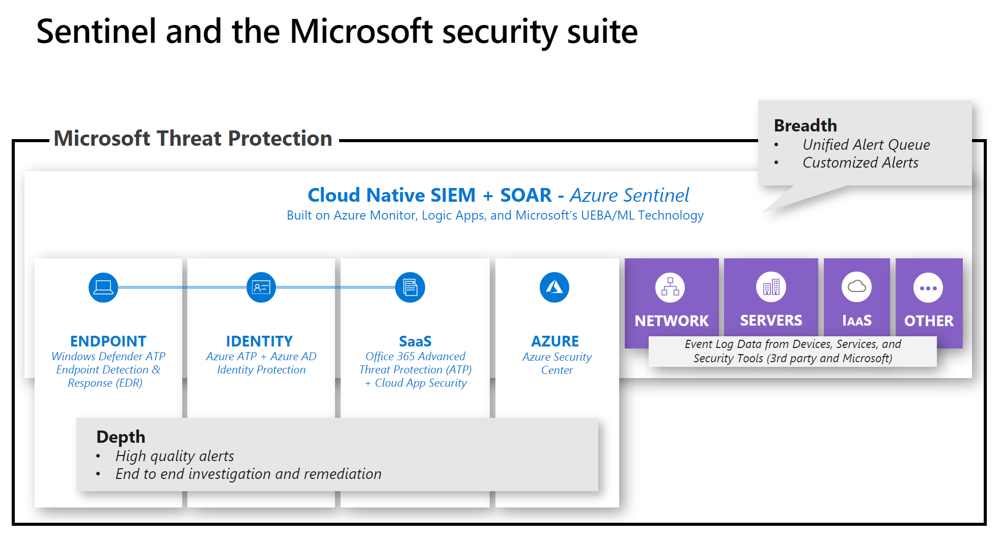
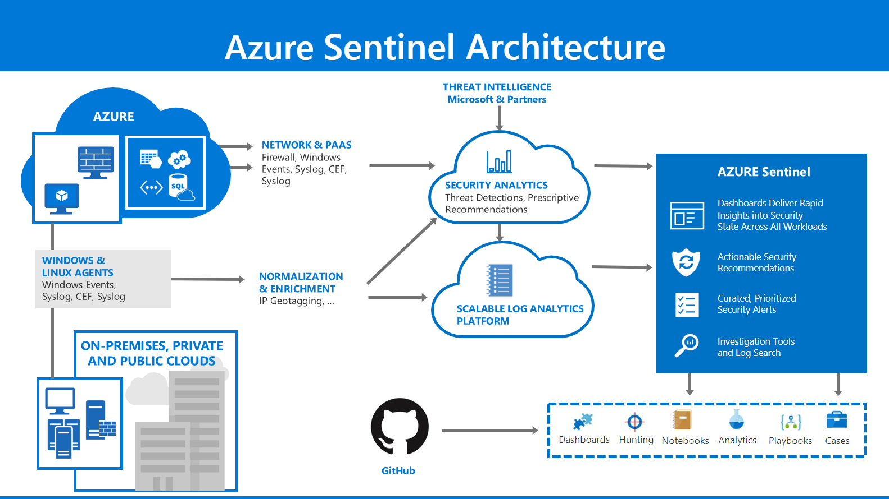

#### [prev](./welcome.md) | [home](./welcome.md)  | [next](./take-aways.md)

# Getting started

To effectively use a SIEM you need to be deliberate. You need to know what you're trying to achieve, and defining these things before you start will enable you have greater success moving forward.

## What is Sentinel?

### Sentinel Architecture

## SIEM Decision Points

* Use Cases
* Role Based Access Control (RBAC)
* Log Analytics decisions
* Data Sources

The reason we cover this is because you, as the security interested team, need to make these decisions in order to effectively incept, configure and use Sentinel as a tool in your environment for your security operations.

At the end of this topic you will be able to accurately describe the need for Use Cases, how you want to establish your Log Analytics deployment, what permissions (RBAC) you need to have in order to use the tool and which data sources you want to connect and the considerations around those (Syslog/CEF forwarders etc).

## Use Cases

As part of our [Azure Sentinel DevOps](https://techcommunity.microsoft.com/t5/azure-sentinel/accelerate-your-azure-sentinel-deployment-with-this-azure-devops/ba-p/1449414) guidance the first section we deal with is defining your use cases. This is important as you move to the cloud, things have changed and are much more dynamic but also amplified by new pillars of threats you are now being exposed to, highlighted below.

**Examples of the new security pillars (not an exhaustive list)**:

| **Potential Use Cases / Attacks** |   |   |   | |
| --- | --- | --- | --- | --- |
| **Tenant Level** | **Subscription Level** | **IaaS** | **PaaS** | **SaaS** |
| Use elevated tenant admin | External account added to subscription | Known hacker/malicious tool/process found | Malicious Key Vault access - keys enumerated | A potentially malicious URL click was detected |
| MFA settings changed | Stale account with access to subscription | Account Password Hash Accessed | Anonymous storage access | Unusual volume of external file sharing |
|   | Attack detection service not configured (ie ASC) | Antimalware disabled | activity from unfamiliar location | Password spray attack |
|   |   | Brute force detected | SQL injection detected |   |
|   |   | Communications with malicious IP | Authentications disabled for App/Web services |   |
|   |   | TOR IP detected |   |   |
|   |   | File less attack technique detected |   |   |
|   |   | DDOS detected |   |   |

[Gartner Research](https://www.gartner.com/en/documents/3950486/how-to-build-security-use-cases-for-your-siem) talk about use cases requiring three things, that they call the "Use Case Triangle". A simple methodology aimed at the following:

**Insight** - examples are the things you're looking to find, like User or Asset behavior.

**Data** - examples are Events and Logs, things you see in your environment.

**Analytics** - this seems simple, *"build rules"* BUT it's not just aimed there. Think about pattern matching or machine learning. Big picture things.

These use cases are important, you need to understand what Insight you're trying to gain with your SIEM, making sure you have the right Data for that Insight and then that you're applying the right Analytics for that Insight.

Having the right uses cases, and making the decisions about the associated data and analytics makes it easier to ensure you're covering all the things you need to cover in your environment. They should reduced the *noise* and allow your analysts to focus on what is important in your environment.

The final point is that they must have a lifecycle, like any methodology in the 2020s. Plan, Deploy, **Measure Performance**, Tune (if required), Retire and Archive. Threats aren't static and your Security Operations shouldn't be either.

## Log Analytics

You'll see, as soon as you open Azure Sentinel, the first thing you need to do is to select a Log Analytics workspace you want to use. We have a multitude of resources to help you make decisions around Azure Sentinel deployments:

[Best Practices White Paper](https://www.microsoft.com/security/blog/wp-content/uploads/2020/07/Azure-Sentinel-whitepaper.pdf)

[Tech Community Blog](https://techcommunity.microsoft.com/t5/azure-sentinel/best-practices-for-designing-an-azure-sentinel-or-azure-security/ba-p/832574)

[Extend Azure Sentinel across workspaces and tenants](https://docs.microsoft.com/en-us/azure/sentinel/extend-sentinel-across-workspaces-tenants)

The point is, with all of these documents, you need to make decisions about how you're going to configure your Log Analytics workspaces. Our guiding recommended best practice is to have a single workspace, where possible, for the full benefit of the tool. However we understand that there will be issues like data sovereignty and regulatory compliance that will impact these decisions, even billing and cost decisions can impact it.

Whatever the case is you need to make the decision. Centralize as much as possible, having your data going to one location, rather than each team maintaining their own repository, will allow your Security team to start ingesting the data and building patterns while reducing the time it takes for them to find them.

[Planning your Log Analytics Deployment](https://docs.microsoft.com/en-us/azure/azure-monitor/platform/design-logs-deployment)

You can then also start making decisions around data retention. Azure Sentinel gives you 90 days of free retention on your Log Analytics workspaces, but then what. What [type of data](https://techcommunity.microsoft.com/t5/azure-sentinel/new-per-data-type-retention-is-now-available-for-azure-sentinel/ba-p/917316) do you need to retain?

* Appendix: [FastTrack for Azure Azure Sentinel on Azure Log Analytics Workspace considerations](appendix-law-refs.md)

## Role Based Access Control (RBAC)

Part of the decisions you will need to make around Log Analytics, and the rest of the platform to be clear, are the access controls. Making these decisions prior to deploying the tool is key, as is working with the relevant team who owns identity in your organisation (typically a disconnect) to ensure the security team have the right permissions, with the least privilege obviously, to accomplish your business requirements.

**This can be achieved a few ways**:

[Workspace level RBAC](https://docs.microsoft.com/en-us/azure/azure-monitor/platform/manage-access#configure-access-control-mode)

[Table Level RBAC](https://docs.microsoft.com/en-us/azure/azure-monitor/platform/manage-access#table-level-rbac)

[Resource Level RBAC](https://docs.microsoft.com/en-us/azure/azure-monitor/platform/design-logs-deployment#access-mode)

**Then we have the overarching Azure Sentinel RBAC considerations**:

[Permissions in Azure Sentinel](https://docs.microsoft.com/en-us/azure/sentinel/roles)

As you can see above, you need to make some careful decisions around the level of access people are given.

Make these decisions early, work with the relevant stakeholders to ensure you have the appropriate permissions in order to establish your security operations.

## Data sources

Now that you have made the decisions around Log Analytics and RBAC you need to start  thinking about the data sources you want to connect. Circle back to the use cases. What makes sense to connect to achieve the desired outcomes? What has a "first party" connector? What has a Microsoft connector (CEF/Syslog) that needs a forwarder built? What might need a custom connector (think on-prem Exchange for example). We help here:

[Azure Sentinel Grand Connector List](https://techcommunity.microsoft.com/t5/azure-sentinel/azure-sentinel-the-connectors-grand-cef-syslog-direct-agent/ba-p/803891#:~:text=The%20Grand%20List%20%20%20Vendor%20%20,Sentinel%20built-in%20connector%20%2032%20more%20rows%20)

[Azure Sentinel Custom Connectors](https://techcommunity.microsoft.com/t5/azure-sentinel/azure-sentinel-creating-custom-connectors/ba-p/864060)

#### [prev](./welcome.md) | [home](./welcome.md)  | [next](./take-aways.md)
