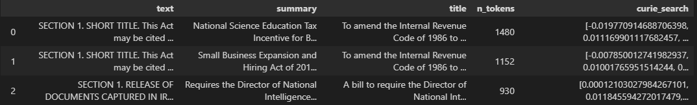
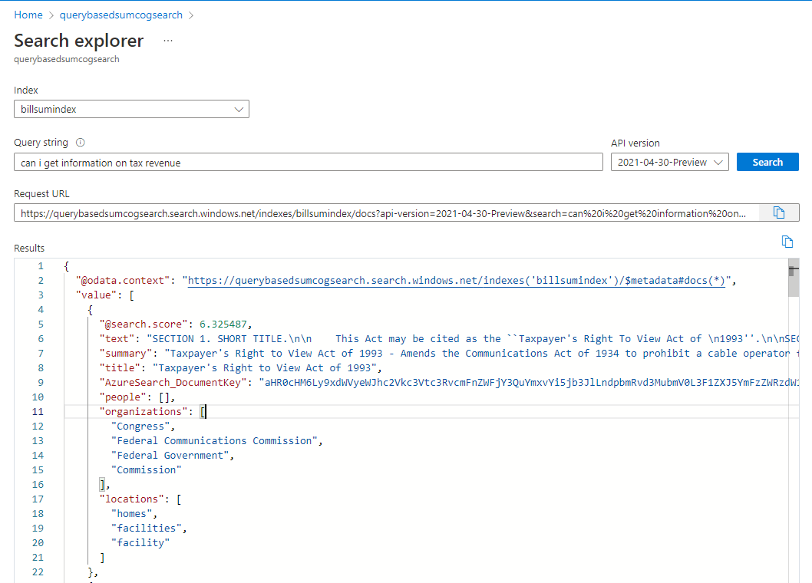
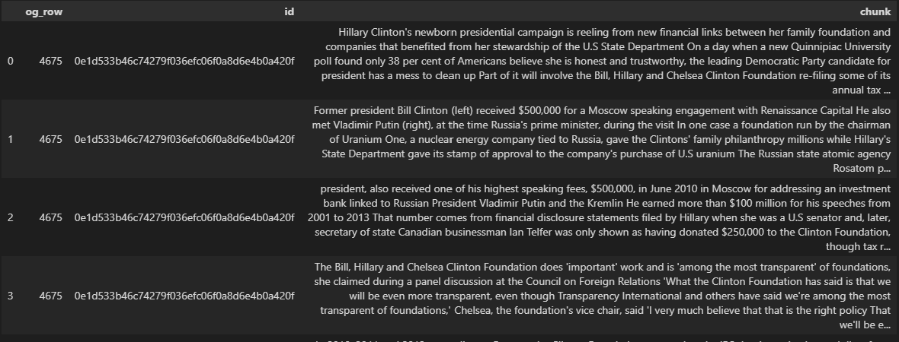
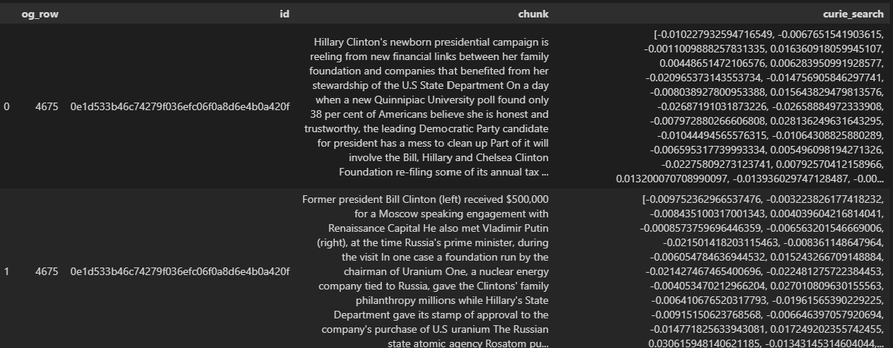
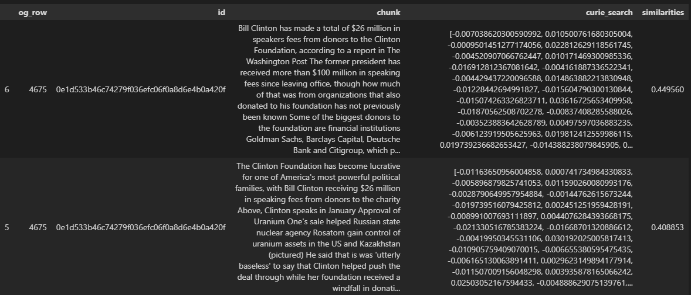
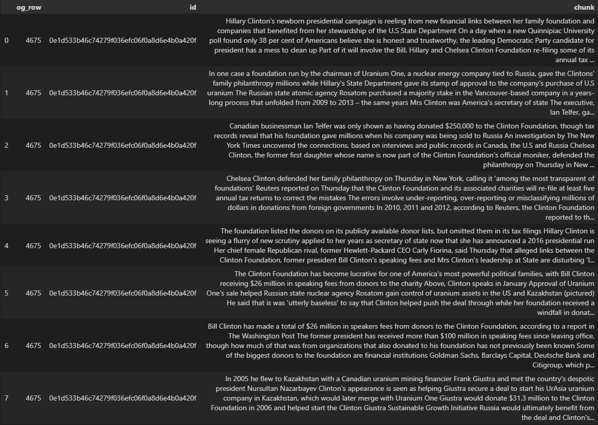
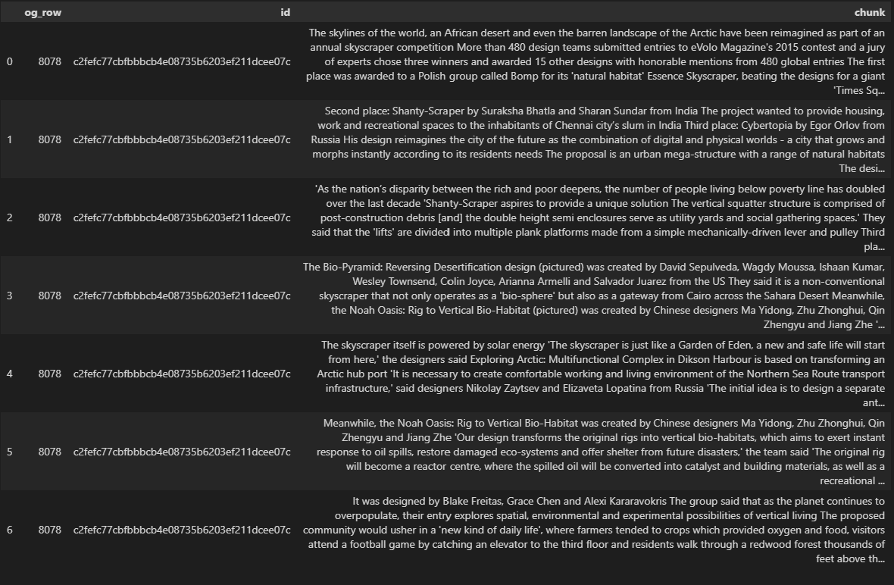
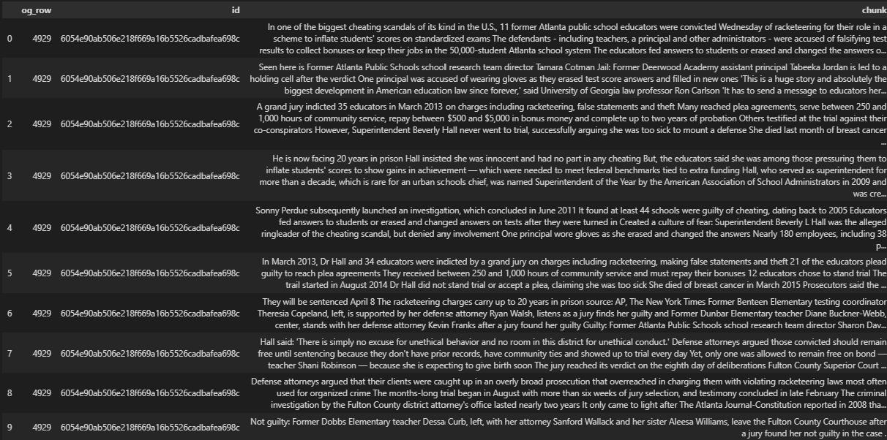
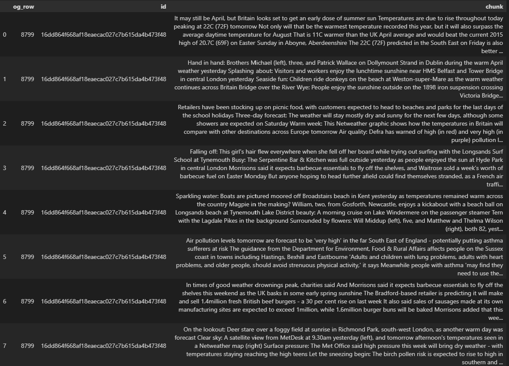
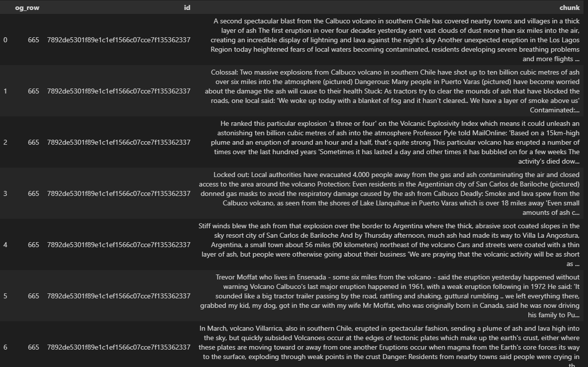

# Using Embeddings for Document Search and Summarization using Azure OpenAI

##  Introduction

Knowledge bases in enterprises are very common in the industry today and
can have extensive number of documents in different categories.
Retrieving relevant content based on a user query is a challenging task.
Until very recently till the advent of transformer-based models, the
process of retrieving the material was limited to the document level but
GPT-3 has made a huge difference and is showing a lot of promise for
extracting the semantic summary based on the user query for a relevant
document that has been identified by other \"Search\" methods. This
solution notebook will introduce the Use Case and End to End
architecture briefly will take you through the step-by-step process of
using OpenAI\'s GPT-3 embedding models to zone in on the part of the
document that will be used for summarization based on the user query.

This solution notebook aims to demonstrate how to use Azure OpenAI's
embedding capabilities to adapt to your document search, and how to make
document summarization more efficient and precise by honing on the
relevant sections. The foundational techniques of embeddings can also be
used to dynamically populate prompts. The methods and architecture are
customizable to your use case and can be applied to different datasets.

## End to End Design


<figcaption align = "center"><b>Figure 1: Technical article search and summarization using GPT-3
endpoints</b></figcaption>

The end-to-end design shown in Figure 1 captures the use case described
above during runtime. This end-to-end diagram assumes the user has
already populated their knowledge base offline. The user provides a
query against the existing knowledge base. Based on the user query,
documents from the knowledge base are ranked in order of most likely to
capture information regarding the query. By selecting the top ranked
articles, that becomes the input to the Document Search (Zone)
component. This component breaks down documents into manageable chunks
and pinpoints the sections or pages in the document most relevant to the
user query based on semantic similarity. These most relevant sections
are extracted and passed into the GPT-3 completion endpoint for
summarization.

**This solution notebook will focus on using Azure OpenAI embedding for
the "Document Filtering (Search)" and "Document Search (Zone)"
components of the design.**

## Use Case

There are two main use cases this solution notebook will cover: Document
Search and Document "Zone".

The notebook will walk through an example of querying against a
knowledge base to find the most relevant document (document search) and
show once a document is isolated how to find the most relevant section
within the document (document zone).

### Document Search

Enterprise document search is the process of bringing a seamless search
experience to finding and retrieving relevant documentation, data, and
knowledge that are stored in various formats across databases within an
organization. Document search can empower your team to quickly find
resources across the organization through a query in natural language,
presented in a holistic view.

Document search is imperative for Enterprises that deal with significant
amounts of documentation such as law firms, large businesses, and public
sector entities. Overall, Enterprise Search is important for businesses
because it saves time, harnesses valuable knowledge, and provides a
seamless user experience.

### Document "Zone"

For many enterprises documents can span across tens of information dense
pages. Once a document search has been performed and a document has been
isolated based on a query, it is essential to zone in on the right page
or section of the document to gather the relevant information or pass it
through to a summarization tool.

Isolating specific pages or sections within a long document to answer a
user query can ensure a succinct and accurate response, less
computational time of summarizing or extracting the entire document and
helping save valuable time and resources for the individual querying the
document.

## Embeddings 

### Overview

An embedding is a special format of data representation that can be
easily utilized by machine learning models and algorithms. The embedding
is an information dense representation of the semantic meaning of a
piece of text. Each embedding is a vector of floating-point numbers,
such that the distance between two embeddings in the vector space is
correlated with semantic similarity between two inputs in the original
format. For example, if two texts are similar, then their vector
representations should also be similar.

Different Azure OpenAI embedding models are specifically created to be
good at a particular task. Similarity embeddings are good at capturing
semantic similarity between two or more pieces of text. Text search
embeddings help measure long documents are relevant to a short query.
Code search embeddings are useful for embedding code snippets and
embedding nature language search queries.

Embeddings make it easier to do machine learning on large inputs
representing words by capturing the semantic similarities in a vector
space. Therefore, we can use embeddings to if two text chunks are
semantically related or similar, and inherently provide a score to
assess similarity.

### Cosine Similarity

A previously used approach to match similar documents was based on
counting maximum number of common words between documents. This is
flawed since as the document size increases, the overlap of common words
increases even if the topics differ. Therefore cosine similarity is a
better approach by using the Euclidean distance.

Mathematically, cosine similarity measures the cosine of the angle
between two vectors projected in a multi-dimensional space. This is
beneficial because if two documents are far apart by Euclidean distance
because of size, they could still have a smaller angle between them and
therefore higher cosine similarity.

The Azure OpenAI embeddings rely on cosine similarity to compute
similarity between documents and a query.

## Document Search with Embeddings

### Use Case Overview

This section will go over how to use Azure OpenAI embeddings for the
document search use case. The goal of this section is - given a
knowledge base with documents and a user query, to isolate to the search
result which can answer the question presented in the query.

### Dataset

The first dataset we will look at is the BillSum dataset. BillSum is the
first dataset for summarization of US Congressional and California state
bills. For illustration purposes, we will look at the US bills solely.
The corpus consists of bills from the 103rd-115th (1993-2018) sessions
of Congress. The data was split into 18,949 train bills and 3,269 test
bills.  The BillSum corpus focuses on mid-length legislation from 5,000
to 20,000 characters in length.

More information on the dataset and downloading instructions can be
found [here](https://github.com/FiscalNote/BillSum):

#### Schema

-   bill_id: an identifier for the bill

-   text: US bill text

-   summary: human written bill summary

-   title: bill title

-   text_len: character length of the bill

-   sum_len: character length of the bill summary

For our use case we will use the text, summary, and title as shown in
Figure 2.


<figcaption align = "center"><b>Figure 2: Example row in BillSum dataset</b></figcaption>


#### Data Cleaning

To ensure quality embedding, we perform basic cleaning operations on the
"text" by removing whitespaces, stripping new line characters, and
removing instances of multiple spaces/punctuation.

The function below is applied to each of the text elements in the
corpus.

```python
# Perform light data cleaning (removing redudant whitespace and cleaning up punctuation)
# s is input text
def normalize_text(s, sep_token = " \n "):
    s = re.sub(r'\s+',  ' ', s).strip()
    s = re.sub(r". ,","",s)
    # remove all instances of multiple spaces
    s = s.replace("..",".")
    s = s.replace(". .",".")
    s = s.replace("\n", "")
    s = s.strip()
    
    return s
```

### Embedding the Documents 

Before the search, we will embed the text documents and save the
corresponding embedding. To do so we split the text corpus into chunks
smaller than the token limit (\~2000 tokens) if needed. Then embed each
chunk using a 'doc' model (i.e. text-search-curie-doc-001).

These embeddings can be stored locally or in an Azure data storage
resource that you prefer (AzureDB/Blob Storage/ etc).

For this use case, we filtered documents that fit fully within the token
limitation.

```python
from transformers import GPT2TokenizerFast

tokenizer = GPT2TokenizerFast.from_pretrained("gpt2")

# remove bills that are too long for the token limitation
df_bills['n_tokens'] = df_bills["text"].apply(lambda x: len(tokenizer.encode(x)))
df_bills = df_bills[df_bills.n_tokens<2000]
```

Then applied a 'doc' model to embed the cleaned "text" portion of each
bill. In this example, the embedding engine used in "text-search-curie-doc-001".

```python
df_bills['curie_search'] = df_bills["text"].apply(lambda x : get_embedding(x, engine = TEXT_SEARCH_EMBEDDING_ENGINE))
```

As a result, each text document has its corresponding embedding vector
as shown in Figure 3.


<figcaption align = "center"><b>Figure 3: text-search-curie-doc-001 embedding computed</b></figcaption>

### Embedding the Query

At the time of search (live compute), we will embed the search query
using the corresponding 'query' model (text-serach-query-001). Next find
the closest embedding in the database, ranked by cosine similarity.

In the example below, the user provides are the query "can I get
information on cable company tax revenue". It is then passed through a
function that embeds the query with the corresponding "query" model and
finds the embedding closest to it from the previously embedded documents
in the step above.

```python
from openai.embeddings_utils import get_embedding, cosine_similarity

# search through the database to find the closest bill
def search_docs(df, user_query, top_n=3, to_print=True):
    embedding = get_embedding(
        user_query,
        engine="text-search-curie-query-001"
    )
    df["similarities"] = df.curie_search.apply(lambda x: cosine_similarity(x, embedding))

    res = (
        df.sort_values("similarities", ascending=False)
        .head(top_n)
    )
    if to_print:
        display(res)
    return res


res = search_docs(df_bills, "can i get information on cable company tax revenue", top_n=4)
```

This returns the top result of the "Taxpayer's Right to View Act of
1993", as shown in Figure 4. This document has a cosine similarity score
of 0.36 between the query and the document. A summary of the bill is
found in the [Appendix](#taxpayers-right-to-view-act-of-1993).


<figcaption align = "center"><b>Figure 4: Results after searching against user query</b></figcaption>

Now, the document from the top result can be passed forward in the
end-to-end pipeline to a summarization model or be segmented further to
retrieve specific information for the document.

### Comparison to Azure Cognitive Search

Now we will compare document search with Azure OpenAI embedding with
another prominent search tool, Azure Cognitive Search.

Azure Cognitive Search is a cloud search service that provides
developers infrastructure, APIs, and tools for building a rich search
experience. This service creates a search engine for full text search
over a search index containing user-owned content. Azure Cognitive
Search uses semantic search that brings relevance and language
understanding to search results. More information on Azure Cognitive
Search can be found
[here](https://docs.microsoft.com/en-us/azure/search/).

To compare, we created a Search app using Azure Cognitive Search. We
created our own index based on the text of the article, similarly, to
embedding the article text in the sections above. By applying the same
query as the example above, "can I get information on tax revenue" the
top search result was the same both the Azure OpenAI embedding approach
and through Azure Cognitive Search as shown in Figure 5. Additionally, 3
out of the 4 top search results overlapped in both the Azure OpenAI
embeddings approach and Azure Cognitive Search.


<figcaption align = "center"><b>Figure 5: Search results using Azure Cognitive Search App</b></figcaption>


It is also important to note that Azure Cognitive Search does not use a
cosine similarity score like the Azure OpenAI embeddings approach. Azure
Cognitive Search uses relevance scoring, which refers to the computation
of a search score that serves as an indicator of an item's relevance in
the context of the current query, rooted in a TF-IDF approach.

## Document "Zone In" with Embeddings

### Use Case Overview

This section will go over the document zone use case. This section
assumes that document search has already been used to narrow onto one
document given the user query. The goal of this section is to show how
given a document and a user query, one can find the relevant zones of
the document to answer the question or extract the text for future
processing such as summarization.

### Dataset

The dataset used for this section is the CNN/Daily Mail dataset. It is a
dataset mainly used for text summarization and question answering tasks.
In all, the corpus has 286,817 training pairs, 13,368 validation pairs
and 11,487 test pairs, as defined by their scripts. The source documents
in the training set have 766 words spanning 29.74 sentences on an
average while the summaries consist of 53 words and 3.72 sentences. More
information on the dataset can be found
[here](https://paperswithcode.com/dataset/cnn-daily-mail-1).

#### Schema

The schema of the dataset is outlined below.

-   id: a string containing the heximal formatted SHA1 hash of the URL
    where the story was retrieved from

-   article: a string containing the body of the news article

-   highlights: a string containing the highlight of the article as
    written by the article author

#### Data Cleaning

The same data cleaning procedure applies to this dataset as the BillSum
dataset outlined [above](#data-cleaning).

### Document Segmentation

The document we are using for this example is a news article from CNN.
It is about 3 pages long, and exceeds the token limitation by thousands.
It's highlights written by the author are:

> \"Hillary Clinton seen as honest and trustworthy by just 38 per cent
> of Americans, new poll shows . New headaches include revelations about
> foreign funds flowing into the Clintons\' family foundation while she
> was secretary of state . \$2.35 million came from family foundation of
> company chairman involved in selling Canadian uranium company to
> Russian state-owned firm . Hillary helped approve that \$610 million
> sale in 2010, which gave Vladimir Putin-linked company control over
> one-fifth of America\'s uranium . Bill Clinton received \$26 million
> in speaking fees from foundation donors, including \$500,000 from an
> investment bank tied to Putin and the Kremlin . Chelsea Clinton
> defended the foundation that now bears her name, saying it\'s \'among
> the most transparent\' philanthropies in the US\"

Due to the token limitation, we cannot pass the entire document into an
Azure OpenAI model. For long documents we must chunk the documents into
logical segments that can be embedded individually. These chunks can be
measured against the query embedding, so determine was chunk to "zone
in" on for information retrieval or summarization in the next step.

For this dataset, the sentences are human readable because they were
news articles. Therefore, by splitting the text into every 8 sentences,
we can manually create paragraph breaks. This is demonstrated with the
splitter function below.

```python
#Splits text after sentences ending in a period. Combines n sentences per chunk.
def splitter(n, s):
    pieces = s.split(". ")
    list_out = [" ".join(pieces[i:i+n]) for i in range(0, len(pieces), n)]
    return list_out
```

```python
# Segmenting document by chunking every 10 sentences

df_cols = ["og_row", "id", "chunk"]
df_chunked = pd.DataFrame(columns=df_cols)
for idx, row in dataset_sample.iterrows():
    df_temp = pd.DataFrame(columns=df_cols)
    for elem in splitter(8,row["article"]):
        df_temp.loc[len(df_temp.index)] = [idx, row["id"], elem]
    df_chunked = df_chunked.append(df_temp)

df_chunked
```

The document used in this example is about 3 pages long. We divided each
chunk into 8 sentences, resulting in 8 chunks total as shown in Figure
6.


<figcaption align = "center"><b>Figure 6: Example chunking of long article</figcaption>

### Embedding the Document

Now, we embed each chunk of the news article use a 'doc' embedding model
(i.e. text-search-curie-doc-001).

```python
df_chunked['curie_search'] = df_chunked['chunk'].apply(lambda x : get_embedding(x, engine = TEXT_SEARCH_EMBEDDING_ENGINE))
```

Resulting in an embedding associated with each chunk, shown in the
"curie_search" column in Figure 7.


<figcaption align = "center"><b>Figure 7: Doc embedding added to each chunk</figcaption>

### Embedding the Query

Now, similarly to the previous section. We embed the user query using
the associated "query" model (text-serach-query-curie-001). We compare
the user query embedding to the embedding for each chunk of the article,
to find the chunk that is most like the user query based on cosine
similarity and can provide the answer.

In this example, we are looking for information specific to the zone in
the article. The query is *"how much money did bill Clinton make from
speaking gigs".*

We first embed the query and find the top 2 most similar chunks of the
article based on cosine similarity.

```python
from openai.embeddings_utils import get_embedding, cosine_similarity
# search through the document for a text segment most similar to the query
# display top n most similar chunks based on cosine similarity
def search_docs(df, user_query, top_n=3, to_print=True):
    embedding = get_embedding(
        user_query,
        engine="text-search-curie-query-001"
    )
    print(len(embedding))
    df["similarities"] = df.curie_search.apply(lambda x: cosine_similarity(x, embedding))

    res = (
        df.sort_values("similarities", ascending=False)
        .head(top_n)
    )
    if to_print:
        display(res)
    return res


res = search_docs(df_chunked, "how much money did Bill Clinton make from speaking gigs", top_n=2)
```
### "Zone In" Results

The top two results from the query above are shown below in Figure 8.
Both segments mention the "\$26 million in speaker fees", which answers
our query directly.


<figcaption align = "center"><b>Figure 8: Results from inter-document search</figcaption>

To see the full text of the results and other examples, refer to the
[Appendix](Zone#_Results_from_).

### Next Steps

After "zoning in" on a chunk of text using embeddings, the selected text
can be extracted as used to create a dynamic prompt that can be passed
into an AOAI Completion endpoint for summarization or classification
type tasks. Due to the fact the original text was chunked in a manner
that will fit within the token limitation, the "zoned in" text is ready
to be passed directly to any downstream task. The end-to-end
summarization use case is outlined in the [End-to-End design
above](#end-to-end-design).

## Takeaways

Overall, embeddings are an extremely useful model for many different use
cases such as text search and text similarity.

We find that embeddings are extremely performant for document search and
ranking given a query. Additionally, embeddings can aid in pinpointing a
specific region in a long document that can answer a user query specific
to the document.

## Future Work

Transformer based models tend to have token limitation for the inputs,
and Azure OpenAI GPT-3 models are no exception. Currently the token
limitation for Azure OpenAI is \~4000 tokens for the text-davinci-002
model. Therefore, long documents require segmentation to be fed into any
Azure OpenAI model. Currently, we use the approach of segmenting the
document based on common features like sentence boundary detection or if
applicable HTML parsing.

However, text documents without structure can be challenging. Future
work that can be helpful to this area is being able to detect natural
paragraph breaks in text through natural features, topic changes, and
other features. This will ensure the chunks being based into the model
are focused on a singular topic and don't interrupt the flow of the
text.

## Appendix

### Taxpayer's Right to View Act of 1993

\"Taxpayer\'s Right to View Act of 1993 - Amends the Communications Act
of 1934 to prohibit a cable operator from assessing separate charges for
any video programming of a sporting, theatrical, or other entertainment
event if that event is performed at a facility constructed, renovated,
or maintained with tax revenues or by an organization that receives
public financial support. Authorizes the Federal Communications
Commission and local franchising authorities to make determinations
concerning the applicability of such prohibition. Sets forth conditions
under which a facility is considered to have been constructed,
maintained, or renovated with tax revenues. Considers events performed
by nonprofit or public organizations that receive tax subsidies to be
subject to this Act if the event is sponsored by, or includes the
participation of a team that is part of, a tax exempt organization.\"

### Results from "Zone" Search 

To evaluate results for inter-document search, we randomly selected 5
articles and tested if the most correct text segment was returned based
on the query. The results are outlined below:
#### Query 1: "How much money did Bill Clinton make from speaking gigs"

Result 1: Cosine similarity of 0.4496

Bill Clinton has made a total of \$26 million in speakers fees from
donors to the Clinton Foundation, according to a report in The
Washington Post The former president has received more than \$100
million in speaking fees since leaving office, though how much of that
was from organizations that also donated to his foundation has not
previously been known Some of the biggest donors to the foundation are
financial institutions Goldman Sachs, Barclays Capital, Deutsche Bank
and Citigroup, which personally paid Bill Clinton \$3 million in
speaking fees Then-senator Hillary Clinton listens to a briefing from
the Committee on Foreign Investment in the United States, the
organization where she would later help approve Russia\'s purchase of US
uranium assets Bill Clinton\'s trip to Kazakhstan and its president
Nursultan Nazarbayev (pictured) helped paved the way for a major
foundation donor Frank Giustra to start a booming uranium business there
Canadian businessman Frank Giustra (right) got a sweetheart uranium
mining deal from Nazarbayev in 2008 with Clinton\'s help, a year after
launching a \'sustainable development initiative\' with the Clinton
Foundation; Giustra pledged \$100 million and half his earnings from
mining to the foundation His June 2010 speech to leading Russian
officials at an event for Renaissance Capital netted him \$500,000
Clinton met with Vladimir Putin, at the time Russia\'s Prime Minister,
during his visit All of the business dealings linked to the Clinton
Foundation took place during the Obama Administration\'s \'reset\' in US
relations with Russia Bill Clinton also engaged in activities in the
post-Soviet world not directly tied to his foundation\"

Result 2: Cosine similarity of 0.4088

The Clinton Foundation has become lucrative for one of America\'s most
powerful political families, with Bill Clinton receiving \$26 million in
speaking fees from donors to the charity Above, Clinton speaks in
January Approval of Uranium One\'s sale helped Russian state nuclear
agency Rosatom gain control of uranium assets in the US and Kazakhstan
(pictured) He said that is was \'utterly baseless\' to say that Clinton
helped push the deal through while her foundation received a windfall in
donations When Clinton joined the Obama Administration as Secretary of
State, she signed an agreement saying that the Clinton Foundation would
not receive money from foreign governments and disclose all donors
However, the donations from Uranium One\'s Telfer reveal that it was
still accepting undisclosed donations from private individuals whose
businesses and interests aligned with governments such as Russia or
businesses Sixty companies that lobbied the State Department when
Hillary Clinton was Secretary donated \$26 million to the foundation, at
the time run by her husband, according to The Wall Street Journal The
Clinton Foundation only reported that Telfer gave it \$250,000, though
tax records reviewed by The New York Times show that Telfer\'s Fernwood
Foundation gave \$1 million in 2009, \$250,000 in 2010, \$600,000 in
2011 and \$500,000 in 2012 Telfer said that his donations were to
support his friend Frank Giustra, who has deep ties to the Clintons and
once benefited from Bill\'s presence on a business trip to Kazakhstan Up
to \$5.6 million may have come from other individuals associated with
Uranium One The revelations about possible connections between the
Clinton Foundation and Hillary\'s work in the State Department come as
more information has been gathered about how the charity lined the
pockets of one of America\'s most powerful political families

Chunks:



#### Query 2: structures to aid with response to natural disasters

Result 1: Cosine similarity of 0.37

Meanwhile, the Noah Oasis: Rig to Vertical Bio-Habitat was created by
Chinese designers Ma Yidong, Zhu Zhonghui, Qin Zhengyu and Jiang Zhe
\'Our design transforms the original rigs into vertical bio-habitats,
which aims to exert instant response to oil spills, restore damaged
eco-systems and offer shelter from future disasters,\' the team said
\'The original rig will become a reactor centre, where the spilled oil
will be converted into catalyst and building materials, as well as a
recreational centre and research facility.\' Underwater, the structure
will be secured to pipes And in the US, a group of designers proposed a
self-contained city featuring a stadium, forest, farm and beach on the
top of a mile-high skyscraper in New York City The Unexpected Aurora in
Chernobyl design (pictured) was submitted by Zhang Zehua, Song Qiang and
Liu Yameng from China This project aims to build a skyscraper for people
in Chernobyl fitted with air and water purification systems The building
is powered by solar energy Exploring Arctic: Multifunctional Complex in
Dikson Harbour is based on transforming an Arctic port (pictured) \'It
is necessary to create working and living areas for the Northern Sea
Route transport infrastructure,\' said Russian designers Nikolay Zaytsev
and Elizaveta Lopatina The designers of the Exploring Arctic:
Multifunctional Complex in Dikson Harbour (pictured) continued: \'The
initial idea is to design a separate anthropogenic microcosm, detached
from the harsh Arctic environment, but based on the dynamic equilibrium
between people and nature\' The giant \'Times Squared 3015\' concept
would be built inside a huge vertical tower at the heart of Times Square
and would measure 5,687ft tall (1,733 metres)

Result 2: Cosine similarity of 0.357

The Bio-Pyramid: Reversing Desertification design (pictured) was created
by David Sepulveda, Wagdy Moussa, Ishaan Kumar, Wesley Townsend, Colin
Joyce, Arianna Armelli and Salvador Juarez from the US They said it is a
non-conventional skyscraper that not only operates as a \'bio-sphere\'
but also as a gateway from Cairo across the Sahara Desert Meanwhile, the
Noah Oasis: Rig to Vertical Bio-Habitat (pictured) was created by
Chinese designers Ma Yidong, Zhu Zhonghui, Qin Zhengyu and Jiang Zhe
\'Our design transforms the original rigs into vertical bio-habitats,
which aims to exert instant response to oil spills, restore damaged
eco-systems and offer shelter from future disasters,\' the team said The
15 honorable mentions include skyscrapers designed for the arctic,
structures that intend to reverse desertification, abandoned oil rigs
transformed into bio-habitats, and atmosphere laboratories among others
The third place was awarded to Egor Orlov from Russia for \'Cybertopia\'
It reimagines the city of the future as the combination of digital and
physical worlds - \'a city that grows and morphs instantly according to
its residents needs\' These include the Bio-Pyramid: Reversing
Desertification, created by David Sepulveda, Wagdy Moussa, Ishaan Kumar,
Wesley Townsend, Colin Joyce, Arianna Armelli and Salvador Juarez from
the US They said their Bio-Pyramid is a non-conventional skyscraper that
not only operates as a \'bio-sphere\' but also as a gateway from Cairo
across the Sahara Desert The Unexpected Aurora in Chernobyl design was
submitted by Zhang Zehua, Song Qiang and Liu Yameng from China This
project aims to build a skyscraper for people who return to Chernobyl
and is fitted with air and water purification systems

Chunks:


#### Query 3: why were educators indicted?

Result 1: Cosine similarity of 0.455

In March 2013, Dr Hall and 34 educators were indicted by a grand jury on
charges including racketeering, making false statements and theft 21 of
the educators plead guilty to reach plea agreements They received
between 250 and 1,000 hours of community service and must repay their
bonuses 12 educators chose to stand trial The trail started in August
2014 Dr Hall did not stand trial or accept a plea, claiming she was too
sick She died of breast cancer in March 2015 Prosecutors said the 12
were looking out for themselves rather than their students On Wednesday,
only one of the 12 educators were acquitted The 11 educators - teachers,
a principal and other administrators - were found guilty

Result 2: Cosine similarity of 0.427

A grand jury indicted 35 educators in March 2013 on charges including
racketeering, false statements and theft Many reached plea agreements,
serve between 250 and 1,000 hours of community service, repay between
\$500 and \$5,000 in bonus money and complete up to two years of
probation Others testified at the trial against their co-conspirators
However, Superintendent Beverly Hall never went to trial, successfully
arguing she was too sick to mount a defense She died last month of
breast cancer Judge: Fulton County Superior Court Judge Jerry Baxter
addresses the jury as he releases them from service after they found 11
former Atlanta Public Schools educators guilty on racketeering charges
Guilty: Defense attorney Robert Rubin, left, talks with his client,
former Dobbs Elementary principal Dana Evans, center, before she is led
to a holding cell after a jury found her guilty Guilty: Former Atlanta
Public Schools school research team director Michael Pitts, right The
jury reached its verdict on the eighth day of deliberations in a case
that ensnared nationally prominent leaders Emotional: Donald Bullock,
left, former Atlanta Public Schools Usher-Collier Heights Elementary
testing coordinator, reacts as a jury finds him gu­ilty

Chunks:



#### Query 4: food sales during heatwave

Result 1: Cosine similarity of 0.39

In times of good weather drownings peak, charities said And Morrisons
said it expects barbecue essentials to fly off the shelves this weekend
as the UK basks in some early spring sunshine The Bradford-based
retailer is predicting it will make and sell 1.4million fresh British
beef burgers - a 30 per cent rise on last week It also said sales of
sausages made at its own manufacturing sites are expected to exceed
1million, while 1.6million burger buns will be baked Morrisons added
that this week it will sell half a million pegs and 62 miles of washing
lines - enough to stretch from London to Cambridge Waitrose said its
rosé wine sales are up 24 per cent, strawberries are up 32 per cent, and
a week's worth of barbecue fuel was sold on Easter Monday A spokesman
added: 'Shoppers are making the most of the change in temperature and
stocking up on summery food and drinks.' Reflection: A spring morning by
Anish Kapoor\'s Temenos sculpture, on the south bank of the Tees in
Middlesbrough Beautiful morning: A view of Derwentwater in the Lake
District yesterday, taken at 7.30am, as Britain enjoys a warm week of
weather Misty morning: A cyclist rides through fog at Richmond Park in
south-west London yesterday as the capital saw temperatures in the high
teens Early risers: A horse rider in Upper Lambourn, Berkshire (left),
and a sunrise in Grange-over-Sands, Cumbria (right), yesterday morning

Result 2: Cosine similarity of 0.38

On the lookout: Deer stare over a foggy field at sunrise in Richmond
Park, south-west London, as another warm day was forecast Clear sky: A
satellite view from MetDesk at 9.30am yesterday (left), and tomorrow
afternoon\'s temperatures seen in a Netweather map (right) Surface
pressure: The Met Office said high pressure this week will bring dry
weather - with temperatures staying reaching the high teens Let the
sneezing begin: The birch pollen risk is expected to rise to high in
southern and central regions of the UK (denoted by \'H\') by tomorrow
Monthly means: The average UK temperature for April is 11.4C (52F) and
for England is 12.4C (54F), according to the Met Office Stunning sunset:
The iconic Spinnaker Tower is silhouetted against the sun at the end of
a warm and sunny day in Portsmouth yesterday In addition, Sainsbury\'s
said it expects to sell an additional 500,000 sandwiches and 500,000
individual fresh burgers to normal this week A spokesman for the
supermarket added that sales of muffin tins have risen by a whopping 350
per cent, while dinnerware is up by 35 per cent M&S said sales of its
Grill range including burgers and 'Posh Dogs' are expected to rise by 30
per cent as people plan barbecues in the warm weather A spokesman added:
'It is expected that our prepared salads sales will increase by 35 per
cent as people are looking for lighter options.' Finally, Aldi said it
expects sales of its premium Aberdeen Angus beef burgers to increase by
25 per cent as customers fire up their barbecues.

Chunks:


#### Query 5: how much ash was produced from the explosion?

Result 1: Cosine similarity of 0.387

He ranked this particular explosion \'a three or four\' on the Volcanic
Explosivity Index which means it could unleash an astonishing ten
billion cubic metres of ash into the atmosphere Professor Pyle told
MailOnline: \'Based on a 15km-high plume and an eruption of around an
hour and a half, that's quite strong This particular volcano has erupted
a number of times over the last hundred years \'Sometimes it has lasted
a day and other times it has bubbled on for a few weeks The activity's
died down for the moment but we don't know what's going to happen
next.\' Many people in Chile are deeply concerned about the harmful
effects on their health, adding: \'We woke up today with a blanket of
fog and it hasn\'t cleared We have a layer of smoke above us.\' A
30-year-old from Puerto Varas admitted many people in Chile are deeply
concerned about the harmful effects on their health, adding: \'We woke
up today with a blanket of fog and it hasn\'t cleared We have a layer of
smoke above us.\' \'People went into a state of panic\' as the ash cloud
spread, according to Miguel Diaz who lives in Puerto Montt 14 miles away
He added: \'I heard a loud noise as if somebody had detonated an atomic
bomb.\' Abandoned: Chile\'s President Michelle Bachelet has declared a
state of emergency even though no one is believed to be injured since
the first explosion yesterday Volatile: Bachelet said this eruption at
Calbuco is \'more serious and unpredictable\' than that of the Villarica
volcano which also forced the evacuation of thousands of people Covered:
Resident of the Ensenada locality (pictured) near Calbuco struggled to
clear the mountains of ash that had built up on their rooves

Result 2: Cosine similarity of 0.378

Colossal: Two massive explosions from Calbuco volcano in southern Chile
have shot up to ten billion cubic metres of ash over six miles into the
atmosphere (pictured) Dangerous: Many people in Puerto Varas (pictured)
have become worried about the damage the ash will cause to their health
Stuck: As tractors try to clear the mounds of ash that have blocked the
roads, one local said: \'We woke up today with a blanket of fog and it
hasn\'t cleared. We have a layer of smoke above us\' Contaminated: Ash
from the second blast seriously impared the visibility of drivers
fleeing the city of La Ensenada (pictured) near the volcano Isolated: A
masked and hooded woman stands alone among the ash falling in the San
Marin de Los Andes area near Calbuco Evacuation: Thousands have fled
their homes after Calbuco erupted unexpectedly on Wednesday and was
still pouring ash into the sky on Thursday Explosion: A second eruption
from the Calbuco volcano in Chile (pictured) has forced over 4,000
people to abandoned their homes and covered nearby communities in ash
Dramatic: 4,000 people were evacuated from cities around Calbuco
following a second spectacular and frightening eruption today (pictured)
Eruption: Residents of Puerto Montt had a clear view of the first
terrifying explosion yesterday (pictured) which threw ash and smoke a
staggering six miles into the air Spectacle: The dense ash cloud from
Calbuco today created an incredible display of lightning and lava
against the night sky Local authorities have evacuated 4,000 people away
from the gas and ash contaminating the air and closed access to the area
around the volcano which lies near the cities of Puerto Varas and Puerto
Montt - 620 miles south of the capital Santiago Even Professor David
Pyle who has studied over a century of eruptions across Chile\'s
1000-mile stretch of volcanoes ranks this one among the strongest - and
claims its ash could cross the Pacific to Australia

Chunks:



## Citations

1.  [How to generate embeddings with Azure OpenAI - Azure OpenAI \|
    Microsoft
    Docs](https://docs.microsoft.com/en-us/azure/cognitive-services/openai/how-to/embeddings)

2.  [Azure OpenAI Models - Azure OpenAI \| Microsoft
    Docs](https://docs.microsoft.com/en-us/azure/cognitive-services/openai/concepts/models)

3.  BILLSUM is the base dataset for our work.

> *\@misc{kornilova2019billsum,*
>
> *    title={BillSum: A Corpus for Automatic Summarization of US
> Legislation},*
>
> *    author={Anastassia Kornilova and Vlad Eidelman},*
>
> *    year={2019},*
>
> *    eprint={1910.00523},*
>
> *    archivePrefix={arXiv},*
>
> *    primaryClass={cs.CL}*


4.  The CNN/Daily Mail dataset was also used for our work.

>  *\@inproceedings{see-etal-2017-get,*
>
>  *title = \"Get To The Point: Summarization with Pointer-Generator
>  Networks\",*
>
>  *author = \"See, Abigail and*
>
>  *Liu, Peter J. and*
>
>  *Manning, Christopher D.\",*
>
>  *booktitle = \"Proceedings of the 55th Annual Meeting of the Association
>  for Computational Linguistics (Volume 1: Long Papers)\",*
>
>  *month = jul,*
>
>  *year = \"2017\",*
>
>  *address = \"Vancouver, Canada\",*
>
>  *publisher = \"Association for Computational Linguistics\",*
>
>  *url = \"https://www.aclweb.org/anthology/P17-1099\",*
>
>  *doi = \"10.18653/v1/P17-1099\",*
>
>  *pages = \"1073\--1083\",*
>
>  *abstract = \"Neural sequence-to-sequence models have provided a viable
>  new approach for abstractive text summarization (meaning they are not
>  restricted to simply selecting and rearranging passages from the
>  original text). However, these models have two shortcomings: they are
>  liable to reproduce factual details inaccurately, and they tend to
>  repeat themselves. In this work we propose a novel architecture that
>  augments the standard sequence-to-sequence attentional model in two
>  orthogonal ways. First, we use a hybrid pointer-generator network that
>  can copy words from the source text via pointing, which aids accurate
>  reproduction of information, while retaining the ability to produce
>  novel words through the generator. Second, we use coverage to keep track
>  of what has been summarized, which discourages repetition. We apply our
>  model to the CNN / Daily Mail summarization task, outperforming the
>  current abstractive state-of-the-art by at least 2 ROUGE points.\",*
>

