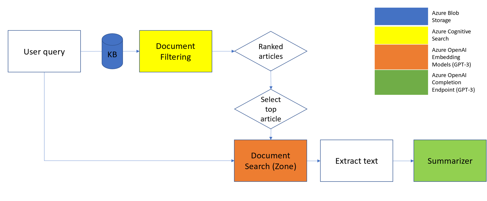

# Query Based Summarization Solution Playbook

## Introduction

Knowledge bases in enterprises are very common in the industry today and can have extensive number of documents in different categories. Retrieving relevant content based on a user query is a challenging task.  Given a query we were able to retrieve information accurately at the document level using methods such as Page Rank developed and made highly accurate especially by Google,  after this point the user has to delve into the document and search for the relevant information.  With recent advances in Foundation Transformer Models such as the one developed by Open AI the challenge is alleviated by using “Semantic Search” methods by using encoding information such as “Embeddings” to find the relevant information and then to summarize the content to present to the user in a concise and succinct manner.

This Playbook will introduce the releavant use cases and the end-to-end archtitecture for this use case. We wuill take you through the step-by-step process of using various Azure Cognitive Services and more specifically Azure OpenAI's GPT-3 models to perform the downstream task of summarization.

This playbook aims to demonstrate how to link various Azure Cognitive Services together to improve results for common downstream tasks in a large enterprise enviorment. The methods and architecture are extremely customizable to your summarization use case and can be applied to many different datasets.

## Use Cases

This playbook links together two main use cases: **Document Search** and **Document Summarization**. By using different Azure Cognitive Services specialized for each task, the end result is focused, succinct, and thoroughly vetted.

### Document Search

Document Search is driven by an initial user query. The user provides their query to the search service, enabling users to find the top most relevant document from their knowledge base. Document Search leverages the state of the art search technology using indexers. Within large enteprises there are various documents in different formats that are congregated in a large knowledge base. Having the ability to quickly, effectively, and accurately find relevant documents is essential to this end-to-end scenario.

### Document Summarization

Document Summarization is performed by providing input quality text into the summarizaton engine. The key to successful document summarization is retrieving the most important points within a large document to feed into summarization, as the quality and focus of a summary is only as good as the input data. To ensure the most succinct and focused summary is returned, we utitlize Embeddings to search within a document for the most salient pieces. Document Summarization is essential in large enteprises to condense large documents into human consumable information that frees up humans to do more specialized and techincal work rather than focus on common tasks such as summmarization.

## Architecture

An E2E architecture found in Images/EndToEndArchitecture.png captures the use case that we talked about the previous sections. The user passes their query to a knowledge base to filter the number of documents top most relevant docouments, narrows the scope of documents to tens from a couple of thousands. This cna be done using Azure Cognitive Search by creating a custom index for your knowledge base. Then once a document is selected, the document needs to be segmented and then each segment can be embedded using GPT-3 embedding models. This allows each text chunk to have its semantic meaning captured through an embedding. Then the user can send another query to search within the document and "zone in" on a particular text segment or segements based using similarities between the query and embeddings for each text chunk. Once a section is "zoned-in", the user can extract the relevant text and pass it to the GPT-3 Completion endpoint for summarization. 


<figcaption align = "center"><b>Figure 1: End-to-end Architecture</b></figcaption>

## Example Walk-Through

This remainder of this notebook will dive deep into each component of the architecture and demonstrate how to link them together for a successful document summarization use case. 

Our guiding query that we will use for this playbook is **"Provide details on the Clinton democratic nomination"**

## Dataset

For this walkthrough, we will be using the **CNN/Daily Mail** dataset. This is a common dataset used for text summarization and question answering tasks. Human generated abstractive summary bullets were generated from news stories in CNN and Daily Mail websites. 

In all, the corpus has 286,817 training pairs, 13,368 validation pairs and 11,487 test pairs, as defined by their scripts. The source documents in the training set have 766 words spanning 29.74 sentences on an average while the summaries consist of 53 words and 3.72 sentences. We will use a subset of the corpus for this example that can be found in the /data folder. 

The relevant schema for our work today consists of:

+ id: a string containing the heximal formatted SHA1 hash of the URL where the story was retrieved from
+ article: a string containing the body of the news article
+ highlights: a string containing the highlight of the article as written by the article author

## Knowledge Base: __Azure Blob Storage__

Being able to store and access unstructured data at scale is imperative for enterprises. Azure Blob Storage provides storage capabilities with optimized costs with tieired storage for long-term data, and flexibiluty for high perofrmancing computer and ML workloads. The comprehensive data management Azure Blob Storage provides coupled with it's ease of use is why we chose to upload our knowledge base to Azure Blob Storage for this scenario.

Around 11.2K articles and their summaries are stored in the Azure cloud for quick aceess. To do this we created a blob services with the dataset uploaded as a jsonl. This blob service is contained wihtin a storage account this will link to other services further in this example.

For more information please reference: https://learn.microsoft.com/en-us/azure/storage/blobs/storage-blobs-introduction

## Enterprise Search: __Azure Cognitive Search__

Azure Cognitive Search is a cloud search service that provides developers infrastructure, APIs, and tools for building a rich search experience. This service creates a search engine for full text search over a search index containing user-owned content. Azure Cognitive Search uses semantic search that brings relevance and language understanding to search results.

In this example, we will create a search service within the Azure portal with a customized index that enables us to search the CNN/Daily Mail knowledge base stored in Azure Blob storage.

In the image below, we have created an index to search against the 11.2K document stored in the Azure Blob Storage. We use the id, article, and highlights field to be retrievable during the search.


<figcaption align = "center"><b>Figure 2: Azure Cognitive Search Index</b></figcaption>


Now that we have our our storage and search services set up through the Azure portal, we can dive into our use case. 

The user is now able to query against the knowledge base. As a reminder from above, our **guiding initial query is "Provide details on the Clinton Democratic nomination"**

Lets place that query or a paragraphse of the query into the Azure Cognitive Search service, and see what the top results are.


<figcaption align = "center"><b>Figure 3: Azure Cognitive Search Results</b></figcaption>


Lets take a deeper dive into the results below.

```json
{
  "@odata.context": "https://testingframeworksearch.search.windows.net/indexes('azureblob-index')/$metadata#docs(*)",
  "value": [
    {
      "@search.score": 35.739716,
      "id": "faf5a752ae42c7e325f93cebef744e02338a9a0c",
      "article": "Apple founder Steve Jobs' widow Laurene has told of her admiration for Democratic White House front-runner Hillary Clinton. Ms Jobs, 51, called former First Lady Hillary a 'revolutionary' woman, and added that it's not just because she's a woman - but 'the type of woman she is'. Speaking to Time 100, Ms Jobs said: 'Hillary Clinton is not familiar. She is revolutionary. Not radical, but revolutionary: The distinction is crucial. She is one of America’s greatest modern creations. Laurene Jobs, pictured, widow of Apple's Steve, has strongly backed Hillary Clinton for president . Laurene Jobs said that Hillary Clinton, right, has 'judgment and wisdom' based on her public service . 'Her decades in our public life must not blind us to the fact that she represents new realities and possibilities. Indeed, those same decades have conferred upon her what newness usually lacks: judgment, and even wisdom. 'It matters, of course, that Hillary is a woman. But what matters more is what kind of woman she is.' Mrs Clinton announced her intention to seek the Democratic nomination on Sunday - and set upon the campaign trail with a trip to meet 'ordinary' voters in Iowa. But she was blasted for her 'staged' visit on Tuesday morning to a coffee shop in LeClaire, Iowa. Austin Bird, one of the men pictured sitting at the table with Mrs Clinton, claimed the whole event was orchestrated 'from beginning to end'. STAGED: Clinton sat to talk with three young Iowans at a coffee shop on Tuesday – all of whom were driven to the event by her Iowa campaign's political director . NOT SO ORDINARY: Austin Bird is a Democratic Party insider who chauffeured Vice President Joe Biden around Davenport, Iowa in October during a pre-election campaign trip . Bird told Daily Mail Online that campaign staffer Troy Price called and asked him and two other young people to meet him Tuesday morning at a restaurant in Davenport, a nearby city. Price then drove them to the coffee house to meet Clinton after vetting them for about a half-hour. The three got the lion's share of Mrs. Clinton's time and participated in what breathless news reports described as a 'roundtable'– the first of many in her brief Iowa campaign swing. Bird himself is a frequent participant in Iowa Democratic Party events. He interned with President Obama's 2012 presidential re-election campaign, and was tapped to chauffeur Vice President Joe Biden in October 2014 when he visited Davenport. 'What happened is, we were just asked to be there by Troy,' Bird said Wednesday in a phone interview. 'We were asked to come to a meeting with Troy, the three of us, at the Village Inn.' The other two, he confirmed, were University of Iowa College Democrats president Carter Bell and Planned Parenthood of the Heartland employee Sara Sedlacek. 'It was supposed to be a strategy meeting,' Bird recalled, 'to get our thoughts about issues. But then all of a sudden he says, \"Hey, we have Secretary Clinton coming in, would you like to go meet her?\"' 'And then we got in a car – Troy's car – and we went up to the coffee house, and we sat at a table and then Hillary just came up and talked with us.' Bird said 'we all were called.' 'I mean, Troy asked us all to do – to go to a meeting with him. And we didn't really know what it was about. I mean, he did. He knew.' It's unclear how many Iowans featured in photographs with Clinton that rocketed around the country on Tuesday were planted. 'The mayor of LeClaire was there, and his wife was there,' Bird said, recalling the scene at the coffee shop. Price was executive director of the Iowa Democratic Party until a month ago. Clinton's team tapped him last week to be its political director in Iowa. He did not respond to a request for comment. Bird is a government and community relations coordinator at Genesis Health System in Davenport, Iowa, according to his LinkedIn profile. A coworker at Genesis said Wednesday that Bird is 'basically a lobbyist in training. That's what he wants to do.' Bird disagreed, saying his role was 'more public relations.' He's also an outspoken progressive whose Facebook wall shows he ordered a 'Hillary For President' bumper sticker 22 months ago. 'Is it 2016 yet?' he wrote in May 2013. Clinton's nascent campaign has carefully coordinated her image as a spontaneous, handshaking populist in her first days as a candidate, posing with Pennsylvanians at a gas station and venturing into an Ohio Chipotle restaurant for lunch. When no one recognized the former first lady – she was wearing sunglasses – the campaign leaked information to The New York Times so its reporters could get security-camera footage to prove she had tried to mingle with voters. Scripting supposedly off-the-cuff appearances is common in presidential politics but could hurt Clinton especially hard since her gonzo road-trip journey to America's broad midwest is designed to counter her image as cold, calculating and politically venomous. And planting party insiders in place of typical Iowans won't go over well in the Hawkeye State, where pressing the flesh and collecting caucus votes is a quadrennial full-contact sport. ASTROTURF: Setting up faux events for news cameras is nothing new in politics, but Iowans take presidential contests seriously and could punish Clinton for the deception . THE FIXER: Bird said Troy Prince (left, pictured with VP Joe Biden), who was executive director of the Iowa Democratic Party until he left last month to help Clinton's statewide political effort, recruited him and others to attend the 'spontaneous' coffee meeting . Clinton's campaign has already taken heat for depicting at least three people in her campaign launch video as 'everyday' Americans who were actually partisans with political connections. One was even a former campaign manager for Wendy Davis, the Texas Democrat who mounted a failed bid for Texas governor last year. In LeClaire on Tuesday, Bloomberg and other outlets referred to Bird as a 'student' at St. Ambrose University, not as a hospital government-affairs staffer with Democratic party street-cred. He does study at St. Ambrose – part-time. But Bird's ties to the party are deep enough that his Facebook wall includes a photo of him standing in front of Joe Biden's limousine in Davenport. 'I was driving the Vice President when he was in town in October,' Bird noted in a Facebook comment. Biden was not there on official government business, but for a campaign stop in support of Democrat Bruce Braley. 'The Vice President will attend a grassroots event for Braley for Iowa with Representative David Loebsack,' according to White House press guidance for his October 27, 2014 schedule.",
      "highlights": "Laurene Jobs praised former First Lady Hillary Clinton .\nSteve Jobs' widow claimed the Democratic front-runner is 'revolutionary'\nMrs Clinton has announced her candidacy and began campaigning in Iowa .\nShe described Mrs Clinton as 'America's greatest modern creation'",
      "AzureSearch_DocumentKey": "aHR0cHM6Ly9xdWVyeWJhc2Vkc3Vtc3RvcmFnZWFjY3QuYmxvYi5jb3JlLndpbmRvd3MubmV0L2NubmRhaWx5bWFpbC9jbm5fdGVzdGluZ2ZyYW1ld29yay5qc29uOzk5MTY1"
    },
    {
      "@search.score": 30.250067,
      "id": "22e1394839f0ec18ee80df0cbf3f2d5ce22bff2b",
      "article": "New York (CNN)Wall Street is more than ready for Hillary Clinton. The former secretary of state confirmed on Sunday what the political world has expected for months -- eight years after her first failed White House bid, Clinton will once again seek the Democratic Party's nomination for president. \"I'm hitting the road to earn your vote, because it's your time,\" Clinton said in a video released Sunday afternoon officially kicking off her campaign. \"And I hope you'll join me on this journey.\" As Clinton sets off onto the campaign trail to reintroduce herself to voters and court donors across the country, Wall Street elites are ready to roll out the red carpet. But while the enthusiastic support from the industry will be a financial boon for Clinton's newly launched campaign, it will also pose a delicate balancing act when it comes to appeasing a vocal wing of her party that is antagonistic toward the banking sector. Clinton, 67, has long enjoyed a close relationship with the financial industry. As a New York senator for almost a decade, she represented Wall Street and courted the industry aggressively during her last presidential campaign. And there is a certain degree of nostalgia within the industry for her husband's two-term presidency, marked by the 1990s bull market and broad financial deregulation, including the repeal of the Glass-Steagall Act, which separated commercial banking from riskier investing activities. Now Clinton's allies in the finance world are eager to galvanize a broad network of potential donors in New York and beyond. Many on Wall Street and in the broader business community view her as a dependable, business-friendly force within a Democratic Party that has grown increasingly populist during President Barack Obama's time in office. Robert Wolf, the former CEO of UBS Americas and a close Obama associate who will back Clinton in 2016, said there's an \"incredible amount of enthusiasm\" for her campaign to get off the ground. \"We know the secretary from the years of being first lady to the senator to the secretary, so we have decades of working relationship with her,\" Wolf, who now runs a boutique consulting firm headquartered in Manhattan, told CNN. \"I don't think it's surprising that the former senator of New York is close to the finance community.\" Longtime Clinton friend and prominent Democratic fundraiser Alan Patricof, who founded the venture capital firm Greycroft Partners, said Clinton has \"an enormous following\" both inside and outside of the finance world. \"There are a lot of people who perhaps didn't know her as well before who are all set to jump on the bandwagon,\" Patricof said. As compared with 2008, he added: \"There is no diminishment, just the opposite -- an acceleration of interest in her running for the presidency.\" But the fanfare won't sit well with everyone. The former first lady's perceived coziness with Wall Street is a source of irritation for liberal activists, who hope to push the eventual Democratic nominee to embrace progressive ideals during the 2016 primaries. Clinton, who lost her first presidential campaign to a challenger from the left, seems to recognize that the liberal wing of the party has grown even more vocal and influential since then, especially on economic matters. Her video message on Sunday centered on the theme of upward mobility and an economic recovery that has left some behind. \"Americans have fought their way back from tough economic times, but the deck is still stacked in favor of those at the top,\" Clinton said, vowing to be a \"champion\" of \"everyday Americans.\" That statement tracks closely with her tone in recent public appearances, where the former secretary has been hitting on populist economic themes. She has taken on a range of issues that most appeal to liberals, such as the wealth gap, minimum wage and equal pay, in the months leading up to her announcement. In January, she took to social media to defend the 2010 Dodd-Frank Wall Street reform law, which contains provisions that the industry has tried to roll back. \"Attacking financial reform is risky and wrong,\" she wrote on Twitter. Bill Daley, a longtime Clinton ally and former Obama chief of staff, said Clinton has to reintroduce herself to the party. If she defends policies viewed as having contributed to the financial crisis, Daley said, \"that's a problem.\" He continued: \"My guess is she'll have enough policy positions that says she's not in the tank with them.\" Clinton's early gestures have not satisfied some activists, who point to Massachusetts Democratic Sen. Elizabeth Warren as their candidate of choice. Several liberal groups have even launched a formal draft campaign to elevate the senator and highlight her progressive views. Former Republican New Hampshire Sen. Judd Gregg, who served as head of the Securities Industry and Financial Markets Association, said part of Clinton's challenge stems from the fact that \"the center of the Democratic Party has moved very much to the left.\" \"Hillary has always been much more rational on these issues and much more mainstream,\" Gregg said. \"I presume she's going to get the nomination, but she may be contested from the left.\" While Warren has shown no interest in running for president this cycle, other Democrats have been taking aim at big banks as they tour the early presidential states. Former Maryland Gov. Martin O'Malley, former Virginia Sen. Jim Webb and Vermont Sen. Bernie Sanders, an independent who caucuses with Democrats, are all testing the waters. They have made economic populism central to their potential campaigns, proposing to crack down on the banking sector, reform the culture on Wall Street and toughen financial regulations. None of these potential candidates will be able to compete with Clinton's extensive fundraising apparatus. But their presence in the race could exert pressure on Clinton to embrace progressive policies. After Clinton's announcement Sunday, a collection of liberal activists declared that the former secretary of state must prove her progressive bona fides. \"We look forward to Hillary Clinton and other candidates laying out their platforms and hearing whether they embrace the fights that Sen. Warren has spent her life leading,\" said Ready for Warren campaign manager Erica Sagrans. \"In the coming days, Ready for Warren will be stepping up our efforts to convince Warren to run for president.\" Now that she is a formally declared candidate, political strategists expect Clinton to be more outspoken, laying out her economic priorities quickly and in her own terms. Democratic strategist Chris Lehane downplayed the notion of Clinton-Warren tension in the Democratic Party, predicting that with Clinton as an announced candidate, \"she'll offer a pretty compelling rationale\" for her campaign. Lehane, who worked in Bill Clinton's administration, said he envisioned an economic message for Clinton anchored in her biography: \"I grew up in the Midwest in a middle class family, I understand the challenges that they face, we need to make sure that America gives people a fair shot.\" Despite Clinton's embrace of more populist rhetoric, finance and business leaders aren't too concerned that she will back policies that are anathema to them. They expect that she will be able to articulate a broad economic goals aimed at the middle class rather than one that rails against bailouts and financial excess, particularly as the country gets more distance from the last financial crisis. Kathy Wylde, president of the Partnership for New York City, a prominent business coalition, predicted that Clinton would be able to maintain her relationship with Wall Street without alienating the liberal base. The fact that Clinton \"is knowledgeable and maintains good, open relationships with the business and financial world does not suggest that she's in anybody's pocket,\" Wylde said. \"She's demonstrated that she's an independent force.\"",
      "highlights": "Hillary Clinton developed a close relationship with the financial world as a New York senator .\nClinton's allies there are eager to galvanize a broad network of potential donors .\nHer coziness with Wall Street irritates liberal activists, who are a growing influence in the Democratic Party .",
      "AzureSearch_DocumentKey": "aHR0cHM6Ly9xdWVyeWJhc2Vkc3Vtc3RvcmFnZWFjY3QuYmxvYi5jb3JlLndpbmRvd3MubmV0L2NubmRhaWx5bWFpbC9jbm5fdGVzdGluZ2ZyYW1ld29yay5qc29uOzg0NDI1"
    },
    {
      "@search.score": 26.443504,
      "id": "cdfed29602a38426efe5e757a141802543d8b94b",
      "article": "Bill de Blasio is going up against Hillary Clinton as the Democratic presidential candidate, it has been claimed. The Mayor of New York is allegedly entering the race as a 'leftist' alternative to Clinton in the hopes that this will see him represent the party in the 2016 elections. This claims come in the wake of a television appearance last week, just hours before Clinton announced her candidacy, where de Blasio refused to back her. Scroll down for video . The Mayor of New York is allegedly entering preparing to run for president as a 'leftist' alternative to Hillary Clinton, according to a source within the Democratic Party . De Blasio's intentions to throw his hat in the ring as Democrat presidential candidate comes from a 'national party operative', according to the New York Post. The mayor's bid for presidency is backed by the Working Families Party, and he hopes that left-leaning 'progressive activists' will join them in supporting him over the coming months, the source claims. 'De Blasio and his advisers are trying to position the mayor as the 'draft' candidate for the left in 2016. That's why he refused to endorse Hillary last week,' the party operative told the Post. The 53-year-old has yet to back Clinton, despite the fact that he was campaign manager of her U.S. Senate bid in 2000, an indication that the rumours of his intentions to run for president may be true. The New York City mayor, known to be more liberal than Clinton on most issues, surprised many Democrats when he declined to endorse his former boss during an interview last week. Behind her back? Bill de Blasio has yet to endorse Hillary Clinton as the Democrats' presidential candidate, despite the fact that he was campaign manager of her U.S. Senate bid in 2000 . The New York City mayor, seen inspecting a Bronx apartment as pary of an affordable housing project, said he will not endorse Clinton  until he can 'see an actual vision of where they want to go' Appearing on Meet The Press, De Blasio said he would withhold his blessing 'until I see an actual vision of where they want to go.' 'She's a tremendous public servant,' the mayor continued. 'I think she is one of the most qualified people to ever run for this office. And by the way, thoroughly vetted, we can say that. But we need to see the substance.' De Blasio has taken several steps to raise his profile in recent weeks, including making a bid for the 2016 Democratic National Convention, hosting a meeting of liberals at Gracie Mansion this month and traveling to Nebraska and Iowa — site of the first nominating caucus —  last  week to champion the fight against income inequality. Today, Clinton is scheduled to arrive in New Hampshire as she steps up her campaign for the Democratic nomination. As she did in Iowa last week, Clinton plans to forgo the packed rallies that marked her previous campaign and focus on smaller round-table events with selected groups of supporters.",
      "highlights": "Bill de Blasio 'wants to be a more liberal alternative to Hillary Clinton'\nNew York mayor's bid is allegedly backed by Working Families Party .\nDe Blasio, Clinton's former campaign manager, has yet to endorse her .",
      "AzureSearch_DocumentKey": "aHR0cHM6Ly9xdWVyeWJhc2Vkc3Vtc3RvcmFnZWFjY3QuYmxvYi5jb3JlLndpbmRvd3MubmV0L2NubmRhaWx5bWFpbC9jbm5fdGVzdGluZ2ZyYW1ld29yay5qc29uOzEwNjM30"
    }
}
```

Here we have selected the top 3 results from our Azure Cognitive Search app. In the results we can see the search score Azure Cognitive Search uses to assess semantic similarity between the query and the knowledge base. 

At this point in the use case, the user can either select the top article or investigate which of the top results is providing the most relevant information for their use case. By putting ourselves in the customer shoes and reflecting back on our guiding initial query of **clinton democratic nomination**, lets move forward with the first article. 

The first article highlights Clinton's campaign kick off in the Iowa caucused and focuses on her seeking the democratic nomation. The top search result matched with our initial query!

## Document Zone: __Azure OpenAI Embedding API__

Now that we have selected a narrowed on a single document from our knowledge base of 11.2K documents - we can dive deeper into the single document to refine our initial query to a more specific section or "zone" of the article.

To do this, we will utilize the Azure Open AI Embeddings API. 

### Embeddings Overview

An embedding is a special format of data representation that can be
easily utilized by machine learning models and algorithms. The embedding
is an information dense representation of the semantic meaning of a
piece of text. Each embedding is a vector of floating-point numbers,
such that the distance between two embeddings in the vector space is
correlated with semantic similarity between two inputs in the original
format. For example, if two texts are similar, then their vector
representations should also be similar.

Different Azure OpenAI embedding models are specifically created to be
good at a particular task. Similarity embeddings are good at capturing
semantic similarity between two or more pieces of text. Text search
embeddings help measure long documents are relevant to a short query.
Code search embeddings are useful for embedding code snippets and
embedding nature language search queries.

Embeddings make it easier to do machine learning on large inputs
representing words by capturing the semantic similarities in a vector
space. Therefore, we can use embeddings to if two text chunks are
semantically related or similar, and inherently provide a score to
assess similarity.

### Cosine Similarity

A previously used approach to match similar documents was based on
counting maximum number of common words between documents. This is
flawed since as the document size increases, the overlap of common words
increases even if the topics differ. Therefore cosine similarity is a
better approach by using the Euclidean distance.

Mathematically, cosine similarity measures the cosine of the angle
between two vectors projected in a multi-dimensional space. This is
beneficial because if two documents are far apart by Euclidean distance
because of size, they could still have a smaller angle between them and
therefore higher cosine similarity.

The Azure OpenAI embeddings rely on cosine similarity to compute
similarity between documents and a query.


### Text Segmentation or "Chunking"

The document that we selected span a few pages. In order to produce a meaningful and a focused summary we must first chunk or segment the document. This is essential for long document summarization for two main reasons:

+ Going around the token limitation inherit in a transformer based model - due to the token limitation we cannot pass the entire document into a model 
+ Creating a mapping from topic to relevant chunks of text - for long documents topics can vary drastically and to produce a meaningful summary, most of the time you want to "zone" on a single area. This may be a page or just a section with the information you want to dive into. 


By chunking the document into logical segments, we can utilize the power of the Azure OpenAI Embeddings following these steps:

1. Chunk the document into logical segments that fit within the token limitation
2. Create an embedding vector for each chunk that will capture the semantic meaning and overall topic of that chunk
3. Upon receiving a query for the specific document, embed the query in the same vector space as the context chunks from Step 2.
4. Find the most relevant context chunks through cosine similarity and use it for your desired downstream tasks. 

Let's walk through this together.

```python
# This is the original text from the top search result from Azure Cognitive Search

document = '''Apple founder Steve Jobs' widow Laurene has told of her admiration for Democratic White House front-runner Hillary Clinton. Ms Jobs, 51, called former First Lady Hillary a 'revolutionary' woman, and added that it's not just because she's a woman - but 'the type of woman she is'. Speaking to Time 100, Ms Jobs said: 'Hillary Clinton is not familiar. She is revolutionary. Not radical, but revolutionary: The distinction is crucial. She is one of America’s greatest modern creations. Laurene Jobs, pictured, widow of Apple's Steve, has strongly backed Hillary Clinton for president . Laurene Jobs said that Hillary Clinton, right, has 'judgment and wisdom' based on her public service . 'Her decades in our public life must not blind us to the fact that she represents new realities and possibilities. Indeed, those same decades have conferred upon her what newness usually lacks: judgment, and even wisdom. 'It matters, of course, that Hillary is a woman. But what matters more is what kind of woman she is.' Mrs Clinton announced her intention to seek the Democratic nomination on Sunday - and set upon the campaign trail with a trip to meet 'ordinary' voters in Iowa. But she was blasted for her 'staged' visit on Tuesday morning to a coffee shop in LeClaire, Iowa. Austin Bird, one of the men pictured sitting at the table with Mrs Clinton, claimed the whole event was orchestrated 'from beginning to end'. STAGED: Clinton sat to talk with three young Iowans at a coffee shop on Tuesday – all of whom were driven to the event by her Iowa campaign's political director . NOT SO ORDINARY: Austin Bird is a Democratic Party insider who chauffeured Vice President Joe Biden around Davenport, Iowa in October during a pre-election campaign trip . Bird told Daily Mail Online that campaign staffer Troy Price called and asked him and two other young people to meet him Tuesday morning at a restaurant in Davenport, a nearby city. Price then drove them to the coffee house to meet Clinton after vetting them for about a half-hour. The three got the lion's share of Mrs. Clinton's time and participated in what breathless news reports described as a 'roundtable'– the first of many in her brief Iowa campaign swing. Bird himself is a frequent participant in Iowa Democratic Party events. He interned with President Obama's 2012 presidential re-election campaign, and was tapped to chauffeur Vice President Joe Biden in October 2014 when he visited Davenport. 'What happened is, we were just asked to be there by Troy,' Bird said Wednesday in a phone interview. 'We were asked to come to a meeting with Troy, the three of us, at the Village Inn.' The other two, he confirmed, were University of Iowa College Democrats president Carter Bell and Planned Parenthood of the Heartland employee Sara Sedlacek. 'It was supposed to be a strategy meeting,' Bird recalled, 'to get our thoughts about issues. But then all of a sudden he says, \"Hey, we have Secretary Clinton coming in, would you like to go meet her?\"' 'And then we got in a car – Troy's car – and we went up to the coffee house, and we sat at a table and then Hillary just came up and talked with us.' Bird said 'we all were called.' 'I mean, Troy asked us all to do – to go to a meeting with him. And we didn't really know what it was about. I mean, he did. He knew.' It's unclear how many Iowans featured in photographs with Clinton that rocketed around the country on Tuesday were planted. 'The mayor of LeClaire was there, and his wife was there,' Bird said, recalling the scene at the coffee shop. Price was executive director of the Iowa Democratic Party until a month ago. Clinton's team tapped him last week to be its political director in Iowa. He did not respond to a request for comment. Bird is a government and community relations coordinator at Genesis Health System in Davenport, Iowa, according to his LinkedIn profile. A coworker at Genesis said Wednesday that Bird is 'basically a lobbyist in training. That's what he wants to do.' Bird disagreed, saying his role was 'more public relations.' He's also an outspoken progressive whose Facebook wall shows he ordered a 'Hillary For President' bumper sticker 22 months ago. 'Is it 2016 yet?' he wrote in May 2013. Clinton's nascent campaign has carefully coordinated her image as a spontaneous, handshaking populist in her first days as a candidate, posing with Pennsylvanians at a gas station and venturing into an Ohio Chipotle restaurant for lunch. When no one recognized the former first lady – she was wearing sunglasses – the campaign leaked information to The New York Times so its reporters could get security-camera footage to prove she had tried to mingle with voters. Scripting supposedly off-the-cuff appearances is common in presidential politics but could hurt Clinton especially hard since her gonzo road-trip journey to America's broad midwest is designed to counter her image as cold, calculating and politically venomous. And planting party insiders in place of typical Iowans won't go over well in the Hawkeye State, where pressing the flesh and collecting caucus votes is a quadrennial full-contact sport. ASTROTURF: Setting up faux events for news cameras is nothing new in politics, but Iowans take presidential contests seriously and could punish Clinton for the deception . THE FIXER: Bird said Troy Prince (left, pictured with VP Joe Biden), who was executive director of the Iowa Democratic Party until he left last month to help Clinton's statewide political effort, recruited him and others to attend the 'spontaneous' coffee meeting . Clinton's campaign has already taken heat for depicting at least three people in her campaign launch video as 'everyday' Americans who were actually partisans with political connections. One was even a former campaign manager for Wendy Davis, the Texas Democrat who mounted a failed bid for Texas governor last year. In LeClaire on Tuesday, Bloomberg and other outlets referred to Bird as a 'student' at St. Ambrose University, not as a hospital government-affairs staffer with Democratic party street-cred. He does study at St. Ambrose – part-time. But Bird's ties to the party are deep enough that his Facebook wall includes a photo of him standing in front of Joe Biden's limousine in Davenport. 'I was driving the Vice President when he was in town in October,' Bird noted in a Facebook comment. Biden was not there on official government business, but for a campaign stop in support of Democrat Bruce Braley. 'The Vice President will attend a grassroots event for Braley for Iowa with Representative David Loebsack,' according to White House press guidance for his October 27, 2014 schedule."'''
```

```python
import openai
import re
import requests
import sys
import os
import pandas as pd
import numpy as np
from openai.embeddings_utils import get_embedding, cosine_similarity

API_KEY = os.getenv("") # SET YOUR OWN API KEY HERE
RESOURCE_ENDPOINT = "" # SET A LINK TO YOUR RESOURCE ENDPOINT

openai.api_type = "azure"
openai.api_key = API_KEY
openai.api_base = RESOURCE_ENDPOINT
openai.api_version = "2022-06-01-preview"

TEXT_SEARCH_DOC_EMBEDDING_ENGINE = 'text-search-curie-doc-001'
TEXT_SEARCH_QUERY_EMBEDDING_ENGINE = 'text-search-curie-query-001'
TEXT_DAVINCI_001 = "davinci-instruct"
```

```python
#Defining helper functions

#Splits text after sentences ending in a period. Combines n sentences per chunk.
def splitter(n, s):
    pieces = s.split(". ")
    list_out = [" ".join(pieces[i:i+n]) for i in range(0, len(pieces), n)]
    return list_out

# Perform light data cleaning (removing redudant whitespace and cleaning up punctuation)
def normalize_text(s, sep_token = " \n "):
    s = re.sub(r'\s+',  ' ', s).strip()
    s = re.sub(r". ,","",s)
    # remove all instances of multiple spaces
    s = s.replace("..",".")
    s = s.replace(". .",".")
    s = s.replace("\n", "")
    s = s.strip()
    
    return s
```

```python
# (STEP 1) Chunking the document by creating a chunk every 10th sentence and creating a pandas DF
document_chunks = splitter(10, normalize_text(document))
df = pd.DataFrame(document_chunks, columns = ["chunks"])

#(STEP 2): Create an embedding vector for each chunk that will capture the semantic meaning and overall topic of that chunk
df['curie_search'] = df["chunks"].apply(lambda x : get_embedding(x, engine = TEXT_SEARCH_DOC_EMBEDDING_ENGINE))

```

Now that we have a dataframe with the document chunks and their corresponding embedding vectors. We can "zone in" more specifically on a certain area of the document by narrowing our query. 

Lets generate a document specific query that will help us isolate the correct context chunks that we can pass down into further downstream tasks.

The document specific query that we will use for Step 3 is **what is the trouble so far in the clinton campaign?**

In the code section below, we will pass the document specific query to a function that embeds the query to the same vector space as the document chunks. Calculate the cosine similarity between each context chunk and the query to find the most relevant context chunk based on the input query.

```python
# (STEP 3) upon receiving a query for the specific document, embed the query in the same vector space as the context chunks
def search_docs(df, user_query, top_n=3, to_print=True):
    embedding = get_embedding(
        user_query,
        engine=TEXT_SEARCH_QUERY_EMBEDDING_ENGINE
    )
    df["similarities"] = df.curie_search.apply(lambda x: cosine_similarity(x, embedding))

    res = (
        df.sort_values("similarities", ascending=False)
        .head(top_n)
    )
    if to_print:
        display(res)
    return res

document_specific_query = "trouble so far in clinton campaign"
res = search_docs(df, document_specific_query, top_n=2)
```

Let's take a deep dive into the results from step 3. They both have very similar cosine simialrity to the input query. Both results talk about current trouble the Clinton campaign is having by staging "ordinary voter" and creating fake events in Iowa where the campaign was kick off. 

The resulting context chunks are relevant to our query and can be used for further downstream tasks. At this point, the user can decide if they want to just take the top result to the downstream task or combine a few context chunks. (Step 4)

For this example, let's use both of the chunks as they are both relevant to the Clinton nomination and issues so far during the campaign for our downstream task of summarization.

> It matters, of course, that Hillary is a woman But what matters more is what kind of woman she is.' Mrs Clinton announced her intention to seek the Democratic nomination on Sunday - and set upon the campaign trail with a trip to meet 'ordinary' voters in Iowa But she was blasted for her 'staged' visit on Tuesday morning to a coffee shop in LeClaire, Iowa Austin Bird, one of the men pictured sitting at the table with Mrs Clinton, claimed the whole event was orchestrated 'from beginning to end' STAGED: Clinton sat to talk with three young Iowans at a coffee shop on Tuesday – all of whom were driven to the event by her Iowa campaign's political director  NOT SO ORDINARY: Austin Bird is a Democratic Party insider who chauffeured Vice President Joe Biden around Davenport, Iowa in October during a pre-election campaign trip  Bird told Daily Mail Online that campaign staffer Troy Price called and asked him and two other young people to meet him Tuesday morning at a restaurant in Davenport, a nearby city Price then drove them to the coffee house to meet Clinton after vetting them for about a half-hour The three got the lion's share of Mrs Clinton's time and participated in what breathless news reports described as a 'roundtable'– the first of many in her brief Iowa campaign swing

> And planting party insiders in place of typical Iowans won't go over well in the Hawkeye State, where pressing the flesh and collecting caucus votes is a quadrennial full-contact sport ASTROTURF: Setting up faux events for news cameras is nothing new in politics, but Iowans take presidential contests seriously and could punish Clinton for the deception  THE FIXER: Bird said Troy Prince (left, pictured with VP Joe Biden), who was executive director of the Iowa Democratic Party until he left last month to help Clinton's statewide political effort, recruited him and others to attend the 'spontaneous' coffee meeting  Clinton's campaign has already taken heat for depicting at least three people in her campaign launch video as 'everyday' Americans who were actually partisans with political connections One was even a former campaign manager for Wendy Davis, the Texas Democrat who mounted a failed bid for Texas governor last year In LeClaire on Tuesday, Bloomberg and other outlets referred to Bird as a 'student' at St Ambrose University, not as a hospital government-affairs staffer with Democratic party street-cred He does study at St Ambrose – part-time But Bird's ties to the party are deep enough that his Facebook wall includes a photo of him standing in front of Joe Biden's limousine in Davenport

## Document Summarization: __Azure OpenAI Completion API__

Now that we have extracted the relevant context chunks using Azure OpenAI Embedding API, we can use these chunks to provide meaningful context for our prompt design. We will be using the **Completion endpoint** for summarization. 

Together, let's design a prompt used for summarizing our extracted texts.

### Prompt Design Refresher

GPT-3 models can perform many tasks. Therefore you must be explicit in describing what you want. 

The models try to guess what you want from the prompt. If you send the words "Give me a list of cat breeds," the model wouldn't automatically assume that you're asking for a list of cat breeds. You could just as easily be asking the model to continue a conversation where the first words are "Give me a list of cat breeds" and the next ones are "and I'll tell you which ones I like." If the model only assumed that you wanted a list of cats, it wouldn't be as good at content creation, classification, or other tasks.

There are three basic guidelines to creating prompts:

**Show and tell**. Make it clear what you want either through instructions, examples, or a combination of the two. If you want the model to rank a list of items in alphabetical order or to classify a paragraph by sentiment, show it that's what you want.

**Provide quality data**. If you're trying to build a classifier or get the model to follow a pattern, make sure that there are enough examples. Be sure to proofread your examples — the model is usually smart enough to see through basic spelling mistakes and give you a response, but it also might assume this is intentional and it can affect the response.

**Check your settings.** The temperature and top_p settings control how deterministic the model is in generating a response. If you're asking it for a response where there's only one right answer, then you'd want to set these lower. If you're looking for more diverse responses, then you might want to set them higher. The number one mistake people use with these settings is assuming that they're "cleverness" or "creativity" controls.

### Few-Shot Approach

The goal of this is to teach the GPT-3 model to learn a conversation style input. We use the “Completion” create OpenAI API and generate a prompt that would best provide us a summary of the conversation. It is important to generate prompts carefully to extract relevant information. To extract general summaries from customer-agent chats, we will be using the following format:

1. Prefix: What do you want it to do
2. Context primer : Describe what the context is
3. Context: # Essentially the information needed to answer the question. In the case of summary, the prose that needs to be summarized. 
4. Suffix: Describe what form the answer should take. Whether it is an answer, a completion, a summary, etc


```python
'''
Designing a prompt that will show and tell GPT-3 how to proceed. 
+ Providing an instruction to summarize the text about the general topic (prefix)
+ Providing quality data for the chunks to summarize and specifically mentioning they are the text provided (context + context primer)
+ Providing a space for GPT-3 to fill in the summary to follow the format (suffix)
'''

# result_1 corresponding to the top chunk from Step 3. result_2 corresponding to the second to top chunk from Step 3. 
prompt_i = 'Summarize the content about the Clinton campaign given the text provided.\n\Text:\n'+" ".join([normalize_text(result_1)])+ '\n\nText:\n'+ " ".join([normalize_text(result_2)])+'\n\nSummary:\n'

# Using a temperature a low temperature to limit the creativity in the response. 
response = openai.Completion.create(
        engine= TEXT_DAVINCI_001,
        prompt = prompt_i,
        temperature = 0.4,
        max_tokens = 500,
        top_p = 1.0,
        frequency_penalty=0.5,
        presence_penalty = 0.5,
        best_of = 1
    )

print(response.choices[0].text)

```

> The text discusses the Clinton campaign and how it has been criticized for allegedly staging events. Specifically, the text discusses an event at a coffee shop in LeClaire, Iowa, which was attended by three people who were driven to the event by the Iowa campaign's political director. These three people received the lion's share of Mrs. Clinton's time and were described in breathless news reports as a 'roundtable.'
> However, one of the participants in the event, Austin Bird, has since claimed that the whole event was orchestrated 'from beginning to end.' He alleges that Troy Price, who is the executive director of the Iowa Democratic Party until he left last month to help Clinton's statewide political effort, recruited him and others to attend the 'spontaneous' coffee meeting.
> Thus far, Clinton's campaign has taken heat for depicting at least three people in her campaign launch video as 'everyday' Americans who were actually partisans with political connections.

As a result, we have a succinct, clear, and impactful summary generated by the Azure OpenAI Completion API.

## Review

To summarize, we started by transferring a large knowledge base of data to **Azure Blob Storage**. We also deployed a **Azure Cognitive Search** service by creating a custom indexer for our data. From there, the user provided an initial query in the Azure Cognitive Search app that searched against the Blob Storage. The **enterprise search** results were listed as an output based on Azure Cognitive Search's similarity metric. From there, we **isolated the top search result** and extracated the text. At this point we are now focusing on one document relevant to the initial query. From here, we **chunked** our document to break up the long document into individual chunks. Then we utilized **Azure OpenAI Embedding API** to embed each context vector and asssign a representation semantic meaning to each chunk. Then we created a document specific query that will enable us to **"zone in"** on a specific section of the document that we want to use for our downstream task. After passing the document specific query, we used Embeddings to find the most **relevant context chunks** to the query. From there we extracted the relevant context chunks, and designed a **few-shot prompt** for the **Azure OpenAI Completion API** for the downstream task of summarization. 

From starting from a 11.2K document knowledge base to narrowing onto a specific document, and then finding the relevant inforamtion within the document to generate the best summary - linking Azure Cognitive services is an excellent approach.

