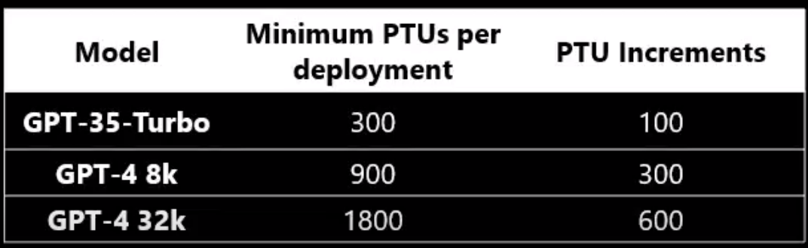

# FastTrack for Azure - Azure OpenAI

## We will start 3-4 minutes after the scheduled time to accommodate those still connecting

> This call will not be recorded due to the wide audience and to encourage
> questions.

**Questions?** Feel free to type them in the chat window at any time. Note that
questions you post will be public.

**Slideless** No death by PowerPoint, we promise! As we update this content you will get
the changes straight away.

**Feeback** We would like to hear your thoughts, please provide us your feedback
and register for other sessions at [//aka.ms/ftalive](https://aka.ms/ftalive).

This live session will introduce Azure OpenAI, discuss the different language models available, and demonstrate how these models can be easily adapted to your specific task including but not limited to content generation, summarization, semantic search, and natural language to code translation. Presenters will demonstrate how users can access the service through REST APIs, Python SDK, or our web-based interface in the Azure OpenAI Studio.

<br/>

# Agenda
1. [Azure OpenAI overview](#1-openai_overview)
2. [Azure OpenAI models](#2-openai-models")
3. [Azure OpenAI deep dive](#3-openai-deepdive)
4. [References](#4-references)

<br/>

---

# <a name="1-openai_overview"></a>1. Azure OpenAI Overiew
In this section, we provide an introduction to the Azure OpenAI service, background into OpenAI, Microsoft's partnership, what is **Azure** OpenAI, and what are the different components within a provisioned environment.  


## Generative AI
Generative AI is a subfield of Artificial Intelligence that focuses on creating systems that can generate new examples, such as images, text, or speech, that are similar to examples from a given dataset. The goal of generative AI is to develop algorithms that can learn the underlying probability distribution of a given dataset and use this knowledge to generate new examples that are similar to the examples in the dataset.
Generative AI models can be classified into two broad categories: generative models and discriminative models. Generative models such as GPT-3, DALL-E, Variational Autoencoders etc learns the underlying probability distribution of the dataset and can generate new examples from the learned distribution. Discriminative models, such as deep neural networks, learn to differentiate between different classes or categories, and are generally used for tasks such as image or speech recognition.
Generative AI sits on top of other areas of AI like unsupervised learning, supervised learning and reinforcement learning. It relies on the capability of those models to extract useful features from the data and use that for learning the underlying probability distribution of the data which is used for generthe potential to be used in a wide range of applications, such as computer vision, natural language processing, speech recognition, and many more.


## Use Cases & Capabilities
Working with customers on OpenAI has highlighted four (4) capabilities moreso than others: Content generation, Summarisation, Code Generation and Semantic Search. 
* Content generation has sparked a lot of interest among those who want to be able to automate responses to customers, or generate personalized UI for their company’s website or with recruitment firms who want to be able to generate content for bringing in their ideals applicants. 
* The second popular capability of OpenAI has been summarization. There’s so much goodness here for call center analytics scenarios where companies would want to summarize conversation logs, or to be able to summarise long and tedious reports or tonnes of analyst articles. Social media trend summarization is another use that is important for companies to know what their customers are heading towards and what their industry is trending towards.
* Code generation – the third popular capability…. Think of wanting to convert your SQL to NL or vice versa. Code generation is powerful capability that can help to convert code, as well as generate text and source code directly into your application.
* Last but not the least, Semantic Search with OpenAI will help quicken the time to search through documents.

These use cases are particular to these 4 categories or capabilities of OpenAI that we are discussing here. IN addition to these, we also have some examples of multiple model use cases that are very popular among our customers:
* End to end call center analytics that takes your process all the way from classification through to email generation to increase productivity and save time and effort during call center operations.
* Customer 360 where hyper-personalization will use more than one of the above capabilities to ensure you have a complete and holistic view of your customers and are increasing your customer satisfaction, whilst using feedback and trends to serve them better in the future.
* Business Process Automation like document automation where we use capabilities across search, code generation and content generation to do things faster and more efficiently.


## OpenAI Overview 

OpenAI is a private artificial intelligence research laboratory consisting of the for-profit OpenAI LP and its parent company, the non-profit OpenAI Inc. The company was founded in December 2015 with the mission of building advanced artificial intelligence capabilities, aspiring to the goal of achieving Artificial General Intelligence (AGI).

OpenAI conducts research on a wide range of topics related to artificial intelligence, including machine learning, computer vision, natural language processing, and robotics. The company also develops and releases various AI-related software tools and products, such as GPT-3, Codex and DALL-E. Recently, they released ChatGPT as a free, consumer offering which caused a surge in interest in their technology.

Microsoft’s relationship with OpenAI began on July 22, 2019, when we announced a $1 billion investment to build artificial general intelligence (AGI) with wide use case benefits and jointly develop new Azure AI supercomputing technologies. On September 20, 2020, Kevin Scott, our EVP and Chief Technology Officer announced that Microsoft is teaming up with OpenAI to exclusively license their GPT-3 AI models.

The partnership also includes a mutual commitment to ethical AI development and responsible use of AI, with both companies working together on safety, trust, and reliability of AI systems and services.


<br></br>

# Azure OpenAI Service

Azure OpenAI Service is an Azure AI service that allows access to OpenAI’s language models GPT-x, Codex and Embeddings through the Azure platform. These models can be adapted to tasks such as content generation, summarization, semantic search, and natural language to code translation. Users access the service through REST APIs, Python SDK, or the web-based interface in the Azure OpenAI Studio. It allows developers to discover the art-of-the-possible with cutting-edge models from OpenAI and take their use-cases to production with the enterprise-grade reliability, security and global availability that comes with Microsoft Azure.

## Enterprise Grade
The Azure OpenAI Service provides customers with the security capabilities of Microsoft Azure while running the same models as OpenAI. Azure OpenAI offers private networking through Virtual Networking (VNets), regional availability, and responsible AI content filtering.

[!WARN]
Confirm region availability with your Microsoft account team.

## Getting Access
Azure OpenAI requires registration and is currently only available to managed customers and partners working with Microsoft account teams. Customers who wish to use Azure OpenAI are required to submit [a registration form](https://aka.ms/oai/access) both for initial access for experimentation and for approval to move from experimentation to production.  Invite-only preview for DALL-E: DALL-E is currently invite only. We welcome you to share your use case information for future consideration. We cannot guarantee onboarding or offer information about timelines. Limited access scenarios: When evaluating which scenarios to onboard, we consider who will directly interact with the application, who will see the output of the application, whether the application will be used in a high-stakes domain (e.g., medical), and the extent to which the application’s capabilities are tightly scoped. In general, applications in high stakes domains will require additional mitigations and are more likely to be approved for applications with internal-only users and internal-only audiences. Applications with broad possible uses, including content generation capabilities, are more likely to be approved if 1) the domain is not high stakes and users are authenticated or 2) in the case of high stakes domains, anyone who views or interacts with the content is internal to your company.  

## Possible causes for a denied application: 
1) You are not a managed customer. Learn more here
2) The application was for more than one use case. For example, expressing interest in DALL-E while also applying for a separate text-to-code scenario.
3) Application submitted with personal email (Example: @gmail.com, @yahoo.com, @hotmail.com, etc.)
4) A scenario we are not yet supporting because of higher potential for misuse, such as a content creation application open to unauthenticated users who can generate unconstrained content on any topic
5) Vague or incomplete answers, or not responding to a request for more information   


## Code of Conduct
The Azure OpenAI service has a [Code of Conduct](https://learn.microsoft.com/en-us/legal/cognitive-services/openai/code-of-conduct) that defines the requirements that all Azure OpenAI Service implementations must adhere to in good faith. This code of conduct is in addition to the Acceptable Use Policy in the Microsoft Online Services Terms.

!Ensure you read the code.

<br></br>
---

# <a name="2-openai_models"></a>2. Azure OpenAI models

## Key Concepts
It's important to provide some information on the underlying concepts.

## Models

 Azure OpenAI provides access to different OpenAI models, which are grouped by family and capability.  Familys are associated with the intended task of the model.  Current models include:
 * GPT-3.  A series of models that can interpret and generate natural language.
 * Codex. A series of models that interpret and generate code, including translating natural language into code.
 * Embeddings.  A series of models that can use embeddedings, which are information-dense representations of the semantic meaning of a piece of text.  Embeddings are a special format of data representation that can be easily utilized by machine learning models and algorithms. 

[Detailed information on models and capability](https://learn.microsoft.com/en-us/azure/cognitive-services/openai/concepts/models#model-summary-table-and-region-availability)


<!Note>
Information from OpenAI on models can be found [here](https://platform.openai.com/docs/model-index-for-researchers)
Models referred to as "GPT 3.5"
GPT-3.5 series is a series of models that was trained on a blend of text and code from before Q4 2021. The following models are in the GPT-3.5 series:

1. code-davinci-002 is a base model, so good for pure code-completion tasks
2. text-davinci-002 is an InstructGPT model based on code-davinci-002
3. text-davinci-003 is an improvement on text-davinci-002

### **Prompts & Completions**
The completions endpoint is the core component of the API service. This API provides access to the model's text-in, text-out interface. Users simply need to provide an input prompt containing the English text command, and the model will generate a text completion.

Here's an example of a simple prompt and completion:

```python
Prompt: """ count to 5 in a for loop """

Completion: for i in range(1, 6): print(i)
```

### **Tokens**
Azure OpenAI processes text by breaking it down into tokens. Tokens can be words or just chunks of characters. For example, the word “hamburger” gets broken up into the tokens “ham”, “bur” and “ger”, while a short and common word like “pear” is a single token. Many tokens start with a whitespace, for example “ hello” and “ bye”.

The total number of tokens processed in a given request depends on the length of your input, output and request parameters. The quantity of tokens being processed will also affect your response latency and throughput for the models

### **Deployments**
Once you create an Azure OpenAI Resource, you must deploy a model before you can start making API calls and generating text. This action can be done using the Deployment APIs or the Azure OpenAI Studio. Both methods allow you to specify the model you wish to use.

### **In-context learning**
Azure OpenAI models use natural language instructions and examples provided in the prompt to identify the task being asked and skill required. When using this approach, the first part of the prompt includes natural language instructions and/or examples of the specific task desired. The model then completes the task by predicting the most probable next piece of text. This technique is known as "in-context" learning. These models aren't retrained during this step but instead give predictions based on the context you include in the prompt.

There are three main approaches for in-context learning: Few-shot, one-shot and zero-shot. These approaches vary based on the amount of task-specific data that is given to the model:

[Demo of Summarisation from Azure/openai-samples](Solution_Notebooks/Summarization/SummarizationOverview.ipynb)


# <a name="3-openai_deep"></a>3. Azure OpenAI Deep Dive

## Provisioned Throughput
An Azure OpenAI Service feature that lets customers reserve model processing capacity for running high-volume or latency-sensitive workloads.

* Consistent latency and throughput with consistent characteristics such as prompt size, completion size, and number of concurrent API requests.
* Capacity defined in units called "Provisioned Throughput Units" (PTUs), that are purchased on a month-to-month term commitment.
* Customers use PTUs to create provisioned deployments of GPT-35-turbo or GPT-4 models during the commitment term.
* High throughput workloads will likely see cost savings vs token-based consumption.



## Prompt Design

Most of the work in using OpenAI is in the prompt design.  The prompt is the instruction to the model on what to generate.  The prompt is also the way to control the output of the model, providing guiance to the model as to what is acceptable and what is not acceptable.  

OpenAI GPT models are based on [InstructGPT](https://openai.com/blog/instruction-following/).  InstructGPT models are initialised from GPT-3 models, whose training dataset is composed of text posted to the internet or uploaded to the internet (e.g., books). The internet data that the GPT-3 models were trained on and evaluated against includes:

1. a version of the CommonCrawl dataset filtered based on similarity to high-quality reference corpora,
2. an expanded version of the Webtext dataset,
3. two internet-based book corpora, and
4. English-language Wikipedia.

### **Instructions vs. completions***
* Referring to work by Scott Lundberg, Marco Tulio Ribeiro
```python
"John Smith is married to Lucy Smith.  They have five kids, and he works as a software engineer at Microsoft.  How should I fact-check this?"
```

```python
"John Smith is married to Lucy Smith.  They have five kids, and he works as a software engineer at Microsoft.  How should I fact-check this? <|endofprompt|>"
```

### Guidelines
There are three basic guidelines to creating prompts:

**Show and tell**. Make it clear what you want either through instructions, examples, or a combination of the two. If you want the model to rank a list of items in alphabetical order or to classify a paragraph by sentiment, show it that's what you want.

**Provide quality data**. If you're trying to build a classifier or get the model to follow a pattern, make sure that there are enough examples. Be sure to proofread your examples — the model is usually smart enough to see through basic spelling mistakes and give you a response, but it also might assume this is intentional and it can affect the response.

**Check your settings.** The temperature and top_p settings control how deterministic the model is in generating a response. If you're asking it for a response where there's only one right answer, then you'd want to set these lower. If you're looking for more diverse responses, then you might want to set them higher. The number one mistake people use with these settings is assuming that they're "cleverness" or "creativity" controls.


## Fine-tuning
Fine-tuning lets you get more out of the models available through the API by providing:

* Higher quality results than prompt design
* Ability to train on more examples than can fit in a prompt
* Token savings due to shorter prompts
* Lower latency requests

Fine-tuning improves on few-shot learning by training on many more examples than can fit in the prompt, letting you achieve better results on a wide number of tasks. Once a model has been fine-tuned, you won't need to provide examples in the prompt anymore. This saves costs and enables lower-latency requests.

At a high level, fine-tuning involves the following steps:

1. Prepare and upload training data
2. Train a new fine-tuned model
3. Use your fine-tuned model

Fine-tuning is currently only available for the following base models: davinci, curie, babbage, and ada. These are the original models that do not have any instruction following training (like text-davinci-003 does for example). You are also able to continue fine-tuning a fine-tuned model to add additional data without having to start from scratch.

Designing your prompts and completions for fine-tuning is different from designing your prompts for use with our base models (Davinci, Curie, Babbage, Ada). In particular, while prompts for base models often consist of multiple examples ("few-shot learning"), for fine-tuning, each training example generally consists of a single input example and its associated output, without the need to give detailed instructions or include multiple examples in the same prompt.

The more training examples you have, the better. **OpenAI recommends having at least a couple hundred examples.** In general, we've found that each doubling of the dataset size leads to a linear increase in model quality.

### Preparing your dataset

To fine-tune a model, you'll need a set of training examples that each consist of a single input ("prompt") and its associated output ("completion"). This is notably different from using our base models, where you might input detailed instructions or multiple examples in a single prompt.

* Each prompt should end with a fixed separator to inform the model when the prompt ends and the completion begins. A simple separator which generally works well is \n\n###\n\n. The separator should not appear elsewhere in any prompt.
* Each completion should start with a whitespace due to the OpenAI tokenization, which tokenizes most words with a preceding whitespace.
* Each completion should end with a fixed stop sequence to inform the model when the completion ends. A stop sequence could be \n, ###, or any other token that does not appear in any completion.
* For inference, you should format your prompts in the same way as you did when creating the training dataset, including the same separator. Also specify the same stop sequence to properly truncate the completion.

## Data Processing

The diagram below illustrates how customer data is processed. This diagram covers three different types of processing:

1. How the Azure OpenAI Service creates a fine-tuned (custom) model with customer training data
2. How the Azure OpenAI Service processes customer text prompts to generate completions, embeddings, and search results; and
3. How the Azure OpenAI Service and Microsoft personnel analyse prompts & completions for abuse, misuse or harmful content generation.


### Fine-tuning

1. Training data (prompt-completion pairs) submitted to the Fine-tunes API through the Azure OpenAI Studio is pre-processed using automated tools for quality checking including data format check.
2. Training data is then imported to the model training component on the Azure OpenAI platform.  During the training process, the training data are decomposed into batches and used to modify the weights of the OpenAI models.

[!NOTE] Training data provided by the customer is only used to fine-tune the customer’s model and is not used by Microsoft to train or improve any Microsoft models.>

### Text-prompts

1. Once a model is deployed, you can generate text using this model using the Completions operation through the REST API, client libraries or Azure OpenAI Studio.

### Abuse and harmful content generation

1. Azure OpenAI Service stores prompts & completions from the service to monitor for abusive use and to develop and improve the quality of Azure OpenAI’s content management systems.  [Learn more about our content management and filtering](https://go.microsoft.com/fwlink/?linkid=2197570).  Authorised Microsoft employees can access your prompt & completion data that has triggered our automated systems for the purposes of investigating and verifying potential abuse; for customers who have deployed Azure OpenAI Service in the European Union, the authorised Microsoft employees will be located in the European Union. This data may be used to improve our content management systems.

## Pricing

Microsoft charges per 1000 “tokens”. A token can be thought of as a “piece” of a word. 1000 tokens is approximately 750 words, depending on the words used.  Refer to the [pricing page](https://azure.microsoft.com/en-us/pricing/details/cognitive-services/openai-service/)

## Demos

### Embeddings
An embedding is an information dense representation of the semantic meaning of a piece of text that can be used by machine learning models and algorithms. Each embedding is a vector of floating-point numbers, such that the distance between two embeddings in the vector space is correlated with semantic similarity between two inputs in the original format. For example, if two texts are similar, then their vector representations should also be similar.

#### Embedding Models
Different Azure OpenAI embedding models are specifically created to be good at a particular task. **Similarity embeddings** are good at capturing semantic similarity between two or more pieces of text. **Text search embeddings** help measure long documents are relevant to a short query. **Code search embeddings** are useful for embedding code snippets and embedding nature language search queries.

####
[Sample Embedding Notebook](src/embeddings.ipynb)

#### Search

#### Fine-tuning

#### Completions

### Fun/interesting examples 

<br></br>
---
## Frequently asked questions

Here is a list of great questions that came up during the live sessions:

**How do I get access to Azure OpenAI**

Access is currently limited as we navigate high demand, upcoming product improvements, and Microsoft’s commitment to responsible AI. For now, we're working with customers with an existing partnership with Microsoft, lower risk use cases, and those committed to incorporating mitigations. In addition to applying for initial access, all solutions using the Azure OpenAI service are required to go through a use case review before they can be released for production use.

More specific information is included in the application form. We appreciate your patience as we work to responsibly enable broader access to the Azure OpenAI service.

Apply [here](https://aka.ms/oaiapply) for initial access or for a production review:

All solutions using the Azure OpenAI service are also required to go through a use case review before they can be released for production use, and are evaluated on a case-by-case basis. In general, the more sensitive the scenario the more important risk mitigation measures will be for approval.

**What is the difference between Azure OpenAI and OpenAI**

Azure OpenAI Service gives customers advanced language AI with OpenAI GPT-3, Codex, and DALL-E models with the security and enterprise promise of Azure. Azure OpenAI co-develops the APIs with OpenAI, ensuring compatibility and a smooth transition from one to the other.

With Azure OpenAI, customers get the security capabilities of Microsoft Azure while running the same models as OpenAI. Azure OpenAI offers private networking, regional availability, and responsible AI content filtering.


**How is data retained and what Customer controls are available?**

* Training, validation, and training results data. The Files API allows customers to upload their training data for the purpose of fine-tuning a model. This data is stored in Azure Storage, encrypted at rest by Microsoft Managed keys, within the same region as the resource and logically isolated with their Azure subscription and API Credentials. Uploaded files can be deleted by the user via the DELETE API operation.

* Fine-tuned OpenAI models. The Fine-tunes API allows customers to create their own fine-tuned version of the OpenAI models based on the training data that you have uploaded to the service via the Files APIs. The trained fine-tuned models are stored in Azure Storage in the same region, encrypted at rest and logically isolated with their Azure subscription and API credentials. Fine-tuned models can be deleted by the user by calling the DELETE API operation.

* Text prompts, queries and responses. The requests & response data may be temporarily stored by the Azure OpenAI Service for up to 30 days. This data is encrypted and is only accessible to authorized engineers for (1) debugging purposes in the event of a failure, (2) investigating patterns of abuse and misuse or (3) improving the content filtering system through using the prompts and completions flagged for abuse or misuse.

To learn more about Microsoft's privacy and security commitments visit the [Microsoft Trust Center](https://www.microsoft.com/TrustCenter/CloudServices/Azure/default.aspx).

**Can a customer opt out of the logging and human review process?**

Some customers in highly regulated industries with low risk use cases process sensitive data with less likelihood of misuse. Because of the nature of the data or use case, these customers do not want or do not have the right to permit Microsoft to process such data for abuse detection due to their internal policies or applicable legal regulations.

To empower its enterprise customers and to strike a balance between regulatory / privacy needs and abuse prevention, the Azure Open AI Service will include a set of Limited Access features to provide potential customers with the option to modify following:

1. abuse monitoring
2. content filtering

These Limited Access features will enable potential customers to opt out of the human review and data logging processes subject to eligibility criteria governed by Microsoft’s Limited Access framework. Customers who meet Microsoft’s Limited Access eligibility criteria and have a low-risk use case can apply for the ability to opt-out of both data logging and human review process. This allows trusted customers with low-risk scenarios the data and privacy controls they require while also allowing us to offer AOAI models to all other customers in a way that minimizes the risk of harm and abuse.

## <a name="4-references"></a>4. References


|Topics          |Links                                               |Notes    |
|----------------|----------------------------------------------------|---------|
|Language Models are Few-Shot Learners     |[[2005.14165] Language Models are Few-Shot Learners](https://arxiv.org/abs/2005.14165)|Research paper for davinci, curie, babbage models|
|Evaluating Large Language Models Trained on Code  |[[2107.03374] Evaluating Large Language Models Trained on Code](https://arxiv.org/abs/2107.03374)|Research paper for code-cushman-001 model|
|Training language models to follow instructions with human feedback   |[[2203.02155] Training language models to follow instructions with human feedback](https://arxiv.org/abs/2203.02155)| Research paper for InstructGPT-3 model  |
|Fine-tuning | [OpenAI Fine-tuning](https://platform.openai.com/docs/guides/fine-tuning) | OpenAI documentation on fine-tuning models |
