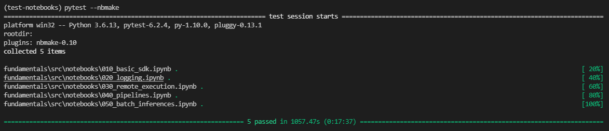

# Demo setup for the AzureML fundamentals Live event

[](https://github.com/Azure/fta-azure-machine-learning/actions/workflows/fundamentals-notebooks-ci.yml)

## Resources deployment

Use the following links to deploy the required resources in your Azure subscription.

[](https://portal.azure.com/#create/Microsoft.Template/uri/https%3A%2F%2Fraw.githubusercontent.com%2FAzure%2Ffta-azure-machine-learning%2Fmain%2Ffundamentals%2Fsrc%2Fdeployment%2Fdemo-deploy.json)
[](http://armviz.io/#/?load=https%3A%2F%2Fraw.githubusercontent.com%2FAzure%2Ffta-azure-machine-learning%2Fmain%2Ffundamentals%2Fsrc%2Fdeployment%2Fdemo-deploy.json)

> **Note**: If you have deleted a KeyVault with the same name recently, you will need to use `recover` create mode. See here how [purge protection](https://docs.microsoft.com/azure/key-vault/general/soft-delete-overview#purge-protection) works.

> **Note**: If you see an error regarding the shutdown schedule of the compute instance, you will need to delete the existing compute instance to re-deploy the template.

> If you already have tags in your resource group and you want to propagate them to your resources, you can use `[resourceGroup().tags]` in the **Resource Tags** parameter.

## Notebooks

The notebooks folder contain a couple of fundamental jupyter notebooks to demo various aspects of the AzureML SDK. It takes approximately 40 minutes to run all the notebooks.

### Testing notebooks from local machine

You can potentially test that all notebooks work well from your local computer.

- Deploy the resources using a service principal that has contributor role in the target resource group.

  ```bash
  az login --service-principal -u $ServicePrincipalId -p $ServicePrincipalPassword -t $ServicePrincipalAzureActiveDirectoryId
  az deployment group create --resource-group $ResourceGroupName --template-file deployment/demo-deploy.json
  ```

- Create a `config.json` file pointing to the newly deployed AzureML workspace.

  ```bash
  echo {"subscription_id": "$AzureSubscriptionId","resource_group": "$ResourceGroupName","workspace_name": "$AzureMLWorkspace"} > config.json
  ```

- Create a `conda` environment with all required packages.

  ```bash
  conda create -n test-notebooks python=3.6 pytest ipykernel
  conda activate test-notebooks
  pip install azureml-sdk pandas sklearn azureml-mlflow mlflow nbmake
  python -m ipykernel install --user --name python3-azureml
  ```

  > **Note:** This should normally be done through a `yaml` environment definition file.

- Run all notebooks.

  ```bash
  pytest --nbmake
  ```

The result should look like the following:


> **Note:** Notebook 030 requires more than 300 seconds to execute. By default `nbmake` has a 300 second timeout, something that got overridden by specifying `"execution":{"timeout": 990}` in the metadata section of the notebook.

## References

Various resources used while curating the demos:

- [Advanced ARM template for Compute Instance](https://github.com/Azure/azure-quickstart-templates/tree/master/quickstarts/microsoft.machinelearningservices/machine-learning-compute-create-computeinstance)
- [Setup scripts for Compute Instance](https://github.com/Azure/azureml-examples/tree/main/setup-ci)
- [Testing notebooks](https://github.com/treebeardtech/nbmake)
- [ARM deploy with GitHub Actions](https://github.com/Azure/arm-deploy)
