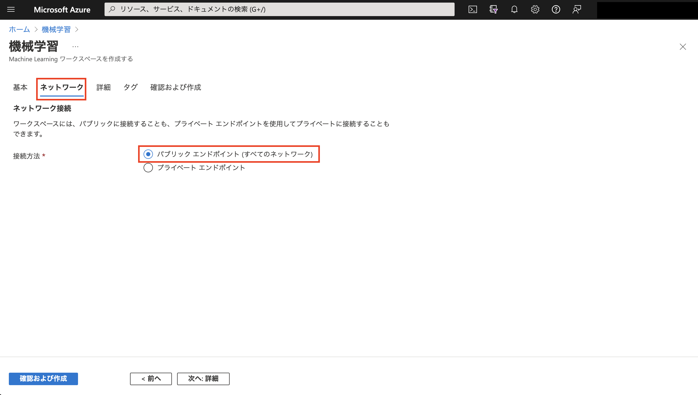

#### [Prev](../FTA-Live-AzureML-Fundamental.pdf) | [Home](../README.md)  | [Next](./azureml_studio_walk_through.md)

 

## Azure Machine Learning サービス作成

Azure Portal を利用した Azure Machine Learning (aka Azure ML) のサービスの作成方法を記載します。

 

### アジェンダ
0. [事前準備](#0-事前準備0-事前準備)
1. [Azure Portal でのサービス作成](#1-azure-portal-でのサービス作成1-azure-portal-でのサービス作成)
2. [作成されたサービスの確認](#2-作成されたサービスの確認)

 

### 0. 事前準備
- Azure のサブスクリプションがあること
- サービスを作成できる管理者権限があること

 

### 1. Azure Portal でのサービス作成

Azure Portal を開きます。上部の検索ボックスで "機械学習" と入力し、Azure Machine Learning に該当する "機械学習" を選択します。

Azure Machine Learning の作成済みリソースが表示されます。まだリソースがない場合は空です。"作成" をクリックして新規に Azure Machine Learning のサービス作成の設定を始めます。

基本タブでは、リソースグループの情報や関連する Azure サービスの情報を入力します。関連する Azure サービス (ストレージアカウント、キーコンテナー、Application Insights、コンテナーレジストリー) は既存のリソースを選択することもできますし、新規に作成することもできます。今回は全て新規に作成します。

ネットワークタブではワークスペースに対するプライベートリンクの設定が可能です。本デモンストレーションではデフォルトのパブリックエンドポイント (プレイベートリンクを利用しない設定) を利用します。

詳細タブでは主にセキュリティに関する設定をします。ストレージアカウントへのアクセス方法ですが、アクセスキーなどを利用した "資格情報ベースのアクセス"、もしくはユーザやマネージド ID を用いた接続のいずれかが選択できます。本デモンストレーションではデフォルト値の "資格情報ベースのアクセス" を利用します。

今回は設定しませんが、より機密性を高めたい場合にカスタマーマネージドーを利用する設定などが選択できます。

必要であればタグを付与します。

以上で設定が完了です。設定内容に誤りがないことを確認して "作成" をクリックし、Azure Machine Learning サービスを作成します。

---
参考情報
- [ポータルまたは Python SDK を使用して Azure Machine Learning ワークスペースを管理する](https://docs.microsoft.com/ja-JP/azure/machine-learning/how-to-manage-workspace?tabs=python)
- [Azure リソースの名前付け規則と制限事項 - Azure Machine Learning](https://docs.microsoft.com/ja-jp/azure/azure-resource-manager/management/resource-name-rules#microsoftmachinelearningservices)
- [名前付け規則を定義する (Cloud Adoption Framework)](https://docs.microsoft.com/ja-jp/azure/cloud-adoption-framework/ready/azure-best-practices/resource-naming)
---

 

### 2. 作成されたサービスの確認

サービスの作成が完了すると "デプロイが完了しました" と表示されます。"リソースに移動" をクリックすると作成された Azure Machine Learning の Azure Portal の画面に移動します。

この画面では関連する Azure サービスの情報やセキュリティ設定などのインフラ観点のメタデータが確認できます。なお実際にモデル作成などに従事する方はこの画面ではなく、Azure ML Studio で作業をします。"スタジオの起動" をクリックすることでアクセス可能です。

またリソースグループのリンクをクリックすると、Azure Machine Learning と同時に作成された関連する Azure のサービスが確認できます。

以上です。

---
参考情報
- [Azure Machine Learning ワークスペースとは - 関連付けられているリソース](https://docs.microsoft.com/ja-jp/azure/machine-learning/concept-workspace#resources)
---

 

#### [Prev](../FTA-Live-AzureML-Fundamental.pdf) | [Home](../README.md)  | [Next](./azureml_studio_walk_through.md)
