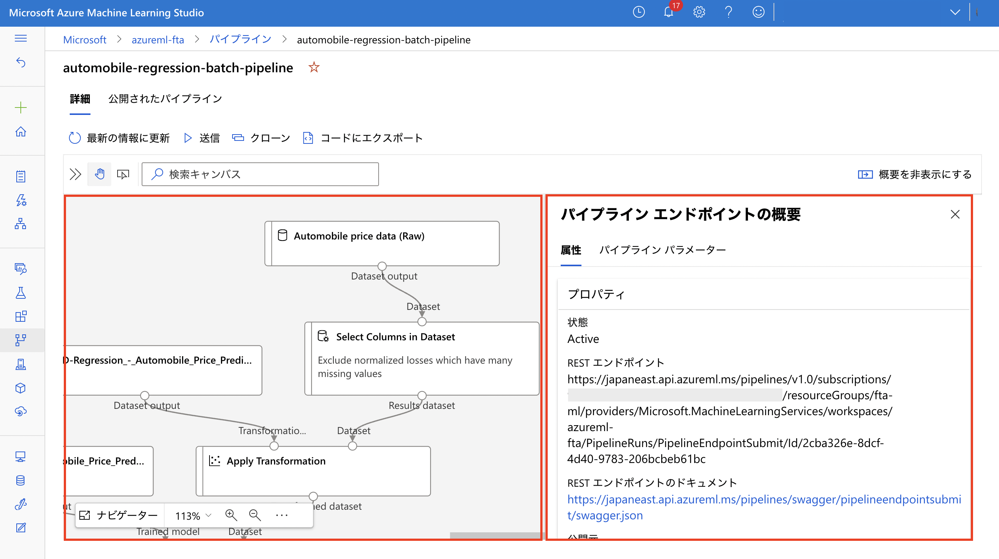

#### [Prev](./azure_portal_azureml.md) | [Home](../README.md)  | [Next](../src/notebooks/train-notebook.mdsrc/notebook/train-notebook.md)

 

## デモンストレーション : Azure Machine Learning Studio 

Azure Machine Learning Studio (aka Azure ML Studio) のデモンストレーションの手順を記載します。

 

### アジェンダ
1. [Azure ML Studio 画面構成](#1-azure-ml-studio-画面構成)
2. [コンピューティングインスタンス (Compute Instance) の作成](#2-コンピューティングインスタンス-compute-instance-の作成)
3. [コンピューティングクラスター (Compute Clusters) の作成](#3-コンピューティングクラスター-compute-clusters-の作成)
4. [環境 (Environments) の作成](#4-環境-environments-の作成)
5. [データストア (Datastores) の設定](#5-データストア-datastores-の設定)
6. [データセット (Datasets) の登録](#6-データセット-datasets-の登録)
7. [Notebooks の操作性](#7-notebooks-の操作性)
8. [自動機械学習 (AutoML) によるモデル開発とデプロイ](#8-自動機械学習-automl-によるモデル開発とデプロイ)
9. [デザイナー (Designer) によるモデル開発とデプロイ](#9-デザイナー-designer-によるモデル開発とデプロイ)

 

### 1. Azure ML Studio 画面構成
[ml.azureml.com](ml.azurem.com) にアクセスします。基本的には左のメニューから各種機能にアクセスして作業をします。

---
参考情報
- [Azure Machine Learning スタジオとは](https://docs.microsoft.com/ja-jp/azure/machine-learning/overview-what-is-machine-learning-studio)
---

 

### 2. コンピューティングインスタンス (Compute Instance) の作成

> :warning: Azure ML のマネージドな計算環境は Azure のサブスクリプション単位でクオータが設定されています。クオータは利用可能なコア数の設定値です。事前にクオータの値を確認することを推奨します。足りない場合には早めにサポートにリクエストを上げてください。詳細は [Azure Machine Learning を使用するリソースのクォータの管理と引き上げ](https://docs.microsoft.com/ja-JP/azure/machine-learning/how-to-manage-quotas) をご確認ください。

Azure Machine Learning の Compute Instance を起動します。

コンピューティング (Compute) のコンピューティングインスタンス (Computing Instance) のタブから「新規」をクリックします。

次に、必須の構成に関する情報を設定します。
- コンピューティング名 : Azure の各リージョンでユニークな名前になるように設定
- 仮想マシンの種類 : CPU
- 仮想マシンのサイズ : クォータの余裕があればどの VM シリーズ選んでも OK (4 core 以上を推奨)

Jupyter などの開発環境の起動できることを確認します。

---
参考情報
- [Azure Machine Learning コンピューティング インスタンスとは](https://docs.microsoft.com/ja-jp/azure/machine-learning/concept-compute-instance)
---
 

### 3. コンピューティングクラスター (Compute Clusters) の作成
「新規」からコンピューティングクラスターを作成していきます。 
 

(例えば) Standard_F4s_v2 などの VM ファミリーを選択します。 
 

名称は `cpu-clusters` とし、最小ノード数は 0、最大ノード数は 4 などに設定し、コンピューティングクラスターを作成します。 
 

正常に作成されたことを確認します。 
 

---
参考情報
- [Azure Machine Learning コンピューティング (マネージド)](https://docs.microsoft.com/ja-jp/azure/machine-learning/concept-compute-target#azure-machine-learning-compute-managed)
---

 

### 4. 環境 (Environments) の作成

環境の名称は `lightgbm-python-env` とし、「Python 仮想環境」を選択し、Python ライブラリとそのバージョンが記載されている [../src/environments/conda-env.yml](../src/environments/conda-env.yml) の内容をコピー&ペーストします。 
次へ進み、内容に誤りない確認をして環境を作成します。 

  

正常に環境が登録されていることを確認します。

 

> :exclamation: Microsoft 製品における Anaconda のライセンスについては [Anaconda licensing for Microsoft products and services](https://docs.microsoft.com/ja-jp/legal/machine-learning/conda-licensing) を参照ください。

---
参考情報
- [Azure Machine Learning 環境とは?](https://docs.microsoft.com/ja-jp/azure/machine-learning/concept-environments)
---

 

### 5. データストア (Datastores) の設定

データストア (Datastores) の機能にアクセスします。

 

いくつかのデータストア (Datastores) が登録済みですが、その中でもデータセット (Datasets) 作成時にデフォルトで利用されるデータストアの "workspaceblobstore" を選択します。

 

表示される画面に接続先の Azure Blob Storage の情報が表示されていたり、"認証の更新"をクリックすることで、認証方法を設定・変更することができます。

> :warning: デフォルトではアクセスキーなどの資格情報を使いますが、Azure Active Directory トークンを利用した ID ベースのアクセスも設定可能です。ただし自動機械学習 (AutoML) のシナリオではサポートされません (2022年4月現在)。

 

今回のデモンストレーションではデータストア (Datastores) の存在は意識しなくても操作できますが、Azure ML Workspace に新たにデータソースを接続したい場合は理解しておく必要があります。

---
参考情報
- [Azure Machine Learning スタジオを使用してデータに接続する](https://docs.microsoft.com/ja-jp/azure/machine-learning/how-to-connect-data-ui?tabs=credential)
- [Azure Machine Learning でのデータ アクセスをセキュリティ保護する](https://docs.microsoft.com/ja-jp/azure/machine-learning/concept-data)
---

 

### 6. データセット (Datasets) の登録
モデル学習に必要なデータセット (Datasets) を作成します。
今回はデータストアにあるデータを利用するのではなく、ブラウザを開いている作業端末に CSV (data フォルダの [Titanic.csv](../src/data/Titanic.csv)) をダウンロードして、データセット (Datasets) として登録します。アップロード時に自動的にデフォルトのデータストアである "workspaceblobstore" にファイルが保存されています。

データセットの名称は `titanic` として、データセットの種類は _表形式_ とします。

 

data フォルダの Titanic.csv データをアップロードします。次にファイル形式、区切り記号などの情報に誤りがないことを確認して次に進みます。 

スキーマの設定に誤りがないことを確認して次に進み、データセットの登録を完了します。

正常に登録されていることを確認します。

---
参考情報
- [Azure Machine Learning スタジオを使用してデータに接続する](https://docs.microsoft.com/ja-jp/azure/machine-learning/how-to-connect-data-ui?tabs=credential)
- [Azure Machine Learning でのデータ アクセスをセキュリティ保護する
](https://docs.microsoft.com/ja-jp/azure/machine-learning/concept-data)
---

 

### 7. Notebooks の操作性

Compute Instance を利用したコードを開発・編集・実行することができます。インターフェースとして、Azure ML Studio に統合された Notebooks を利用することができます。

 

他には Compute Instance が対応している開発環境として Notebooks のインターフェースから Jupyter、JupyterLab、VSCode が選択できます (R Studio は Compute Instance の画面から選択可能)。

 

---
参考情報
- [ワークスペースで Jupyter Notebook を実行する](https://docs.microsoft.com/ja-jp/azure/machine-learning/how-to-run-jupyter-notebooks)
---

 

### 8. 自動機械学習 (AutoML) によるモデル開発とデプロイ

自動機械学習 (AutoML) は Azure ML Studio もしくは Azure ML Python SDK などのコードから実行することができます。Azure ML Studio での実行はあまり細かい設定はできませんが、機械学習のタスクに対応しているデータセット (Datasets) があれば簡単に実行することができます。

"新しい自動 ML の実行" をクリックして自動機械学習の設定を始めます。

 

最初に対象のデータセット (Datasets) である `Titanic` を選択します。タイタニック号の乗客情報とそれぞれの生死のフラグデータが含まれます。

 

任意の実験名を記入し、予測の対象をする変数であるターゲット変数を選択します。Titanic 号のサンプルデータでは `Survived` を選択します。生死のフラグ変数です。

また、計算環境としてコンピューティングクラスター (Compute Clusters) の `cpu-clusters` を選択します。

 

機械学習のタスクを設定します。今回のデータは Titanic 号の乗客の生死 `Survived` の予測 (=2 値分類) なので "分類" を選択します。

 

次に検証方法として "k 分割交差検証" (クロスバリデーション) を "5" のクエス検証数で設定し、テストデータを学習データからランダムに 10 % 設定します。"終了" を押下して自動機械学習によるモデル学習を開始します。

 

モデル学習が始まると "状態" が "実行中 モデルトレーニング" と表示されます。

 

モデル学習が完了すると "状態" が "完了" と表示されます。また左上の "最適なモデルの概要" セクションから最終的に精度が一番高かったアルゴリズムや精度の情報などが表示されます。

 

"データガードレール" タブではモデル学習前のデータ前処理におけるデータ品質の確認結果が表示されます。

 

"モデル" タブでは試行されたモデルの一覧が確認できます。一番精度が高い試行に関してはデフォルトで説明性が付与されます。

 

一番精度が高かったモデルの詳細を確認します。

 

"メトリック"タブでは、モデルの精度が数値やチャートから確認できます。

 

"データ変換 (プレビュー)"タブでは、データ前処理の流れを確認することができます。

 

"説明 (プレビュー)" ではモデル説明性を確認することができます。説明 ID が二つありますが、上の方はデータ前処理を実行する前の変数名で表示され、下の方はデータ前処理後の変数名で表示されるという違いあります。

 

細かいログは "出力とロブ"タブから確認することができます。

 

以上までがモデル学習の部分です。以下、モデルのエンドポイント (Endpoints) の作成を進めていきます。

今回は Azure Container Instance に学習済みモデルを Web サービスとしてデプロイします。リアルタイム推論の形態です。"デプロイ"ボタンから "Web サービスへの配置" をクリックします。

 

エンドポイントの名前を入力し、コンピューティングの種類として "Azure コンテナーインスタンス" を選択します。この環境は主にテスト用に用いられます。本番用途であれば Azure Kubernetes Services にデプロイすることを推奨します。

自動機械学習 (AutoML) のモデルであればコードの開発や環境 (Environments) の設定は不要です。Azure ML 側で自動で実行されます (モデルがお客様自身で開発されたものであれば推論コードや環境設定が必要です)し、カスタマイズすることも可能です。"デプロイ" をクリックしてデプロイメントを開始します。

 

デプロイが完了するとエンドポイントが生成され、利用したモデルの情報などのメタデータが確認できます。

 

"テスト"タブではモデルにテストデータをインプットし予測値を取得することができます。

 

また "使用"タブからは、Python や C# から利用するためのサンプルコードが表示されます。

 

---
参考情報
- [スタジオ UI を使用してコード不要の自動 ML トレーニングを設定する](https://docs.microsoft.com/ja-jp/azure/machine-learning/how-to-use-automated-ml-for-ml-models)
---

 

### 9. デザイナー (Designer) によるモデル開発とデプロイ

デザイナー (Designer) は、マウスのドラッグ&ドロップでモデル学習やリアルタイム・バッチ推論のパイプラインを作成し実行することができる機能です。

ここではサンプルにある "Regression - Automobile Price Prediction (Basic)" を使います。

 

学習パイプラインのドラフトが表示されます。

 

設定からパイプラインで利用するコンピューティングクラスター (Compute Clusters) を選択します。

 

"送信" をクリックし、任意の実験名を記載し、パイプラインを実行します。

 

実験が完了すると、各モジュールに "完了" というメッセージが表示されます。

 

モデルが完成したので推論環境を構築していきます。

> :exclamation:: デザイナー (Desginer) はリアルタイム推論とバッチ推論の両方をサポートしていますが、自動機械学習 (AutoML) はリアルタイム推論のみサポートしています。

"推論パイプラインの作成" から "リアルタイム推論パイプライン" をクリックします。

 

リアルタイム推論専用のタブページが作成され、ドラフトのパイプラインが表示されます。

 

デプロイ前にこのパイプラインを実行します。"送信" をクリックし、任意の実験名を入力して実行します。

 

実行が完了すると先ほどと同様、各モジュールに "完了" というメッセージが表示されます。

 

次にこのリアルタイム推論パイプラインを Azure Container Instance にデプロイします。"デプロイ" をクリックし、任意の名前を入力し、コンピューティングの種類で "Azure コンテナーインスタンス" を選択し、デプロイを開始します。

 

デプロイが正常に完了するとデプロイ状態が "Healty" と表示されます。その他作成日などのメタデータも確認することができます。

 

また、テストタブの画面では推論環境にテストデータを送信して、予測値を取得する流れを検証することができます。

 

テストタブの画面では推論環境の REST API の URI や認証に用いるアクセスキー、Python や C# のサンプルコードにアクセスできます。

 

次にバッチ推論のパイプラインを作成します。先ほどと同様 "推論パイプラインの作成" をクリックし、今回は "バッチ推論パイプライン" を選択します。

 

パイプラインのドラフトが表示されます。

 

"送信" をクリックし、任意の実験名を記載し、パイプラインを実行します。

 

実験が完了すると、各モジュールに "完了" というメッセージが表示されます。

 

次にこのバッチ推論パイプラインを公開します。

 

パイプラインのメニューの "パイプライン エンドポイント" のタブページでバッチ推論のパイプラインが確認できます。

 

パイプライン名のリンクをクリックすると REST API の RUI やパイプラインのチャートなどの情報が確認できます。

 

以上です。

---
参考情報
- [Azure Machine Learning デザイナーとは](https://docs.microsoft.com/ja-jp/azure/machine-learning/concept-designer)
- [Azure Machine Learning デザイナーのパイプラインとデータセットのサンプル](https://docs.microsoft.com/ja-jp/azure/machine-learning/samples-designer)
- [チュートリアル:Power BI 統合 - ドラッグ アンド ドロップで予測モデルを作成する (パート 1/2)](https://docs.microsoft.com/ja-jp/azure/machine-learning/tutorial-power-bi-designer-model)
---

 

#### [Prev](./azure_portal_azureml.md) | [Home](../README.md)  | [Next](../src/notebooks/train-notebook.mdsrc/notebook/train-notebook.md)
