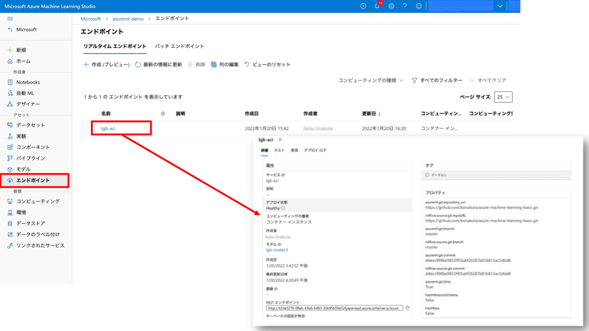

#### [Prev](./train-notebook.md) | [Home](../../README.md)

<br/>

# Azure Machine Learning による機械学習プロセス - デプロイ編

## アジェンダ
### A. 学習編
- ワークスペース (Workspace) への接続
- データセット (Datasets) の登録
- 環境 (Environments) の登録
- コンピューティングクラスター (Compute Clusters) の作成
- モデル学習の実行と実験 (Runs & Experiments)
- モデル登録 (Models)

### **B. デプロイ編 (本ノートブック)**
- ワークスペース (Workspace) への接続
- 推論環境の作成 (Endpoints)
- エンドポイントの利用 (Endpoints)

## 事前設定
- 本ノートブックは Azure Machine Learning の Compute Instances を利用することを想定しています。
- 開発環境は JupyterLab, VSCode, Integrated Notebook など Compute Instances で稼働するものであれば自由に選択いただけます。
- カーネルは `python38-azureml (Python 3.8 AzureML)` を選択ください。

<br>

## ワークスペース (Workspace) への接続
クライアント環境の Python 環境にインストールした Azure ML Python SDK を用いて Azure Machine Learning Workspace に接続します。


```python
# Compute Instances を利用する場合
from azureml.core import Workspace

ws = Workspace.from_config()
```


```python
# # その他の任意のクライアント環境を利用する場合
# ws = Workspace.get(
#     name='name',
#     subscription_id='subscription_id',
#     resource_group='resource_group',
# )
```

<br>

## 推論環境の作成 (Endpoints)
下記の情報を利用してモデルをデプロイし、推論環境を作成します。
- 登録済みのモデル (Modelss)
- 推論環境で稼働する環境 (Environments)
- 推論スクリプト : _score.py_


```python
from azureml.core.environment import Environment
from azureml.core import Model
from azureml.core.webservice import LocalWebservice, AciWebservice
from azureml.core.model import InferenceConfig
```

##### 登録済みのモデル (Models)


```python
model = Model(ws, "lgb-model")
```

##### 推論環境で稼働する環境 (Environments)


```python
env = Environment.get(ws, "lightgbm-python-env")
# env.inferencing_stack_version = 'latest'
```


```python
env
```

##### 推論スクリプト _score.py_
`script` フォルダに予め作成済みです。

```python
import os
import json
import numpy as np
import pandas as pd
import lightgbm as lgb

def data_preprocess(df, categorical_cols, float_cols):
    df[categorical_cols] = df[categorical_cols].astype('category')
    df[float_cols] = df[float_cols].astype('float')
    return df


def init():
    global bst
    model_root = os.getenv("AZUREML_MODEL_DIR")
    # The name of the folder in which to look for LightGBM model files
    lgbm_model_folder = "model"
    bst = lgb.Booster(
        model_file=os.path.join(model_root, lgbm_model_folder, "model.lgb")
    )


def run(raw_data):
    categorical_cols = ['Name', 'Sex', 'Ticket', 'Cabin', 'Embarked']
    float_cols = ['Pclass', 'Age', 'SibSp', 'Parch', 'Fare']
    columns = bst.feature_name()
    data = np.array(json.loads(raw_data)["data"])
    test_df_original = pd.DataFrame(data=data, columns=columns)
    test_df = data_preprocess(test_df_original, categorical_cols, float_cols)
    # Make prediction
    out = bst.predict(test_df)
    return out.tolist()
```

コードや環境 (Environments) の情報を設定します。


```python
inference_config = InferenceConfig(
    entry_script="score.py", source_directory="script", environment=env
)
```

最初にローカル環境にデプロイをします。


```python
localconfig = LocalWebservice.deploy_configuration(port=8890)
local_service_name = "ftalive-localmodel"
local_service = Model.deploy(
    workspace=ws,
    name=local_service_name,
    models=[model],
    inference_config=inference_config,
    deployment_config=localconfig,
    overwrite=True,
)
```

テストデータを入力して予測値を算出します。


```python
import json

# テストデータ
data = {
    "data": [
        [
            2,
            "Kvillner, Mr. Johan Henrik Johannesson",
            "male",
            31,
            0,
            0,
            "C.A. 18723",
            10.5,
            "",
            "S",
        ]
    ]
}

test_sample = json.dumps(data)
test_sample = str.encode(test_sample, encoding="utf8")

prediction = local_service.run(input_data=test_sample)
print(prediction)
```

<br>

次に Azure Container Instance へデプロイをします。


```python
aciconfig = AciWebservice.deploy_configuration(auth_enabled=True)
```

Azure Container Instance にモデルをデプロイします。<br>
なお、`service_name` は文字から始まる 3 以上 32 小文字・数字・記号 (ダッシュのみ)で記載ください。


```python
aciconfig.validate_configuration()
```


```python
service_name = "ftalive-lgb-aci"
service = Model.deploy(
    workspace=ws,
    name=service_name,
    models=[model],
    inference_config=inference_config,
    deployment_config=aciconfig,
    overwrite=True,
)
```


```python
service.wait_for_deployment(show_output=True)
```


```python
service.get_logs()
```

Azure Machine Learning Studio にて正常に登録されていることを確認します。<br>
<br>


<br>

## エンドポイントの利用 (Endpoints)
推論環境にテストデータをインプットして、デプロイした機械学習モデルから予測値を算出します。


```python
import urllib.request
import json

# テストデータ
data = {
    "data": [
        [
            2,
            "Kvillner, Mr. Johan Henrik Johannesson",
            "male",
            31,
            0,
            0,
            "C.A. 18723",
            10.5,
            "",
            "S",
        ]
    ]
}
body = str.encode(json.dumps(data), encoding="utf8")
```


```python
url = service.scoring_uri
key, _ = service.get_keys()
headers = {"Content-Type": "application/json"}
headers["Authorization"] = f"Bearer {key}"
req = urllib.request.Request(url, body, headers)
```


```python
try:
    response = urllib.request.urlopen(req)

    result = response.read()
    print(result)
except urllib.error.HTTPError as error:
    print("The request failed with status code: " + str(error.code))

    # Print the headers - they include the requert ID and the timestamp, which are useful for debugging the failure
    print(error.info())
    print(json.loads(error.read().decode("utf8", "ignore")))
```

<br/>

#### [Prev](./train-notebook.md) | [Home](../../README.md)
