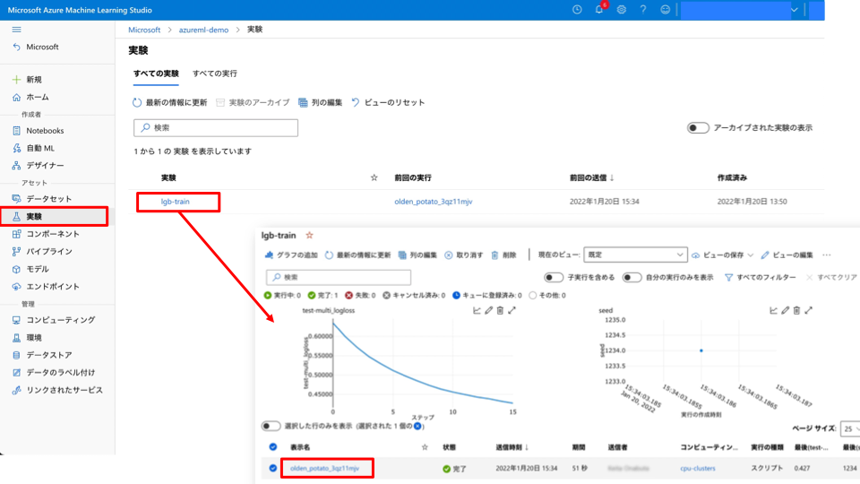

#### [Prev](./azureml_studio_walk_through.md) | [Home](../README.md)  | [Next](./deploy-notebook.md)

<br/>

# Azure Machine Learning による機械学習プロセス - モデル学習編
本ノートブックでは、オープンソースライブラリの LightGBM (Python API) を用いたモデルを構築します。各機械学習プロセスを Azure Machine Learning Python SDK を用いて実行します。

## アジェンダ
### **A. 学習編 (本ノートブック)**
- ワークスペース (Workspace) への接続
- データセット (Datasets) の登録
- 環境 (Environments) の登録
- コンピューティングクラスター (Compute Clusters) の作成
- モデル学習の実行と実験 (Runs & Experiments)
- モデル登録 (Models)

### B. デプロイ編
- ワークスペース (Workspace) への接続
- 推論環境の作成 (Endpoints)
- エンドポイントの利用 (Endpoints)

## 事前設定
- 本ノートブックは Azure Machine Learning の Compute Instances を利用することを想定しています。
- 開発環境は JupyterLab, VSCode, Integrated Notebook など Compute Instances で稼働するものであれば自由に選択いただけます。
- カーネルは `python38-azureml (Python 3.8 AzureML)` を選択ください。

<br>

## ワークスペース (Workspace) への接続
クライアント環境の Python 環境にインストールした Azure ML Python SDK を用いて Azure Machine Learning Workspace に接続します。


```python
# Compute Instances を利用する場合
from azureml.core import Workspace

ws = Workspace.from_config()
```


```python
# # その他の任意のクライアント環境を利用する場合
# ws = Workspace.get(
#     name='name',
#     subscription_id='subscription_id',
#     resource_group='resource_group',
# )
```

<br>

## データストア (Datastores) の利用
データソースへの接続情報を保持しているデータストア (Datastores) を利用して、CSV ファイルを Azure ストレージ (Azure ML のデフォルトストレージ) にアップロードします。


```python
# データストア (Datastores) へのアップロード
datastore = ws.get_default_datastore()
datastore.upload_files(
    files=["../data/Titanic.csv"], target_path="demo", overwrite=True
)
```

## データセット (Datasets) の登録
データストア (Datstores) として定義されたAzure のストレージやデータベースに格納されているデータをデータセット (Datasets) として登録します。


```python
from azureml.core import Dataset

# データセット (Datasets) の登録
datastore_paths = [(datastore, "demo/Titanic.csv")]
# 表形式を選択
titanic_ds = Dataset.Tabular.from_delimited_files(path=datastore_paths)
titanic_ds.register(ws, "titanic", create_new_version=True)
```

Azure Machine Learning Studio にて正常に登録されていることを確認します。<br>
<br>

<br>

## 環境 (Environments) の登録
モデル学習や推論で利用する Python ライブラリとそのバージョンを環境 (Environments) として登録します。

環境の名称は `lightgbm-python-env` とし、「Python 仮想環境」を選択し、Python ライブラリとそのバージョンが記載されている [environments/requirements.txt](environments/requirements.txt) のファイルを読み込み、環境を作成します。


```python
from azureml.core import Environment

environment_name = "lightgbm-python-env"
pip_file_path = "../environments/requirements.txt"
conda_file_path = "../environments/conda-env.yml"
env = Environment.from_conda_specification(
    name=environment_name, file_path=conda_file_path
)
# env = Environment.from_pip_requirements(name = environment_name, file_path = pip_file_path)
env.register(ws)
```

Azure Machine Learning Studio にて正常に登録されていることを確認します。<br>
<br>

<br>

## コンピューティングクラスター (Compute Clusters) の作成
(バッチ的な) モデル学習に利用する計算クラスターであるコンピューティングクラスター (Compute Clusters) を作成します。

名称は `cpu-clusters` とし、(例えば) Standard_F4s_v2 VM ファミリーを選択します。<br>
最小ノード数は 0、最大ノード数は 4 などに設定し、コンピューティングクラスターを作成します。<br>


```python
compute_name = "cpu-clusters"
```


```python
from azureml.core.compute import ComputeTarget, AmlCompute

# TODO: 仮想ネットワークの情報を記載
# vnet_resourcegroup_name = ""
# vnet_name = ""
# subnet_name = "default"

if compute_name not in ws.compute_targets:  # compute_name の名前の Compute Cluster が無ければ...
    compute_config = AmlCompute.provisioning_configuration(
        vm_size="Standard_F4S_V2",
        max_nodes=4,
        idle_seconds_before_scaledown=300,
        # vnet_resourcegroup_name=vnet_resourcegroup_name,
        # vnet_name=vnet_name,
        # subnet_name=subnet_name
    )

    ct = ComputeTarget.create(ws, compute_name, compute_config)
    ct.wait_for_completion(show_output=True)
```

Azure Machine Learning Studio にて正常に登録されていることを確認します。<br>
<br>

<br>

## モデル学習の実行 (Runs & Experiments)
モデル学習を実行します。それぞれの実行 (Runs) は実験 (Experiments) に情報が集約されます。実験名は `ftalive-lgb-train` とします。


```python
from azureml.core import Experiment

experiment_name = "ftalive-lgb-train"
experiment = Experiment(ws, experiment_name)
```

ScriptRunConfig で実行の構成設定をします。
- 参考ドキュメント : [トレーニングの実行を構成して送信する - スクリプト実行構成とは](https://docs.microsoft.com/ja-JP/azure/machine-learning/how-to-set-up-training-targets#whats-a-script-run-configuration)

なお、学習コードは [script/train-lgb.py](script/train-lgb.py) から確認できます。学習データは Azure Machine Learning に登録されているものを呼びだしています。メトリックの記録は MLflow の Autolog 機能などを用いています。


```python
from azureml.core import ScriptRunConfig

script_dir = "script"
script_name = "train-lgb.py"
args = ["--input-data", titanic_ds.as_named_input("titanic")]

src = ScriptRunConfig(
    source_directory=script_dir,
    script=script_name,
    environment=env,
    arguments=args,
    compute_target=compute_name,
)
```

ジョブを実行します。


```python
run = experiment.submit(src)
run
```

ジョブ実行が完了するまで待機します。


```python
run.wait_for_completion(show_output=True)
```


```python
# run.download_files(output_directory=experiment_name+"_logging")
```


```python
run
```

Azure Machine Learning Studio にて正常にジョブが実行されたことを確認します。<br>
<br>
実行時間、メトリック、コードなどの情報が確認できます。<br>
<br>


<br>

## モデル登録 (Models)
ジョブ実行の run オブジェクトを利用して、モデル登録をします。<br>
※ Azure Machine Learning Studio 経由で実行する場合と違って、クライアント端末への学習済みモデルのダウンロードは不要です。


```python
model = run.register_model(
    model_name="ftalive-lgb-model",
    model_framework="LightGBM",
    model_framework_version="3.3.1",
    tags={"algorithm": "lightGBM"},
    model_path="model",
)
```

Azure Machine Learning Studio にて正常に登録されていることを確認します。<br>
<br>

<br/>

#### [Prev](./azureml_studio_walk_through.md) | [Home](../README.md)  | [Next](./deploy-notebook.md)
