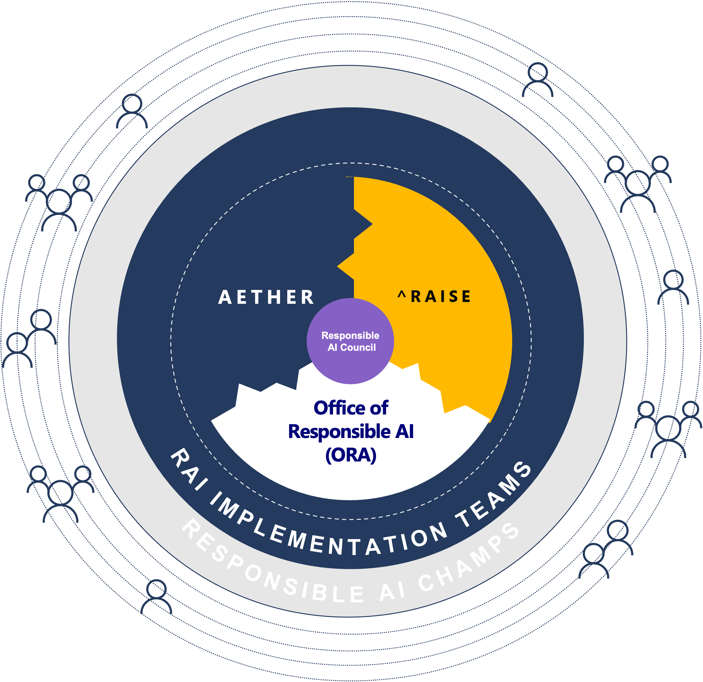

# Responsible AI

AI is one of the most exciting technology developments in our time. It has the potential to transform our lives in ways we can only imagine. However, AI can also be used in ways that are harmful to people and society. This is why it is important to ensure that AI is developed and used responsibly.

There have been numerous examples of AI being used in ways that are harmful to people and society - both intentionally and accidently:

* [AI used to predict criminality](https://mindmatters.ai/2022/07/can-ai-really-predict-crime-a-week-in-advance-thats-the-claim/)
* [Millions of black people affected by racial bias in health-care algorithsm](https://www.nature.com/articles/d41586-019-03228-6)

This live session will introduce concepts such as Microsoft's Responsible AI Principles from the perspective of our internal efforts, discuss how organisations can adopt RAI practises, and incorporate RAI into their machine learning lifecycle from a technical perspective.

<br/>

## Agenda
1. [Responsible AI Overview](#rai_overview)
2. [Understand machine learning models](#2-understand-ml)
3. [Protect your machine learning models and data](#3-protect-ml)
4. [References](#4-references)

<br/>

---

 ## <a name="1-rai-overview"></a>1. Responsible AI Overview
In this section, we provide an overview of Responsible AI, describing Microsoft's journey from thought to processes, frameworks, and tools, including the steps we're taking to ensure that AI is developed and used responsibly.

<br/>

### Background

As AI technology evolves rapidly, the need for transparency across AI systems is growing due to the way that AI systems can operate - exhibiting human-like characterstics - and their potential for large-scale social impact. AI systems without transparency reduce stakeholder trust and is one of the major contributors to the lack of adoption.  However, Responsible AI is not yet widely understood or adopted by many of the companies that are developing and using AI systems.  There may be no guidance or rules around who is responsibie for the challenges of AI systems, such as privacy concerns, malfunctions, and possible side effects. The purpose of this section is to explain Responsible AI concepts and technologies, and help you build, operate, and manage  human-centric, trusted, and transparent AI systems.

"The more powerful the tool, the greater the benefit or damage it can cause…Technology innovation is not going to slow down.  The work to manage it needs to speed up."
Brad Smith, President and Chief Legal Officer, Microsoft

<br/>

### Microsoft's Responsible AI Commitment

Microsoft has been on the Responsible AI journey since 2016.


- 2016 : Microsoft CEO Satya Nadella posts an op-ed titled [The Partnership of the Future](https://slate.com/technology/2016/06/microsoft-ceo-satya-nadella-humans-and-a-i-can-work-together-to-solve-societys-challenges.html). It mentions the transparency, efficiency, respect for privacy, and protection from bias in AI systems.
- 2017 : Founded AETHER (AI, Ethics, and Effects in Engineering and Research). This organisation is Microsoft's strategic Responsible AI organisation and makes recommendations on a variety of Responsible AI challenges, technologies, processes, and best practices.
- 2018 : Published a book called [The Future Computed](https://blogs.microsoft.com/blog/2018/01/17/future-computed-artificial-intelligence-role-society/). It outlines Microsoft's views on the challenges AI poses to society, how AI can be developed and operated responsibly, and how governance should be established. It also mentions six basic principles that we'll discuss later. It also calls for the need for transparency in facial recognition technology and the legal-regulation of testing by independent third-party organisations.
- 2019 : Established Office of Responsible AI to develop policies and governance processes.
- 2020 : RAISE (Responsible AI Strategy in Engineering) was established to facilitate the implementation of Responsible AI rules and processes across engineering groups.
- 2021 : Responsible AI Standard (v2) published. Recently, in order to convey the knowledge that Microsoft has cultivated to society and customers, we have released [AI Business School](https://www.microsoft.com/ai/ai-business-school), which is contains learning material, guidelines, targetted at business decision makers to help learn about Responsible AI.

<br/>

### Responsible AI Principles

Microsoft believes that the development and deployment of AI must be guided by the creation of an ethical framework. We set out our view in The Future Computed that there are six core principles that should guide the work around AI. Four core principles of fairness, reliability & safety, privacy & security, and inclusiveness, underpinned by two foundational principles of transparency and accountability 

<br/>


- Fairness
    - AI systems should treat everyone fairly and avoid affecting similarly situated groups of people in different ways. For example, when AI systems provide guidance on medical treatment, loan applications, or employment, they should make the same recommendations to everyone with similar symptoms, financial circumstances, or professional qualifications. 
    - Examples:
        - [Racial Bias in Healthcare Algorithm](https://www.nature.com/articles/d41586-019-03228-6)
        - [Gender Bias in roles](https://www.bing.com/images/search?q=ceo&form=HDRSC3&first=1&tsc=ImageHoverTitle)
- Reliability & Safety
    - To build trust, it’s also important that AI systems operate reliably, safely, and consistently under normal circumstances and in unexpected conditions. How they behave and the variety of conditions they can handle reliably and safely largely reflects the range of situations and circumstances that developers anticipate during design and testing.
    - Examples:
        - [Driving to Safety](https://www.rand.org/pubs/research_reports/RR1478.html)
- Privacy & Security
    - It’s also crucial to develop AI systems that can protect private information and resist attacks. As AI becomes more prevalent, protecting privacy and securing important personal and business information is becoming more critical and complex. Privacy and data security issues require especially close attention for AI because access to data is essential for AI systems to make accurate and informed predictions and decisions about people. 
    - Examples:
        - [How Target Figured Out A Teen Girl Was Pregnant Before Her Father Did](https://www.forbes.com/sites/kashmirhill/2012/02/16/how-target-figured-out-a-teen-girl-was-pregnant-before-her-father-did/?sh=1826a54c6668)
- Inclusiveness
    - AI can improve access to education, government services, employment, information, and a wide range of other opportunities. Inclusive design practices can help system developers understand and address potential barriers in a product environment that could unintentionally exclude people. By addressing these barriers, we create opportunities to innovate and design better experiences that benefit everyone.
- Transparency
    - When AI systems are used to help inform decisions that have tremendous impacts on people’s lives, it’s critical that people understand how those decisions were made. A crucial part of transparency is what we refer to as intelligibility or the useful explanation of the behavior of AI systems and their components. 
- Accountability
    - The people who design and deploy AI systems must be accountable for how their systems operate. The need for accountability is particularly crucial with sensitive use technologies like facial recognition.
    - Examples:
        - [UK Official Says It's Too Expensive to Delete All the Mugshots of Innocent People in Police Databases](https://gizmodo.com/uk-official-says-its-too-expensive-to-delete-all-the-mu-1825388626)


### Putting Responsible AI into Practice

We put Responsible AI and our principles into practice through the development of resources and a system of governance.  


#### Strategy

At the core of our approach are the six principles just mentioned (Fairness, Reliability & Safety, Privacy & Security, Inclusiveness, Transparency, Accountability).


#### Practices
For us, putting responsible AI into action starts with practices that are grounded in human-centric design that spans roles 
Taking over 20 years of research and applying it in the development of AI guidelines and standards that are meant to help other anticipate and address potential issues throughout the software development lifecycle, and develop a responsible AI system. 

Some of our guidelines include:

- [Human-AI Guidelines](https://www.microsoft.com/en-us/haxtoolkit/ai-guidelines/)
    - [Human-AI eXperiences (HAX)](https://www.microsoft.com/en-us/haxtoolkit/) Toolkit。
- [Conversational AI Guidelines](https://www.microsoft.com/en-us/research/publication/responsible-bots/)
- [Inclusive Design Guidelines](https://www.microsoft.com/design/inclusive/)
- [AI Fairness Checklist](https://www.microsoft.com/en-us/research/project/ai-fairness-checklist/)
- [Datasheets for Datasets](https://www.microsoft.com/en-us/research/project/datasheets-for-datasets/)
- [AI Security Guidelines](https://blogs.microsoft.com/on-the-issues/2019/12/06/ai-machine-learning-security/)

As a result of that effort Transparency Notes (e.g. [Transparency Note for Azure Cognitive Service for Language](https://docs.microsoft.com/en-us/legal/cognitive-services/language-service/transparency-note)), helps communicate about the purpose, capabilities, and limitations of our AI systems, bridges the gap between marketing and technical writing, and proactively communicates what customers need to know to responsibly adopt AI.  Other guidelines for responsible AI in Azure Cognitive Services can be found in [Responsible use of AI in Cognitive Services](https://learn.microsoft.com/en-us/azure/cognitive-services/responsible-use-of-ai-overview).


#### Tools

In addition to practices, we’ve developed a set of tools to help others understand, protect, and control their AI at every stage of innovation.

Our tools are a result of collaboration across disciplines to strengthen and accelerate responsible AI, spanning software engineering and development to social sciences, user research, law and policy. 

The tools range from a variety of asset types:

At the highest level, we’ve launched a series of research papers that set the context behind AI systems. 

To further collaboration, we've open-source many tools and datasets that others can use to contribute and build upon.

We've also democratised our tools through our managed services offered through Azure Machine Learning. 


- Understand
    - AI systems can behave unexpectedly for a variety of reasons. Software tools can help you understand the behavior of your AI systems so that you can better tailor them to your needs.
    - Tools: [InterpretML](https://interpret.ml), [Fairlearn](https://fairlearn.org/), [Error Analysis](https://erroranalysis.ai/), [Causal Inference](https://github.com/interpretml/DiCE), [Counterfactual Analysis](https://github.com/microsoft/EconML), [Responsible AI Toolbox](https://responsibleaitoolbox.ai/).
- Protect
    - AI systems rely on data. Software tools can help you protect that data by preserving privacy and ensuring confidentiality.
    - Tools: [SmartNoise differential privacy](https://smartnoise.org/), [Presidio de-identification](https://microsoft.github.io/presidio/), [Confidential Computing for Machine Learning](https://azure.microsoft.com/solutions/confidential-compute/), [Homomorphic Encryption](https://www.microsoft.com/research/project/microsoft-seal/), [Counterfit](https://github.com/Azure/counterfit/).
- Control
    - Responsible AI needs governance and control through the development cycle.
    - Tools: MLOps, audit trails, [datasheets for datasets](https://query.prod.cms.rt.microsoft.com/cms/api/am/binary/RE4t8QB).
 

* For the latest information on resources provided by Microsoft, see [Responsible AI Resources](https://www.microsoft.com/ai/responsible-ai-resources), and for resource developments, see [Advancing AI trustworthiness: Updates on responsible AI research](https://www.microsoft.com/en-us/research/blog/advancing-ai-trustworthiness-updates-on-responsible-ai-research/).


#### Governance

Microsoft using a Hub and Spoke model for it's Responsible AI governance structure



- Responsible AI Council
    - It is comprised of Microsoft executive members and representatives from each responsible AI group (Aether Comittee, Office of Responsible AI, RAISE) to support responsible AI efforts across the enterprise.
- Aether Committee
    - Aether (AI, Ethics, and Effects in Engineering and Research) is made up of a variety of expert groups across departments within Microsoft that address senior leadership and Office of Responsible AI (ORA) within Microsoft and AI.  They provide advisory services for questions and issues related to the system. There are also six working groups that develop useful tools, best practices, and implementation guidance in their respective areas.
- Office of Responsible AI (ORA)
    - Implement and manage governance towards practicing responsible AI principles. A typical initiative is to create the Responsible AI Standard to support responsible AI practices within the company.
- RAISE (Responsible AI Strategy in Engineering)
    - The engineering group is responsible for developing AI rules, implementing system strategy, and processes.
- Responsible AI Champs
    - Responsible AI Champs acts as a spoke, helping to implement rules and increase awareness across the organisation. We provide advisory services to customers and internal sensitive use cases.


<br/>


### Responsible AI Lifecycle (RAIL)

Microsoft has developed the Responsible AI Lifecycle (aka RAIL). It is a framework for building and deploying responsible AI to systems in line with the Responsible AI Standard. Whilst details have not been made public, the following is a rough outline.

- Evaluate and prepare your AI system
    - Assess the benefits, technologies, potential risks, and teams that the product brings.
- Design, construction and documentation of AI systems
    - Design and build models and related systems, and write about AI systems.
- AI System Validation and Support
    - Select a test procedure to ensure that the product works as intended.


<br/>

--- 

## <a name="2-understand-ml"></a>2. Understand machine learning models

In this section, we will introduce various techniquess for understanding models. These are used in the "Design, construction and documentation of AI Systems" phase of the Responsible AI Lifecycle. We will mainly focus on the transparency, reliability and safety, and fairness aspects of the model.

- Model Transparency
    - A crucial part of transparency is interpretability: the useful explanation of the behavior of AI systems and their components.  Understanding global and local explanations provide multiple views into a model's behaviour.  This helps to explain the model to executives and stakeholders when implementing AI systems. 
- Model Reliability and Safety
    - Models should be able to operate as they were originally designed, and respond safely to unanticipated conditions.
- Model Fairness
    - Assess the fairness of the trained model and mitigate as needed. Fairness means that the model does not behave differently from others for a particular group. It is considered in terms of sensitive features/attributes (race, gender, age, disability status, etc.)


Assessing and debugging machine learning models is critical for model reliability, interpretability, fairness, and compliance. It helps determine how and why AI systems behave the way they do. You can then use this knowledge to improve model performance. Conceptually, model debugging consists of three stages:

1. **Identify**, to understand and recognise model errors and/or fairness issues by addressing the following questions: "What kinds of errors does my model have?" and "In what areas are errors most prevalent?"
2. **Diagnose**, to explore the reasons behind the identified errors by addressing: "What are the causes of these errors?", and "Where should I focus my resources to improve my model?"
3. **Mitigation**, to use the identification and diagnosis insights from previous stages to take targeted mitigation steps and address questions such as: "How can I improve my model?" and "What social or technical solutions exist for these issues?"


<br/>

Here are some of the key technologies that will assist here.

### Fairlearn
<br/>

It is a library that evaluates the fairness of machine learning models and mitigates unfairness.

Two common types of AI-caused harms are:

- Harm of allocation
    - An AI system extends or withholds opportunities, resources, or information for certain groups. Examples include hiring, school admissions, and lending, where a model might be better at picking good candidates among a specific group of people than among other groups.
- Harm of quality-of-service
    - An AI system doesn't work as well for one group of people as it does for another. For example, a voice recognition system might fail to work as well for women as it does for men.

The Fairlearn tookit can assist in assessing and mitigation unfairness in Machine Learning models.

<br/>

### Error Analysis

<br/>

Error Analysis is a tool that provides a deep analysis of the error in a model. One of the biggest challenges with current model-debugging practices is using aggregate metrics to score models on a benchmark dataset. Model accuracy might not be uniform across subgroups of data, and there might be input cohorts for which the model fails more often. The direct consequences of these failures are a lack of reliability and safety, the appearance of fairness issues, and a loss of trust in machine learning altogether. 

<br/>


Therefore, by digging deeper into the error and identifying cohorts with large or small errors, it is possible to communicate the potential risks of the model to stakeholders, and it is expected that accuracy will be improved by improving the quality of data for cohorts with large errors.

<br/>

### InterpretML
<br/>

[InterpretML](https://interpret.ml/) is a set of libraries that you to train interpretable glassbox models and explain blackbox systems. InterpretML helps you understand your model's global behavior, or understand the reasons behind individual predictions.  InterpretML also includes the first implementation of the Explainable Boosting Machine, a powerful, interpretable, glassbox model that can be as accurate as many blackbox models.

#### LIME 
Local interpretable model-agnostic explanations [LIME](https://arxiv.org/pdf/1602.04938.pdf) is a method that fits a surrogate glassbox model around the decision space of any blackbox model’s prediction.

#### SHAP

[SHAP (SHapley Additive exPlanations)](https://github.com/slundberg/shap) uses the framework of Shapley values in game theory to look at the contribution of each feature of the dataset, regardless of the type of model.

### Explainable Boosting Machines (EBM)

EBM is an interpretable model developed at Microsoft Research. It uses modern machine learning techniques like bagging, gradient boosting, and automatic interaction detection to breathe new life into traditional GAMs (Generalised Additive Models). This makes EBMs as accurate as state-of-the-art techniques like random forests and gradient boosted trees. However, unlike these blackbox models, EBMs produce exact explanations and are editable by domain experts.

<!-- $$
y =  f(x_1) + f(x_2) + f(x_3) + ... + \Sigma_{ij} f_{ij}(x_i, x_j)
$$ --> 

<!-- it uses [Math >> Image](https://marketplace.visualstudio.com/items?itemName=MeowTeam.vscode-math-to-image) to render math in github markdown. -->

<div align="center"></div>


Each feature <!-- $x_i$ -->  is represented by function <!-- $f(x_i)$ --> . Unlike linear models such as linear regression, the relationship with the <!-- $y$ -->  objective variable does not assume linearity. There are several ways to estimate this function, but EBM estimates this function by boosting. An algorithm for estimating interaction terms (FAST) is also implemented, contributing to improved accuracy.


<br/>

### Responsible AI Toolbox

<br/>


The Responsible AI Toolbox is a collection of some of the tools previously described (Fairlearn, Error Analysis, InterpretML) as well as other tools that can help operationalise Responsible AI in practice.  Including the Responsible AI dashboard, a single pane of glass in bringing together the areas of machine learning interpretability, unfairness assessment and mitigation, error analysis, causal inference, and counterfactual analysis for a holistic assessment and debugging of models and making informed business decisions. The dashboard addresses the tool discoverability and fragmentation issues by enabling you to:

1. [Model Debugging] Evaluate machine learning models by identifying model errors, diagnosing why those errors are happening, and mitigating them.
2. [Responsible Decision Making] Boost your data-driven decision-making abilities

<br/>


<br/>
<br/>

## Demo

We will build an AI system that considers responsible AI for a scenario in which we create a model that predict loan fulfillment and loan default, using [UCI Adult Dataset](https://archive.ics.uci.edu/ml/datasets/adult).


### Phase 1 : Evaluation and Preparation of AI Systems

In this phase, you'll organise the requirements for the AI system, validate whether the system can be built responsibly, identify potential risks, and think about how to mitigate them if necessary. Try to answer the following questions:

> Do you really need AI/ML technology? 
> Are there any potential risks? What does they look like? 
> Can the AI system behave incorrectly or stop working?

Based on the above information, we will test and document the risks and benefits of AI systems (who among the stakeholders will benefit and who may suffer damages, etc.), mitigations to the risks and remaining risks, fairness, security, privacy impacts, etc. as necessary.

For example, in this scenario, the AI system will be used in loan screening and will benefit loan applicants and banks if it is the right model, but if the AI system behaves incorrectly or differently than expected, and more people and companies with unrepayable debts increase, the social impact may be greater.

Microsoft has published documentation on [Harms Modeling](https://docs.microsoft.com/en-us/azure/architecture/guide/responsible-innovation/harms-modeling/). Building a reliable AI system requires evaluation from the perspective of values and interests of all stakeholders, and we present the following process.


There are many different types of such harms. Before entering the next phase, assess whether the AI system falls under each type of damage and the extent of the damage, if so.


<br/>

### Phase2 : Design, Construction and Writing of AI Systems

#### Data Preparation
Because the quality of data has a significant impact on AI systems, it's important to document detailed information about your data. [Datasheets for Datasets](https://www.microsoft.com/en-us/research/project/datasheets-for-datasets/) ([Templates](https://query.prod.cms.rt.microsoft.com/cms/api/am/binary/RE4t8QB)) increase data transparency and credibility, and facilitate communication between stakeholders.

#### Model Building

Next, we will proceed with model construction. The first model construction uses the gradient boosting library [CatBoost](https://catboost.ai/). You then construct a highly interpretable model, a generalised additive model, using the Explainable Boosting Machine (aka EBM). It also uses InterpretML to add explanatory value to the pre-built CatBoost model.

Finally, FairLearn is used to assess fairness and mitigate unfairness.

Let's first build a model of CatBoost.

```python
from catboost import CatBoostClassifier
model_1 = CatBoostClassifier(
    random_seed=42, logging_level="Silent", iterations=150)


pipeline_1 = Pipeline(steps=[
    ('preprocessor', column_transformer), # preprocessing
    ('classifier_CBC', model_1)]) # model

catboost_predictor = pipeline_1.fit(X_train, Y_train)

```

Next, you'll build an interpretable model, the EBM.

```python
from interpret.glassbox import ExplainableBoostingClassifier
seed = 1234

#  No pipeline needed due to EBM handling string datatypes
ebm_predictor = ExplainableBoostingClassifier(random_state=seed, interactions=4)
ebm_predictor.fit(X_train, Y_train)
```

Next, you'll build an interpretable model, the EBM.


<br/>

Review the output of the interaction term.


<br/>


Next, you'll add explanatory content to the CatBoost model.

```python
from raiwidgets import ExplanationDashboard
from interpret.ext.blackbox import TabularExplainer

explainer = TabularExplainer(catboost_predictor, 
                             X_train)

global_explanation = explainer.explain_global(X_test)

ExplanationDashboard(global_explanation, catboost_predictor, dataset=X_test, true_y=Y_test)
```


Perform an error analysis to identify the cohort with the most error.

```python
from raiwidgets import ErrorAnalysisDashboard
ErrorAnalysisDashboard(global_explanation, catboost_predictor, dataset=X_test, true_y=Y_test)
```


The sequence of events from now on is expressed using the Responsible AI Toolbox, an integrated dashboard.

```python
from raiwidgets import ResponsibleAIDashboard
from responsibleai import RAIInsights


# In case of no feature transformations:
rai_insights = RAIInsights(pipeline_1, train_data, test_data, target_feature, 'classification',
                               categorical_features=categorical_features, maximum_rows_for_test=7000)
# Add model interpretability for diagnosis
rai_insights.explainer.add()
# Add model error analysis for identification
rai_insights.error_analysis.add()

# 計算処理
rai_insights.compute()

# Load the Responsible AI dashboard
ResponsibleAIDashboard(rai_insights)
```


<br/>
Next, we will evaluate fairness and reduce unfairness. First, check the CatBoost model for fairness in terms of gender.

```python
from raiwidgets import FairnessDashboard
Y_pred = catboost_predictor.predict(X_test)
FairnessDashboard(sensitive_features=A_test,
                  y_true=Y_test,
                  y_pred=Y_pred)
```


then use GridSearch to create multiple models with reduced unfairness

```python
from fairlearn.reductions import GridSearch
from fairlearn.reductions import DemographicParity, ErrorRate

sweep = GridSearch(
    model_1,
    constraints=DemographicParity(),
    grid_size=70)

sweep.fit(X_train, Y_train, sensitive_features=A_train.Sex)
```

Double-check the fairness.

```python
from raiwidgets import FairnessDashboard
mitigated_predictors = sweep.predictors_

ys_mitigated_predictors = {} # it contains (<model_id>, <predictions>) pairs

# the original prediction:
ys_mitigated_predictors["census_unmitigated"]=catboost_predictor.predict(X_test)

base_predictor_name="mitigated_predictor_{0}"
model_id=1

for mp in mitigated_predictors:
    id=base_predictor_name.format(model_id)
    ys_mitigated_predictors[id]=mp.predict(X_test)
    model_id=model_id+1
    
FairnessDashboard(
    sensitive_features=A_test,
    y_true=Y_test,
    y_pred=ys_mitigated_predictors)
```

The model highlighted in orange is the model before the reduction. The dashboard confirms the trade-offs between accuracy and fairness, and decides which model to adopt.


<br/>

### Phase3 : Validation and Support of AI Systems

In Phase 2, a model was chosen that considered the trade-offs between accuracy and the principles of responsible AI. In Phase 3, you deploy the model to production. Primarily machine learning and DevOps engineers are at work, but MLOps are introduced because they need to work seamlessly with Data Scientist or release and retrain models in a short cycle.

In the Azure Machine Learning we are using this time, we will use GitHub (GitHub Actions) and/or Azure DevOps (Azure Pipelines). In general, implement the following MLOps practices:

* Repeatable machine learning pipelines
* Automating the Machine Learning Lifecycle
* Automatic capture of audit trails
* Monitoring AI systems and models
* How notifications and alerts work

※ For more information on MLOps in Azure Machine Learning, see [MLOps: Model management, deployment, lineage, and monitoring with Azure Machine Learning](https://docs.microsoft.com/en-us/azure/machine-learning/concept-model-management-and-deployment)


In some cases, the explanatory and interpretability of the model are also required at the time of inference. In this loan examination, by knowing the attributes (age, years of service, amount of debt, etc.) that greatly influenced the result of the loan examination, the bank can explain the reason for the apologation to the user and the bank representative can check the validity of the result.


<br/>

---


## <a name="3-protect-ml"></a>3. Protect your machine learning models and data

In this section, we will introduce techniques to protect machine learning models from adversarial attacks and potential misuse

- Intentional failure
    - Attackers aim to misclassify AI systems, guess private data such as personal information, and steal algorithms.
- Unintentional failure
    - AI systems produce correct but completely insecure results.


For specific types of possible failures, see [Failure Modes in Machine Learning](https://docs.microsoft.com/security/engineering/failure-modes-in-machine-learning).

### SmartNoise

[SmartNoise](https://smartnoise.org/) is an open source library for building AI systems that take advantage of differential privacy. Differential privacy adds noise and random numbers to your data so that Data Scientist or external attackers cannot identify individual data points.

### Confidential Computing

[Azure Confidential Computing](https://azure.microsoft.com/solutions/confidential-compute/) enables secure processing of sensitive data on Azure. Internally, Microsoft encrypts data by default, but it's hard to be sure that Microsoft won't access that data. Attackers' approaches to sensitive data are also diversifying. Azure Confidential Computing uses Trusted Execution Environments (TEE) to protect data in use. Intel SGX, AMD SEV-SNP, and Nvidia A100 GPUs with APM (Private Preview) are currently available.

<br/>

---

## <a name="4-references"></a>4. References


|Topics          |Links                                               |Notes    |
|----------------|----------------------------------------------------|---------|
|Microsoft RAI   |[Microsoft Responsible AI](https://www.microsoft.com/ai/responsible-ai)||
|Microsoft RAI   |[Responsible AI resources](https://www.microsoft.com/en-us/ai/responsible-ai-resources)||
|Error Analysis  |[Error Analysis Web page](https://erroranalysis.ai/)|         |
|Fairlearn       |[Fairlearn Web page](https://fairlearn.org/)        |         |
|InterpretML     |[InterpretML Web page](https://interpret.ml)        |         |
|DiCE            |[DiCE repo](https://github.com/interpretml/DiCE)    |         |
|Microsoft Learn |[Discover ways to foster an AI-ready culture in your business](https://docs.microsoft.com/en-us/learn/paths/foster-ai-ready-culture/)||
|Microsoft Learn |[Identify principles and practices for responsible AI](https://docs.microsoft.com/en-us/learn/paths/responsible-ai-business-principles/)||
|Microsoft Learn |[Identify guiding principles for responsible AI in government](https://docs.microsoft.com/en-us/learn/paths/responsible-ai-government-principles/)||
|AI Business School |[AI Business School](https://www.microsoft.com/ai/ai-business-school?rtc=1)||