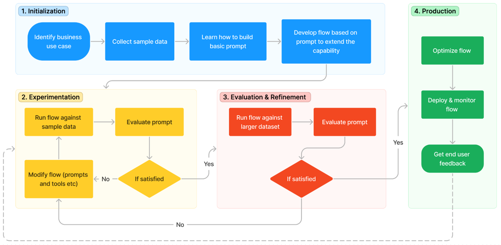

# Overview
This material is used to support an FTA Live session on Responsible AI with LLMs.  It provides an overview of Microsofts Responsible AI Principles, discusses the challenges presented by LLMs, and provides guidance on how to mitigate potential harms with an iterative, layered approach.

# Responsible AI Principles

Microsoft believes that the development and deployment of AI must be guided by the creation of an ethical framework. We set out our view in The Future Computed that there are six core principles that should guide the work around AI. Four core principles of fairness, reliability & safety, privacy & security, and inclusiveness, underpinned by two foundational principles of transparency and accountability 

 

- Fairness
    - AI systems should treat everyone fairly and avoid affecting similarly situated groups of people in different ways. For example, when AI systems provide guidance on medical treatment, loan applications, or employment, they should make the same recommendations to everyone with similar symptoms, financial circumstances, or professional qualifications. 
    - Examples:
        - [Racial Bias in Healthcare Algorithm](https://www.nature.com/articles/d41586-019-03228-6)
        - [Gender Bias in roles](https://www.bing.com/images/search?q=ceo&form=HDRSC3&first=1&tsc=ImageHoverTitle)
- Reliability & Safety
    - To build trust, it’s also important that AI systems operate reliably, safely, and consistently under normal circumstances and in unexpected conditions. How they behave and the variety of conditions they can handle reliably and safely largely reflects the range of situations and circumstances that developers anticipate during design and testing.
    - Examples:
        - [Driving to Safety](https://www.rand.org/pubs/research_reports/RR1478.html)
- Privacy & Security
    - It’s also crucial to develop AI systems that can protect private information and resist attacks. As AI becomes more prevalent, protecting privacy and securing important personal and business information is becoming more critical and complex. Privacy and data security issues require especially close attention for AI because access to data is essential for AI systems to make accurate and informed predictions and decisions about people. 
    - Examples:
        - [How Target Figured Out A Teen Girl Was Pregnant Before Her Father Did](https://www.forbes.com/sites/kashmirhill/2012/02/16/how-target-figured-out-a-teen-girl-was-pregnant-before-her-father-did/?sh=1826a54c6668)
- Inclusiveness
    - AI can improve access to education, government services, employment, information, and a wide range of other opportunities. Inclusive design practices can help system developers understand and address potential barriers in a product environment that could unintentionally exclude people. By addressing these barriers, we create opportunities to innovate and design better experiences that benefit everyone.
- Transparency
    - When AI systems are used to help inform decisions that have tremendous impacts on people’s lives, it’s critical that people understand how those decisions were made. A crucial part of transparency is what we refer to as intelligibility or the useful explanation of the behavior of AI systems and their components. 
- Accountability
    - The people who design and deploy AI systems must be accountable for how their systems operate. The need for accountability is particularly crucial with sensitive use technologies like facial recognition.
    - Examples:
        - [UK Official Says It's Too Expensive to Delete All the Mugshots of Innocent People in Police Databases](https://gizmodo.com/uk-official-says-its-too-expensive-to-delete-all-the-mu-1825388626)

# Challenges presented by LLMs
Deploying LLMs responsibly requires new, purpose-built tools and processes. LLMs are different from traditional AI models in several ways:

Harm = Type of content + Model capabilities/Tendencies

* Types of Content – Specific types of content, e.g., content relating to violence, profanity Types of content are identifiable from raw text and are independent of system usage. 
* Model Capabilities/Tendencies – Capabilities or behaviors exhibited by the model. These  capabilities or behaviors may be desirable or undesirable and intended or unintended. 
* Harms – A harm involves one or more types of content and one or more model 
capabilities/behaviors. Harms can affect the user, other entities, groups of entities, or society

Taxonomy of harms in LLMs/MMMs*
* continues to evolve

| Category | Potential Harm |
| --- | --- |
| **Prohibited Content** | **Harmful Content** - Users may be exposed to illegal or harmful content, such as hate speech, incitement or glorification of violence, sexual solicitation, or sexually graphic content, or content that describes, features, or promotes child sexual exploitation or abuse. |
| | Advice related to highly regulated domains, such as medical, financial, and legal. Inaccurate advice can lead to injury (e.g., if medical advice is inaccurate) or negatively impact an individual’s legal, financial, or life opportunities (e.g., if legal or financial advice is inaccurate or incomplete). |
| | Third-party content regurgitation. Text and image generation models may be trained on data from the web and can regurgitate/replicate content verbatim or with little change.|
| **Performance quality** | **Quality of service (QoS) disparities.** The AI system may perform better for some groups of people than others. |
| | Potential performance disparities in non-English languages. LLMs are capable of generating text in languages other than English, but performance for non-English languages should be assessed according to your system’s intended uses. Similarly, image generation models may perform differ in performance for inputs in non-English languages.
| **Harms to trust** | Fabrication due to lack of content verification through external sources. (Does not apply to creative image generation.)  When the system generates knowledge or factual statements without referring to the information source or verifying the accuracy of the factual statement, it can fabricate information. Additionally, if the period between model training and deployment is large and the model responds from knowledge acquired during training, rather than up to date external sources, information may be outdated and incorrect. |
| | Ungrounded content. In products where input sources are provided to the system, the model may still generate information that is neither present nor inferred from input sources (e.g., produces ungrounded results) and users may be exposed to inaccurate or misleading content. 
| | Lack of provenance for generated content. When generated text or images are shared, its origin and any changes made to it may not be traceable|
| **Overreliance** | **Transparency.** Users may not be aware that they are interacting with an AI system or AI-generated content. They may not know that the AI system has certain capabilities and limitations, especially if the system can respond to personal questions (e.g., Where are you? How do you like X? What is your favorite color?).|
| | **Intelligibility.** Users may not be able to interpret the system’s behavior effectively.|
| **Misuse** | **Prompt injection (jailbreaks).** A jailbreak is a successful attempt to break the model out of its instructions, evade mitigations, or produce harmful content. |
| | **Misuse for influencing political process.** Systems could generate content that displays political biases or can be misused for generating content to influence the political process|
| | **Generation of malware, incorrect or insecure code.** Given the LLMs’ capabilities of code generation, they may generate untrustworthy code.|
| | **Misuse for building an API.** Users can (and have the incentive to) build APIs on top of the service to provide their users functionality different from the 1P intended use.
| **Privacy Harms** | **Privacy harms.** LLMs and MMMs may regurgitate personal data about individuals. In production, the system may collect excessive data about users and may not comply with relevant privacy laws and regulations

  
# Responsible AI in practice

## Mitigate potential LLM harms with an iterative, layered approach

Mitigating potential harms presented by these new models requires an iterative, layered approach that includes experimentation and measurement. We find that most production applications require a mitigation plan with four layers of technical mitigations: (1) the model, (2) safety system, (3) metaprompt and grounding, and (4) user experience layers. The model and safety system layers are typically platform layers, where built-in mitigations would be common across many applications. The next two layers depend on the application’s purpose and design, meaning the implementation of mitigations can vary a lot from one application to the next. Below, we’ll discuss how Azure AI can aid the use and development of each of these mitigation layers.

1. Discover, fine-tune, and evaluate models

    At the model layer, it's important to understand the model you'll be using.  One of the things that we've seen recently is a lot of innovation to figure out where and how can we bake safety directly into a foundation model.  For example, working with OpenAI, we've explored techniques like Reinforcement learning from human feedback (RLHF) and fine-tuning in the base models to build safety into the model itself, and so starting with ChatGPT and GPT 4, you see safety built into the model to mitigate unwanted behaviors.

    And of course, many other models available on Azure are providing this. For example, Meta’s Llama 2 models are fine-tuned models that have mitigations built in for you, so that the model already knows how to look at certain types of sensitive queries and respond appropriately.

2. Deploy your LLM with a built-in safety system using Azure AI Content Safety

    For most applications, it’s not enough to rely on the safety fine-tuning built into the model itself.  LLMs can make mistakes and are susceptible to attacks like jailbreaks. In many applications at Microsoft, we use an additional AI-based safety system, Azure AI Content Safety, to provide an independent layer of protection.

3. Build effective metaprompts and ground your model

4. Apply user-centric design to mitigate potential harms in your LLM application

  
# Model
To better-understand the capabilities and limitations of each model, you can view model cards that provide model descriptions and may have the option to try a sample inference or [test the model with your own data](https://learn.microsoft.com/en-us/azure/machine-learning/how-to-use-foundation-models?#how-to-evaluate-foundation-models-using-your-own-test-data) . This makes it easy to visualize how well a selected model performs, and you can even compare the performance of multiple models side-by-side to pick the one that works best for your use case. You can also [fine-tune models using your own training data](https://learn.microsoft.com/en-us/azure/machine-learning/how-to-use-foundation-models?view=azureml-api-2#how-to-finetune-foundation-models-using-your-own-training-data) to improve model performance for your use case.

## Model catalog
* Models from Meta, Hugging Face, and Azure OpenAI.
* Model cards

  
# Safety System
For most applications, it’s not enough to rely on the safety fine-tuning built into the model itself.  LLMs can make mistakes and are susceptible to attacks like jailbreaks. In many applications at Microsoft, we use an additional AI-based safety system, [Azure AI Content Safety](https://azure.microsoft.com/en-us/products/cognitive-services/ai-content-safety), to provide an independent layer of protection.

When you deploy models through the model catalog, you’ll see the default option is to add Azure AI Content Safety to filter harmful inputs and outputs from the model. This can help mitigate intentional misuse by your users and mistakes by the model. When you deploy your model to an endpoint with this option selected, an [Azure AI Content Safety](https://azure.microsoft.com/en-us/products/cognitive-services/ai-content-safety) resource will be created within your Azure subscription.

This safety system works by running both the prompt and completion for your model through an ensemble of classification models aimed at detecting and preventing the output of harmful content across [four categories](https://learn.microsoft.com/en-us/azure/cognitive-services/content-safety/concepts/harm-categories) (hate, sexual, violence, and self-harm) and four severity levels (safe, low, medium, and high). The default configuration is set to filter content at the medium severity threshold for all four content harm categories for both prompts and completions. This system can work for all languages, but quality may vary. It has been specifically trained and tested in the following languages: English, German, Japanese, Spanish, French, Italian, Portuguese, and Chinese. Variations in API configurations and application design may affect completions and thus filtering behavior. In all cases, customers should do their own testing to ensure it works for their application.

  
# Metaprompt and Grounding

Metaprompt design and proper data grounding are at the heart of every generative AI application. They provide an application’s unique differentiation and are also a key component in reducing errors and mitigating risks. At Microsoft, we find [retrieval augmented generation (RAG)](https://aka.ms/WhatIsGrounding) to be a particularly effective and flexible architecture. With RAG, you enable your application to retrieve relevant knowledge from selected data and incorporate it into your metaprompt to the model. In this pattern, rather than using the model to store information, which can change over time and based on context, the model functions as a reasoning engine over the data provided to it during the query. This improves the freshness, accuracy, and relevancy of inputs and outputs. In other words, RAG can ground your model in relevant data for more relevant results.

Once you have the right data flowing into your application through grounding, the next step is building a metaprompt. A metaprompt, or system message, is a set of instructions used to guide an AI system’s behavior. Prompt engineering plays a crucial role here by enabling AI developers to develop the most effective metaprompt for their desired outcomes. Ideally, a metaprompt will enable a model to use the grounding data effectively and enforce rules that mitigate harmful content generation or user manipulations like jailbreaks or prompt injections. You can also use a metaprompt to define a model’s tone to provide a more responsible user experience. For more powerful generative AI applications, you should consider using [advanced prompt engineering techniques](https://aka.ms/advanced_metaprompts) to mitigate harms, such as requiring citations with outputs, limiting the lengths or structure of inputs and outputs, and preparing pre-determined responses for sensitive topics.

## Prompt Flow
[Prompt flow](https://learn.microsoft.com/en-us/azure/machine-learning/prompt-flow/overview-what-is-prompt-flow?view=azureml-api-2) in Azure Machine Learning streamlines the development, evaluation, and continuous integration and deployment (CI/CD) of prompt engineering projects. It empowers LLM application developers with an interactive experience that combines natural language prompts, templates, built-in tools, and Python code. We define a flow as an executable workflow that streamlines the development of your LLM-based application. By leveraging connections in prompt flow, users can easily establish and manage connections to external APIs and data sources, facilitating secure and efficient data exchanges and interactions within their AI applications. For example, a pre-built connection for Azure AI Content Safety is available, should you want to customize where and how content filters are used in your application’s workflows.

### Benefits of using Azure Machine Learning prompt flow
* Prompt engineering agility
    - Interactive authoring experience
    - Variants for prompt tuning
    - Evaluation
    - Comprehensive resources

* Enterprise readiness for LLM-based applications
    - Collaboration
    - All-in-one platform
    - Azure Machine Learning Enterprise Readiness Solutions

### LLM-based application development lifecycle

Prompt flow offers a well-defined process that facilitates the seamless development of AI applications. The lifecycle consists of the following stages:

* Initialization: Identify the business use case, collect sample data, learn to build a basic prompt, and develop a flow that extends its capabilities.
* Experimentation: Run the flow against sample data, evaluate the prompt's performance, and iterate on the flow if necessary. Continuously experiment until satisfied with the results.
* Evaluation & Refinement: Assess the flow's performance by running it against a larger dataset, evaluate the prompt's effectiveness, and refine as needed. Proceed to the next stage if the results meet the desired criteria.
* Production: Optimize the flow for efficiency and effectiveness, deploy it, monitor performance in a production environment, and gather usage data and feedback. Use this information to improve the flow and contribute to earlier stages for further iterations.

  
# User Experience

## Creating appropriate trust with the HAX Toolkit

aka.ms/HAXtoolkit
The HAX Toolkit is for teams building user-facing AI products. It helps you conceptualize what the AI system will do and how it will behave. Use it early in your design process.

### How to use the HAX Toolkit
1. Familiarize yourself with the [Guidelines for Human-AI Interaction](https://www.microsoft.com/en-us/haxtoolkit/ai-guidelines/). They prescribe how an AI system should behave. Read an [overview](https://www.microsoft.com/en-us/haxtoolkit/ai-guidelines/) of the Guidelines and browse the [Design Library](https://www.microsoft.com/en-us/haxtoolkit/library/) to see examples and patterns for implementing the Guidelines.

2. Bring your team together and go through the [HAX Workbook](https://www.microsoft.com/en-us/haxtoolkit/workbook/). The HAX Workbook is a discussion and planning guide. Your HAX Workbook session will result in prioritized work items for which Guidelines to implement first, and how.

3. If you’re creating a product that uses natural language processing (NLP), use the [HAX Playbook](https://www.microsoft.com/en-us/haxtoolkit/playbook/) to identify how the AI system will fail so you can plan for helping users recover from inevitable failures.

## Responsible AI style guide to create appropriate trust
Kathy Walker, Mihaela Vorvoreanu

Appropriate trust - users don’t over-trust and accept incorrect LLM outputs, and they don’t under-trust and reject correct LLM outputs.

### What is RAI style guide?
https://aka.ms/RAIstyleguide
Creating appropriate trust in LLMs helps meet the Accountability and Transparency goals in the RAI Standard
* Use language responsibly when describing LLMs

* Don't overclaim or misrepresent what AI can do
    - Be precise when explaining what an AI system can and cannot do - [FTC](https://www.ftc.gov/business-guidance/blog/2023/02/keep-your-ai-claims-check)
    - Avoid language that exaggerates AI capabilities
    - Use simple and clear language.

* Explain what the AI system can and cannot do in precise terms
    - e.g. [FEATURE NAME] uses a type of AI called a large language model. It generates human-like responses on the spot by predicting what words come next in a phrase – like putting together a puzzle. Even though its responses seem convincing, they might be inaccurate, incomplete, or inappropriate. It can’t understand or evaluate response accuracy, and it doesn’t search the internet.​
    
* Don’t humanize AI​
    - Don’t suggest an AI system understands language, or that AI can think, reason, see, sense, feel, or experience. It is not possible for AI to be sentient or develop consciousness. It’s OK for LLM responses to use “I,” but don’t go out of the way to humanize LLM-based features.​ Disclose AI, remind users this is a machine, use non-humanizing terms and third-person voice where possible.
    - Avoid language that claims AI has feelings

* Use easy-to-understand language to describe AI systems
    - Avoid using technical jargon to impress.

### RAI Maturity Model
The Responsible AI Maturity Model (RAI MM) is a framework to help organizations identify their current and desired levels of RAI maturity.

[Download executive summary & FAQ](https://www.microsoft.com/en-us/research/uploads/prod/2023/05/RAI-MM-Exec-Summary-for-PDF-printing-July-26.pdf)

The RAI MM contains 24 empirically derived dimensions that are key to an organization’s RAI maturity. The dimensions and their levels are based on interviews and focus groups with over 90 RAI specialists (e.g., RAI champs, MSR experts) and AI practitioners (e.g., user experience (UX) researchers, UX designers, data scientists). Each dimension has five levels, going from low (Level 1: Latent) to high (Level 5: Leading) maturity. The dimensions are organized into three main categories:

* Organizational Foundations
* Team Approach
* RAI Practice

Think of the RAI MM as a high-level map of the complex and evolving territory of RAI. Use it to help you navigate what it means to be a mature RAI organization.

### RAI Impact Assessment

# References
| Title | Link | Author |
| --- | --- | --- |
| Deploy large language models responsibly with Azure AI | https://techcommunity.microsoft.com/t5/ai-machine-learning-blog/deploy-large-language-models-responsibly-with-azure-ai/ba-p/3876792 | Sarah Bird |
| How to use Open Source foundation models curated by Azure Machine Learning | https://learn.microsoft.com/en-us/azure/machine-learning/how-to-use-foundation-models?view=azureml-api-2#how-to-evaluate-foundation-models-using-your-own-test-data | Microsoft Learn |

