# Responsible AI

AI のテクノロジーが大きな注目を浴びています。画期的で便利な技術が開発される一方で、AI が持つリスクや障害に対応できずに、ガバナンス・セキュリティ・コンプラインスの観点でさまざまな課題が出てきています。そのため、近年はこれまで以上に AI を責任を持って開発し運用管理することが求められています。

本ライブセッションでは Microsoft 社内の取り組みの視点から、責任のある AI に対する原則などのコンセプトを紹介し、技術的な観点で機械学習ライフサイクルにおいて具体的に責任のある AI を取り入れる方法を説明します。

<br/>

## アジェンダ
1. [責任のある AI 概要](#1-責任のある-ai-概要)
2. [機械学習モデルを理解する](#2-機械学習モデルを理解する)
3. [機械学習モデルとデータを保護する](#3-機械学習モデルとデータを保護する)
4. [参考情報](#4-参考資料)

<br/>

---

## 1. 責任のある AI 概要
本モジュールでは 責任のある AI について Microsoft の取り組みを踏まえながら説明をしてきます。

<br/>

### 背景

AI の技術が急速に進化しています。AI が人間に近いような能力を保持したり動作をすることや、社会的影響も大きいことから AI システム全体の透明性に対するニーズが高まっています。透明性が無い AI システムはステークホルダーの信頼を失い、AI の社会実装を妨げる一つの大きな要因となります。しかしながら、責任のある AI はまだ十分に浸透しているとは言えません。AI システムのプライバイシーの懸念、誤動作、副作用などの課題に対して、誰が責任を取るのか、どのように対処するのかがルール化されていないことがあります。ここでは、責任のある AI の概念や技術について説明し、皆様の人間中心で信頼された透明性の高い AI システムの構築・運用管理の手助けとなることを目的としています。

_"The more powerful the tool, the greater the benefit or damage it can cause ... Technology innovation is not going to slow down. The work to manage it needs to speed up." Brad Smith, President and Chief Legal Officer, Microsoft_

<br/>

### Microsoft の責任のある AI への取り組み

Microsoft 自身も責任のある AI に取り組んでいます。

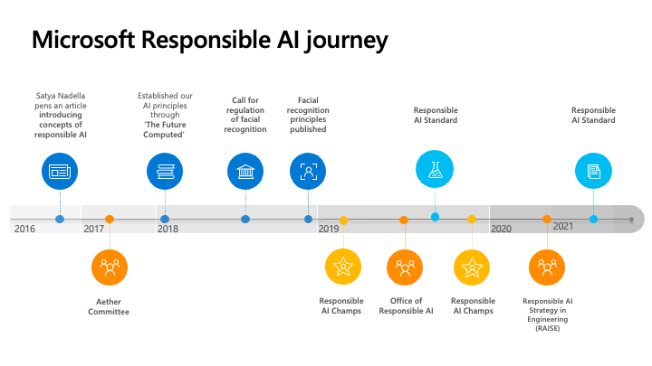

- 2016年 : Microsoft CEO Satya Nadella が [The Partnership of the Future](https://slate.com/technology/2016/06/microsoft-ceo-satya-nadella-humans-and-a-i-can-work-together-to-solve-societys-challenges.html) という論説を投稿しました。AI システムの透明性、効率性、プライバシーの尊重、バイアスからの保護などに言及しています。
- 2017年 : Aether (AI, Ethics, and Effects in Engineering and Research) を設立しました。この団体は Microsoft 社内の責任のある AI に関する最高機関になっており、様々な責任のある AI の課題、テクノロジー、プロセス、ベストプラクティスに関する提言を行なっています。
- 2018年 : [The Future Computed](https://news.microsoft.com/ja-jp/2018/01/24/180117-future-computed-artificial-intelligence-role-society/) という書籍を公表しました。AI が社会にもたらす課題、AI をどうすれば責任がある形で開発され、運用されるのか、どのようにガバナンスを制定すればいいのかについて Microsoft の見解を述べているものです。後に説明する 6 つの基本原則についても言及しています。また、顔認証技術の透明や独立した第三者機関によるテストの法規制の必要性を訴えています。
- 2019年 : Office of Responsible AI を設立しました。ポリシーやガバナンスのプロセスを策定しています。また、Responsible AI Standard (v1) を発行しました。
- 2020年 : RAISE (Responsible AI Strategy in Engineering) はエンジニアリンググループ全体で責任のある AI のルールとプロセスの実装を促進するために設立されました。
- 2021年 : Responsible AI Standard (v2) を発行しました。また最近では Microsoft のこれまでの培ってきた知見を社会・お客様に伝えていくべく、[AI Business School](https://www.microsoft.com/ja-JP/ai/ai-business-school) という責任のある AI などについて学べるビジネス向け学習コンテンツ、ガイドライン、オープンソースのツールを公開しています。

<br/>

### 責任のある AI の 6 つの原則

Microsoft は AI システムの開発および運用管理における責任のある AI の原則を 6 つ定義しています。

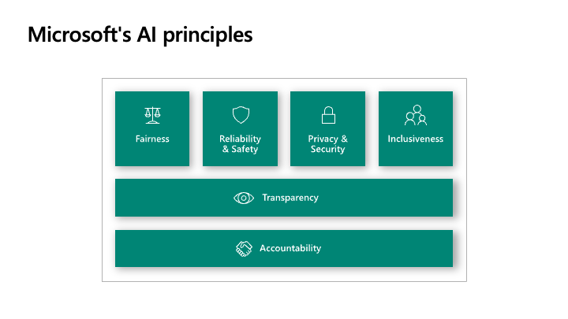<br/>


- 公平性 (Fairness)
    - AI システムは全ての人を公平に扱い、同じ属性・状況の人たちに対して異なる影響を与えることを回避する必要があります。
- 信頼性と安全性 (Reliability & Safety)
    - AI システムは信頼性が高く安全である必要があります。設計されたとおりに動作し、新しい状況にも安全に対応できるようにすることが重要です。
- プライバシーとセキュリティ (Privacy & Security)
    - AI システムではデータを扱うためプライバシーとセキュリティの保護が必要です。
- 包括性 (Inclusiveness)
    - AI システムに限らず技術は全ての人にもたらされるべきで、様々なニーズに対応していく必要があります。
- 透明性 (Transparency)
    - AI システムが意思決定に利用される場面などでは、どのように AI システムが決定を行ったのかを理解することが重要です。
- アカウンタビリティ (Accountability)
    - AI システムを設計・構築・運用管理する人は、システムがどのように動作するかについて説明責任があります。


### 責任のある AI の実践

これらの 6 つの原則をベースに、設計フェーズから責任のある AI が考慮された AI システムが統制の効いたガバナンスの元に実装されるために Microsoft が社内外に公開している取り組みを紹介します。

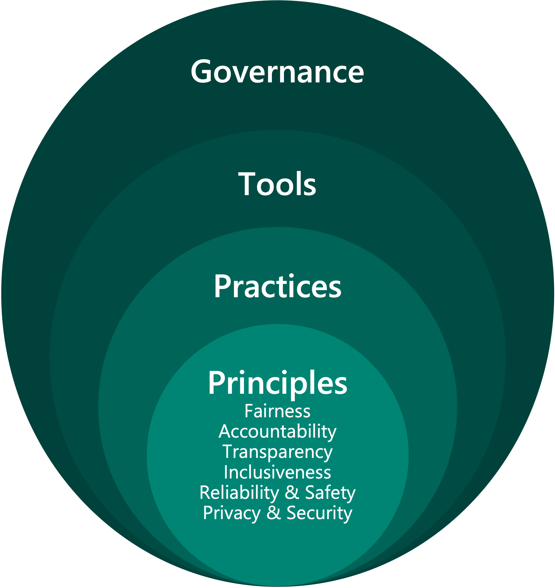

#### 原則 (Principles)

先ほど述べた 6 つの原則 (Fairness, Reliability & Safety, Privacy & Security, Inclusiveness, Transparency, Accountability) を指します。


#### プラクティス (Practices)
人間中心のデザインや、ソフトウェア開発のライフサイクルにおける問題を予測し、それを解決することで責任のある方法で AI システムを開発することをサポートするガイドラインを提供しています。

- [Human-AI Guidelines](https://www.microsoft.com/en-us/haxtoolkit/ai-guidelines/)
    - [Human-AI eXperiences (HAX)](https://www.microsoft.com/en-us/haxtoolkit/) Toolkit に含まれます。
- [Conversational AI Guidelines](https://www.microsoft.com/en-us/research/publication/responsible-bots/)
- [Inclusive Design Guidelines](https://www.microsoft.com/design/inclusive/)
- [AI Fairness Checklist](https://www.microsoft.com/en-us/research/project/ai-fairness-checklist/)
- [Datasheets for Datasets](https://www.microsoft.com/en-us/research/project/datasheets-for-datasets/)
- [AI Security Guidelines](https://blogs.microsoft.com/on-the-issues/2019/12/06/ai-machine-learning-security/)


その取り組みの結果として 例えば [Transparency Note for Azure Cognitive Service for Language](https://docs.microsoft.com/en-us/legal/cognitive-services/language-service/transparency-note) などの Transparency Note を公開し、AI システムの目的、能力、限界についてのコミュニケーションを支援し、マーケティングと技術文章のギャップを埋め、お客様が責任を持って AI を導入するために知っておくべき情報を積極的に伝えています。その他、Azure Cognitive Services 全般における責任のある AI のガイドラインは [Cognitive Services における AI の責任ある使用](https://docs.microsoft.com/ja-jp/azure/cognitive-services/responsible-use-of-ai-overview) で確認できます。


#### ツール

Data Scientist や機械学習エンジニアなどの技術者が AI の構築・運用のライフサイクルの各所において AI を理解し、保護し、制御するためのツールを開発しています。

モデル開発フェーズにおいては、Azure Machine Learning 上であらゆるツールが実行できます。

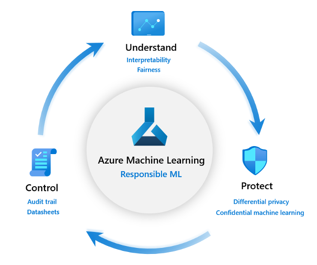

- 理解 (Understand)
    - AI システムの挙動を理解します。公平性、透明性の観点が重要になることが多いです。
    - ツール : InterpretML、Fairlearn、Error Analysis、Responsible AI Toolbox など。
- 保護 (Protect)
    - モデルやデータを外部からの攻撃や潜在的なリスクから保護します。
    - ツール : 差分プライバシー、機密コンピューティングなど。
- 制御 (Control)
    - ガバナンス統制下で責任ある形で開発が進められるようにします。
    - ツール : MLOps、監査証跡、データシートなど。
 

※ Microsoft が提供するツールの最新の情報は [責任ある AI のリソース](https://www.microsoft.com/ja-JP/ai/responsible-ai-resources) 、研究開発の取り組みは [Advancing AI trustworthiness: Updates on responsible AI research](https://www.microsoft.com/en-us/research/blog/advancing-ai-trustworthiness-updates-on-responsible-ai-research/) を参照ください。


#### ガバナンス

Microsoft は Hub and Spokes モデルでガバナンスの体制を構築しています。

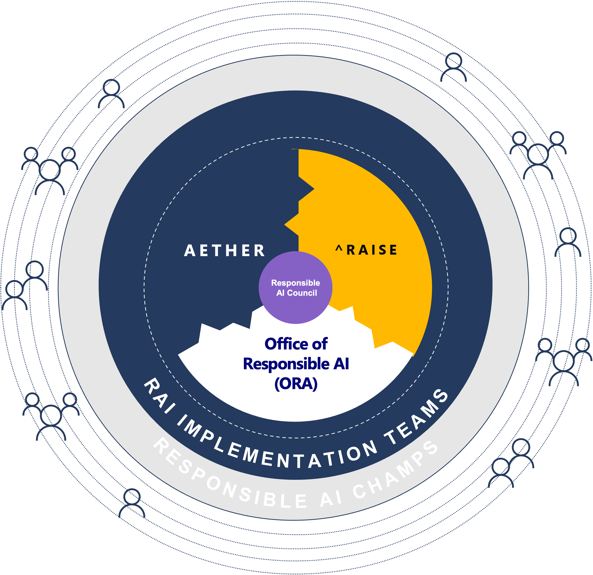

- Responsible AI Council
    - Microsoft のエグゼクティブメンバーや責任のある AI の各グループ (Aether Comittee, Office of Responsible AI, RAISE) の代表者から構成され、全社的に責任のある AI への取り組みをサポートします。
- Aether Committee
    - Aether (AI, Ethics, and Effects in Engineering and Research) は Microsoft 社内の部門を横断する様々な専門家グループから構成され、Microsoft 社内のシニアリーダーシップや Office of Responsible AI (ORA) に対して、AI システムに関する疑問・課題などについて助言するアドバイザリーを提供します。また 6 つの作業グループがあり、それぞれの分野で有益なツール、ベストプラクティス、実装ガイダンスなどを開発しています。
- Office of Responsible AI (ORA)
    - 責任のある AI の原則を実践に向けたガバナンスの実装と管理をします。代表的な取り組みとしては Responsible AI Standard を作成し、社内の責任のある AI の実践をサポートしています。
- RAISE (Responsible AI Strategy in Engineering)
    - エンジニアリンググループにおける責任のある AI のルールの策定、システム戦略、プロセスの実装を実行します。
- Responsible AI Champs
    - Responsible AI Champs はスポークの役割を果たし、組織全体にわたるルールの実装や、認知度の向上をサポートします。お客様や社内におけるセンシティブなユースケースに対するアドバイザリーを行なっています。


<br/>


### Responsible AI Lifecycle (RAIL)

Microsoft は Responsible AI Lifecycle (aka RAIL) を開発しました。これは Responsible AI Standard に沿った形で責任のある AI をシステムに構築・デプロイするためのフレームワークです。詳細は公開されていませんが、下記が概略です。

- AI システムの評価と準備
    - 製品がもたらす利益、技術、潜在的なリスク、チームを評価する。
- AI システムの設計・構築とドキュメンテーション
    - モデルや関連するシステムの設計・構築を行い、AI システムについて文章を作成する。
- AI システムの検証とサポート
    - テスト手順を選択し、製品が意図した通りに動作するか確認する。


<br/>

--- 

## 2. 機械学習モデルを理解する

本モジュールでは、モデルを理解するための様々な技術を紹介します。Responsible AI Lifecycle の中でも 「 AI システムの設計・構築とドキュメンテーション」のフェーズで利用する技術です。主にモデルの透明性と公平性に言及していきます。

- モデルの透明性
    - 機械学習アルゴリズムの説明性・解釈可能性の技術より、大域的・局所的なトレンドを理解します。これは AI システムを実装する際に Data Scientist が経営者やステークホルダーにモデルを説明する際に役立ちます。また運用中モデルの挙動について説明が求められるようなシーンでも有効ですし、Data Scientist 自身が開発中の機械学習モデルをデバッグする際にも有効です。
- モデルの公平性
    - 学習済みモデルの公平性を評価し、必要に応じて軽減を行います。公平性とは特定のグループに対してモデルが他とは異なる挙動しないことを意味します。特にセンシティブな属性 (人種、ジェンダー、年齢、障害の有無 etc) の観点で考慮されます


これらの技術は下記の 3 つのステップ (特定 → 診断 → 緩和) で実行します。モデルの理解だけで良いのであれば `診断` のプロセスまでで十分ですが、公平性に問題があったり、モデルの精度が足りない場合には次の `緩和` のステップが必要になってきます。


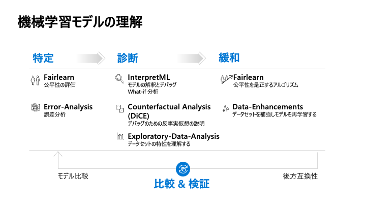

<br/>

ここで登場する主な技術を紹介します。

### Fairlearn
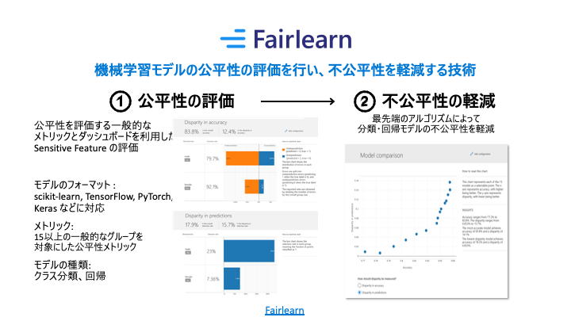<br/>

機械学習モデルの公平性の評価と不公平性の緩和を行うライブラリです。

モデルの不公平性は大きく 2 つに分類されます。

- 割り当ての害
    - AI システムによって、特定のグループの機会、リソース、または情報が増減されます。 たとえば、雇用、入学許可、融資などで、モデルにより、特定のグループの人が、他のグループより、適切な候補をうまく選択される場合があります。
- サービス品質の害
    - AI システムによる対応のよさが、ユーザーのグループによって異なります。 たとえば、音声認識システムでは、女性に対する対応が男性より悪くなる場合があります。


Fairlearn はこういった不公平性の危害を評価し、必要に応じて緩和することができます。

<br/>

### Error Analysis

<br/>

Error Analysis はモデルの誤差を深堀り分析するツールです。よく機械学習モデルの精度を 90 % などと集計された数値で見ることが多いと思います (上図) が、ユースケース次第ではそれでは不十分です。誤差がデータのどこに潜んでいるのかはこれでは分からないので、例えば性別や人種の違いで誤差が異なれば公平性の問題になりますし、病理診断などのシナリオでも子供や高齢者の精度が悪いと、社会的な問題になることが考えられます。

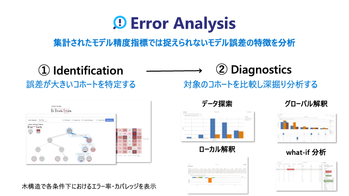<br/>


そのため、誤差を深掘りし、誤差が大きくなる・小さくなるコホートを特定することで、ステークホルダーに対してモデルの潜在的なリスクを伝えることができたり、誤差が大きいコホートのデータの品質を改善することで精度が向上することが期待できます。

<br/>

### InterpretML
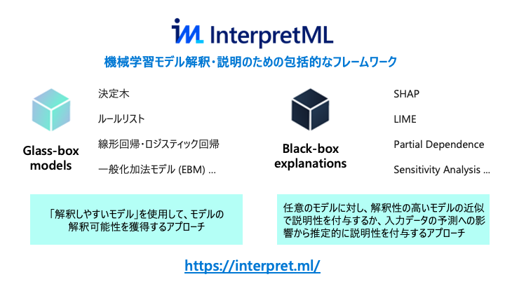<br/>

[InterpretML](https://interpret.ml/) は、主要な「解釈可能性が高い Glass-box なモデル」 と 「任意の学習済みモデル (Black-box) に対する説明性付与手法」が実装されているライブラリ群です。それぞれに共通してモデル全体の傾向を見る大域的な説明とテストデータ個々の予測値に対する局所的な説明があります。


#### Global Surrogate

グローバルなモデル解釈方法。学習済みモデルへの入力データとその予測値を再度線形回帰などの解釈可能なモデルで学習し直して、モデル解釈をするアプローチ方法。InterpretML では LightGBM や線形回帰のモデルが利用できます。


#### SHAP

[SHAP (SHapley Additive exPlanations)](https://github.com/slundberg/shap) はゲーム理論のシャープレイ値の枠組みを利用して、モデルの種類に関わらず、ここのデータの特徴量ごとの貢献度をみることができます。SHAP 単体でもライブラリが公開されています。

<br/>

### Responsible AI Toolbox

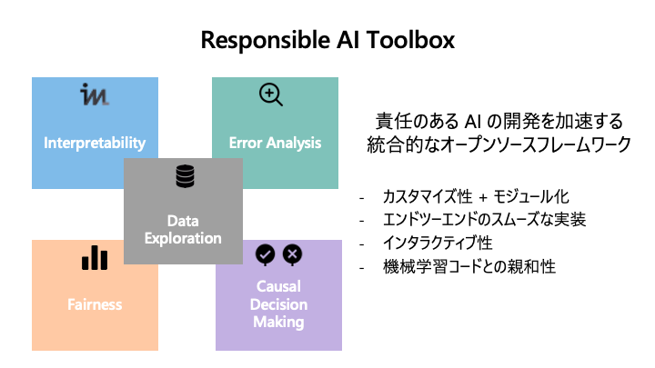<br/>


モデルの説明性付与、誤差分析、データ可視化、反事仮想分析、因果推論の機能をより簡単にスムーズに利用するために Responsible AI Toolbox という統合されたダッシュボードを提供しています。モデルをデバッグする機能と意思決定をサポートする機能の 2 つを提供しています。


<br/>


<br/>

### Explainable Boosting Machines (EBM)

Explainable Boosting Machines (EBM) は、一般化加法モデル (GAM) に交互作用項を組み込んだモデル (GA2M) を高速に推定するアルゴリズムです。

<!-- $$
y =  f(x_1) + f(x_2) + f(x_3) + ... + \Sigma_{ij} f_{ij}(x_i, x_j)
$$ --> 

<!-- it uses [Math >> Image](https://marketplace.visualstudio.com/items?itemName=MeowTeam.vscode-math-to-image) to render math in github markdown. -->

<div align="center"></div>


それぞれの特徴量 <!-- $x_i$ -->  は関数 <!-- $f(x_i)$ -->  で表現されています。線形回帰などの線形モデルとは違い目的変数 <!-- $y$ -->  との関係性は線形性は前提としていません。この関数を推定する方法はいくつかありますが、EBM ではこの関数をブースティングで推定します。また交互作用項を推定するアルゴリズム (FAST) も実装されており精度向上に寄与しています。

<br/>


<br/>

### デモンストレーションのシナリオ
ローンの履行・不履行を予測するモデルを作成するシナリオで責任のある AI を考慮した AI システムを構築していきます。[UCI Adault Dataset](https://archive.ics.uci.edu/ml/datasets/adult) を用いた擬似データを利用します。


### Phase1 : AI システムの評価と準備

このフェーズでは、AI システムの要件を整理し、責任のある形でシステムが構築可能かどうかの検証を行い、潜在的なリスクを洗い出し、必要に応じてリスクを緩和する方法を考えます。下記の質問に回答してみます。

> AI/ML の技術が本当に必要か？
> 潜在的なリスクがあるか？それはどのようなものか？
> AI システムが誤った挙動や動作停止することがあるか？

以上の情報をベースに AI システムが抱えるリスクと利益 (ステークホルダーの誰が得をして、誰が損害を被る可能性があるか etc)、リスクに対する軽減策と残存するリスク、公平性、セキュリティ、プライバシーの影響などに関して、必要に応じてテストを行い、ドキュメントを作成します。

例えば、今回のシナリオで AI システムはローンの審査で利用され、適切なモデルであればローン申込者や銀行へ利益をもたらしますが、仮に AI システムが誤った or 想定とは異なる挙動を起こしてしまい、返済不可能な債務を抱える人・企業が増えてしまえば、社会的影響は大きくなる可能性があります。


Microsoft は [Harms Modeling (損害のモデル化)](https://docs.microsoft.com/en-us/azure/architecture/guide/responsible-innovation/harms-modeling/) に関するドキュメントを公開しています。信頼される AI システムの構築にはあらゆるステークホルダーの価値観や利益の観点での評価が必要であり、下記のようなプロセスを提示しています。


このような損害 (Harms) はさまざまな種類があります。次のフェーズに入る前に AI システムがそれぞれの損害の種類に該当するのかどうか、該当する場合の損害の大きさを評価します。


<br/>

### Phase2 : AI システムの設計・構築と文章化

#### データ準備
データの品質が AI システムに大きな影響を与えるため、データの詳細な情報をドキュメントに残しておくことが重要です。[Datasheets for Datasets](https://www.microsoft.com/en-us/research/project/datasheets-for-datasets/) ([Template](https://query.prod.cms.rt.microsoft.com/cms/api/am/binary/RE4t8QB)) を利用することで、データの透明性と信頼性を高め、ステークホルダー間のコミュニケーションを促進します。

#### モデル構築

次にモデル構築を進めていきます。最初のモデル構築は勾配ブースティングのライブラリ [CatBoost](https://catboost.ai/) を用います。その後、解釈可能性の高いモデルである一般化加法モデルを Explainable Boosting Machine (aka EBM) を用いて構築します。また、構築済みの CatBoost のモデルに InterpretML を利用して説明性を付与します。

最後は FairLearn を用いて公平性の評価を行い、不公平性を緩和する処置を行います。


それではまず最初に CatBoost のモデルを構築します。

```python
from catboost import CatBoostClassifier
model_1 = CatBoostClassifier(
    random_seed=42, logging_level="Silent", iterations=150)


pipeline_1 = Pipeline(steps=[
    ('preprocessor', column_transformer), # 前処理
    ('classifier_CBC', model_1)]) # モデル

catboost_predictor = pipeline_1.fit(X_train, Y_train)

```

次に解釈可能性の高いモデルである EBM を構築します。

```python
from interpret.glassbox import ExplainableBoostingClassifier
seed = 1234

#  No pipeline needed due to EBM handling string datatypes
ebm_predictor = ExplainableBoostingClassifier(random_state=seed, interactions=4)
ebm_predictor.fit(X_train, Y_train)
```

各変数の貢献度や推定された関数を確認します。

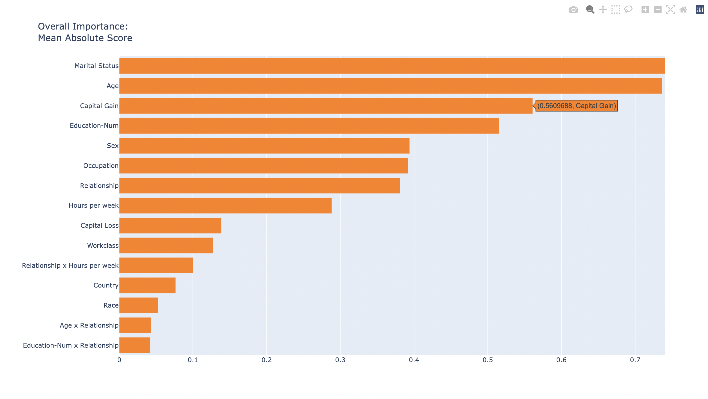
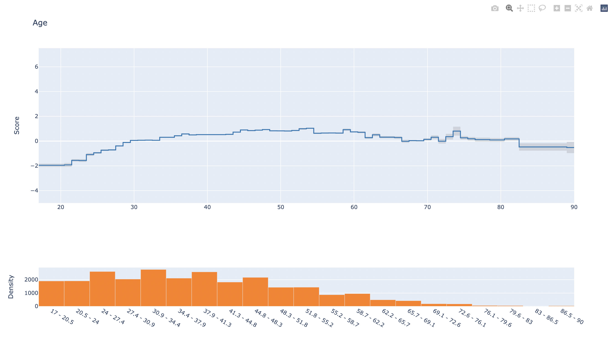<br/>

交互作用項のアウトプットを確認します。

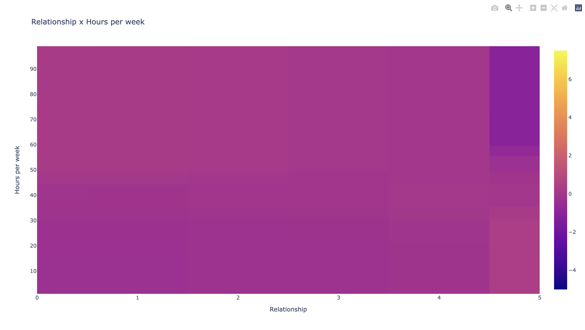

<br/>


次に CatBoost のモデルに説明性を付与します。

```python
from raiwidgets import ExplanationDashboard
from interpret.ext.blackbox import TabularExplainer

explainer = TabularExplainer(catboost_predictor, 
                             X_train)

global_explanation = explainer.explain_global(X_test)

ExplanationDashboard(global_explanation, catboost_predictor, dataset=X_test, true_y=Y_test)
```

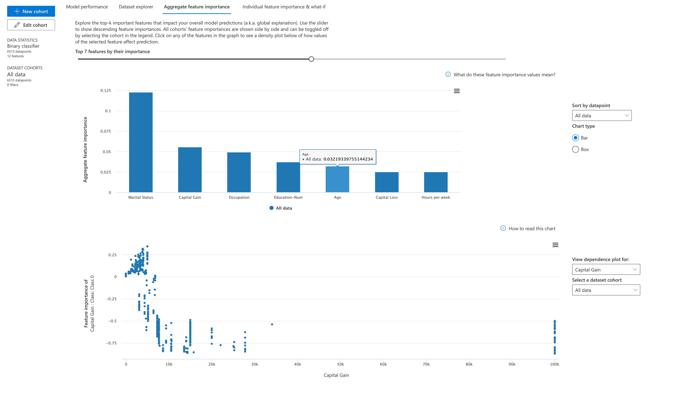


誤差分析を行い、誤差の大きいコホートを特定します。

```python
from raiwidgets import ErrorAnalysisDashboard
ErrorAnalysisDashboard(global_explanation, catboost_predictor, dataset=X_test, true_y=Y_test)
```
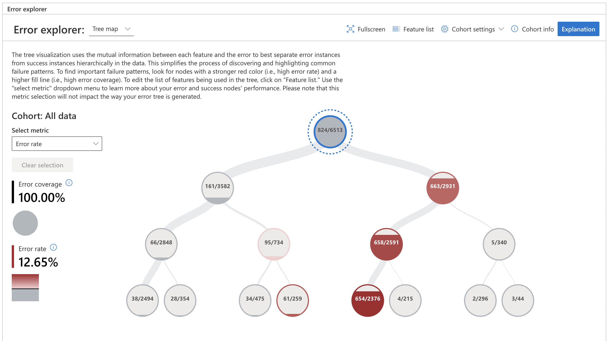
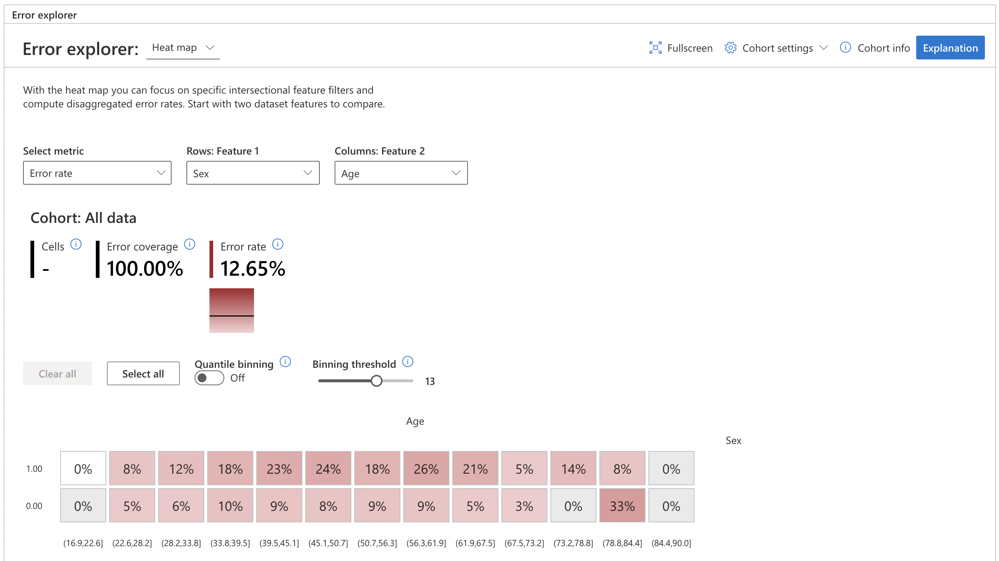


これからの一連の流れを統合されたダッシュボードである Responsible AI Toolbox を用いて表現します。

```python
from raiwidgets import ResponsibleAIDashboard
from responsibleai import RAIInsights


# データや目的変数などの情報
rai_insights = RAIInsights(pipeline_1, train_data, test_data, target_feature, 'classification',
                               categorical_features=categorical_features, maximum_rows_for_test=7000)
# モデル説明性 (InterpretML)
rai_insights.explainer.add()
# モデル誤差解析 (Error Analysis)
rai_insights.error_analysis.add()

# 計算処理
rai_insights.compute()

# ダッシュボード出力
ResponsibleAIDashboard(rai_insights, locale="ja")
```


<br/>
次に公平性の評価と不公平性を軽減していきます。まずは最初に CatBoost モデルを性別の観点で公平性を確認します。

```python
from raiwidgets import FairnessDashboard
Y_pred = catboost_predictor.predict(X_test)
FairnessDashboard(sensitive_features=A_test,
                  y_true=Y_test,
                  y_pred=Y_pred)
```
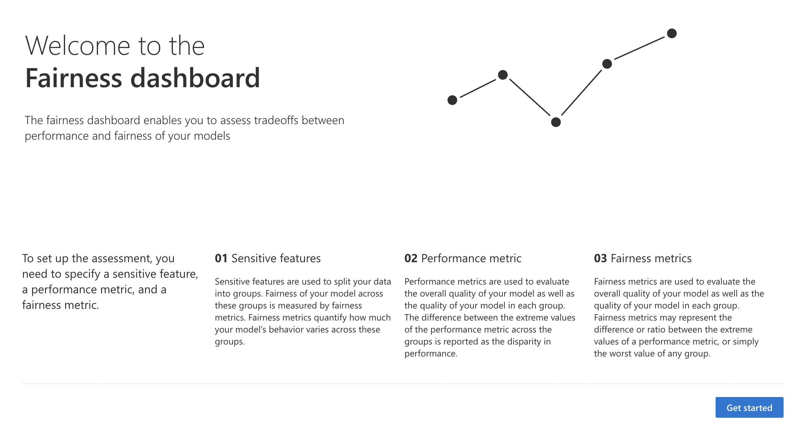

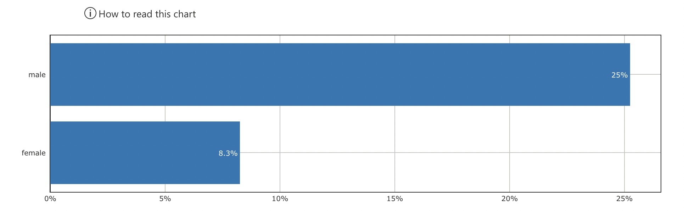

次に、GridSearch を用いて不公平性を軽減したモデルを複数作成します

```python
from fairlearn.reductions import GridSearch
from fairlearn.reductions import DemographicParity, ErrorRate

sweep = GridSearch(
    model_1,
    constraints=DemographicParity(),
    grid_size=70)

sweep.fit(X_train, Y_train, sensitive_features=A_train.Sex)
```

公平性を再度確認します。

```python
from raiwidgets import FairnessDashboard
mitigated_predictors = sweep.predictors_

ys_mitigated_predictors = {} # it contains (<model_id>, <predictions>) pairs

# the original prediction:
ys_mitigated_predictors["census_unmitigated"]=catboost_predictor.predict(X_test)

base_predictor_name="mitigated_predictor_{0}"
model_id=1

for mp in mitigated_predictors:
    id=base_predictor_name.format(model_id)
    ys_mitigated_predictors[id]=mp.predict(X_test)
    model_id=model_id+1
    
FairnessDashboard(
    sensitive_features=A_test,
    y_true=Y_test,
    y_pred=ys_mitigated_predictors)
```

オレンジ色にハイライトされているモデルが軽減前のモデルです。ダッシュボードで精度で公平性のトレードオフを確認し、採用するモデルを決めていきます。

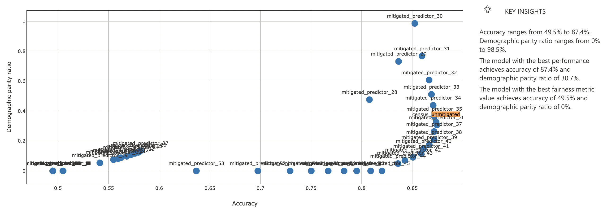


<br/>

### Phase3 : AI システムの検証とサポート

Phase2 で精度と責任ある AI の原則とのトレードオフを考慮したモデルが選択されました。Phase3 では本番環境にモデルをデプロイしていきます。主に機械学習エンジニア、DevOps エンジニアが作業を進めますが、Data Scientist とシームレスに連携する必要があったり、短いサイクルでモデルのリリースや再学習を行う必要性があるため、MLOps を導入します。

今回利用している Azure Machine Learning では GitHub (GitHub Actions) and/or Azure DevOps (Azure Pipelines) 用います。一般的には下記の MLOps のプラクティスを実装します。

- 再現可能な機械学習パイプライン
- 機械学習ライフサイクルの自動化
- 監査証跡の自動取得
- AI システムやモデルの監視
- 通知とアラートの仕組み

※ Azure Machine Learning における MLOps の詳細は [MLOps: Model management, deployment, lineage, and monitoring with Azure Machine Learning](https://docs.microsoft.com/en-us/azure/machine-learning/concept-model-management-and-deployment) を参照ください。


モデルの説明性・解釈可能性は、推論時にも必要になるケースがあります。今回のローン審査においては、ローンの審査の結果に大きく影響を与えた属性 (年齢、勤続年数、負債額 etc) が分かることで、銀行がユーザに謝絶理由を説明できたり、銀行の担当者が結果の妥当性を確認することができます。


<br/>

---


## 3. 機械学習モデルとデータを保護する

本モジュールでは、機械学習モデルを敵対的攻撃や潜在的な誤用などから保護するための技術を紹介します。

- 意図的な障害
    - 攻撃者は、AI システムの誤分類を発生させたり、個人情報などのプライベートなデータの推測、アルゴリズムの盗みを目的とします。
- 非意図的な障害
    - AI システムが正しい結果だが完全に安全で無い結果を生成します。

想定される具体的な障害の種類は [Machine Learning の エラー モード](https://docs.microsoft.com/ja-JP/security/engineering/failure-modes-in-machine-learning) を参照ください。

### SmartNoise

[SmartNoise](https://smartnoise.org/) は差分プライバシーを利用した AI システムを構築するためのオープンソースのライブラリです。。差分プライバシーはデータにノイズや乱数を追加することで、Data Scientist や外部の攻撃者が個々のデータポイントを識別できないようにします。

### Confidential Computing

[Azure Confidential Computing](https://azure.microsoft.com/ja-jp/solutions/confidential-compute/) を利用して Azure 上で機密データの処理を安全に行うことができます。Azure 内部ではデフォルトで Microsoft がデータを暗号化していますが、Microsoft がそのデータにアクセスしないことを確認するのは難しいことです。また機密データに対する攻撃者の手法も多様化しています。Azure Confidential Computing は使用中のデータ (Data In Use) を TEE (Trusted Execution Environments) を利用して保護します。現在は Intel SGX、AMD SEV-SNP、また Nvidia A100 GPUs with APM (Private Preview) が利用できます。

<br/>

---

## 4. 参考資料


|Topics          |Links                                               |Notes    |
|----------------|----------------------------------------------------|---------|
|Microsoft RAI   |[Microsoft の責任のある AI の原則](https://www.microsoft.com/ja-jp/ai/responsible-ai)||
|Microsoft RAI   |[Responsible AI resources](https://www.microsoft.com/en-us/ai/responsible-ai-resources)||
|Error Analysis  |[Error Analysis Web page](https://erroranalysis.ai/)|         |
|Fairlearn       |[Fairlearn Web page](https://fairlearn.org/)        |         |
|InterpretML     |[InterpretML Web page](https://interpret.ml)        |         |
|DiCE            |[DiCE repo](https://github.com/interpretml/DiCE)    |         |
|Microsoft Learn |[Discover ways to foster an AI-ready culture in your business](https://docs.microsoft.com/en-us/learn/paths/foster-ai-ready-culture/)||
|Microsoft Learn |[Identify principles and practices for responsible AI](https://docs.microsoft.com/en-us/learn/paths/responsible-ai-business-principles/)||
|Microsoft Learn |[Identify guiding principles for responsible AI in government](https://docs.microsoft.com/en-us/learn/paths/responsible-ai-government-principles/)||
|AI Business School |[AI Business School の人工知能コース](https://www.microsoft.com/ja-jp/ai/ai-business-school?rtc=1)||


