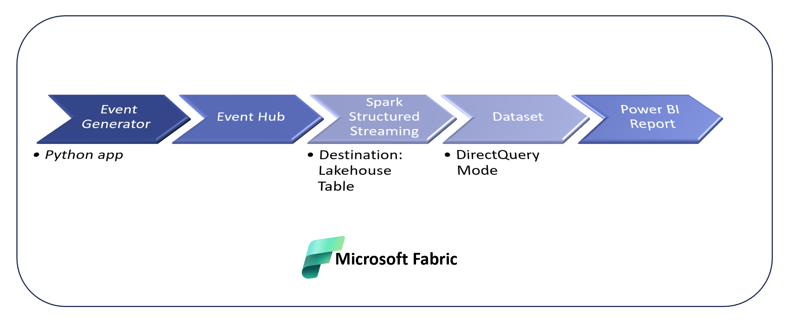
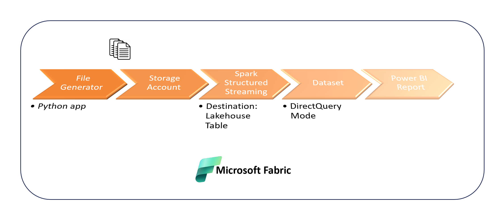

# Exploring Various Lakehouse Streaming within Microsoft Fabric <h3>( Different Real Time Analytics Pattern in Microsoft Fabric)

## What is Microsoft Fabric ?

- **all-in-one** analytics solution under one platform, all data services are seamlessly integrated.
  - Services within Microsoft Fabric:
    - *Data Engineering*: Empowers data engineers with Spark for transformation and Lakehouse democratization. Integrates with Data Factory for scheduling.
    - *Data Factory*: Unites Power Query's simplicity with Azure's scale. 200+ connectors enable efficient data movement.
    - *Data Science*: Seamlessly deploys Azure Machine Learning models. Enriches data for predictive BI insights.
    - *Data Warehouse*: High performance SQL, scalable with independent compute / storage. Utilizes Delta Lake format for data files.
    - *Real-Time Analytics*: Excels with high-volume, semi-structured observational data.
    - *Power BI*: Leading BI platform for intuitive Fabric data access.
- **Less management overhead**. Fabric allows creators to concentrate on producing their best work, freeing them from the need to integrate, manage, or understand the underlying infrastructure that supports the experience.
- **Enterprise Capabilities are pre-provisioned as part of the tenant**
  - [Flexible Licensing](https://learn.microsoft.com/en-us/fabric/enterprise/licenses)
    - [Pause and Resume Capacity](https://learn.microsoft.com/en-us/fabric/enterprise/pause-resume)
    - [Ability to resize Capacities](https://learn.microsoft.com/en-us/fabric/enterprise/scale-capacity)
  - [Inbuilt Monitoring App](https://learn.microsoft.com/en-us/fabric/enterprise/metrics-app-install?tabs=1st)
- **Data Governance** capabilities that are provided in Microsoft Fabric:
  - [Information Protection](https://learn.microsoft.com/en-us/fabric/governance/information-protection)
  - [Item Endorsement](https://learn.microsoft.com/en-us/fabric/get-started/endorsement-promote-certify#promote-items) (Promotion, Certification)
  - [Lineage](https://learn.microsoft.com/en-us/fabric/governance/lineage)
  - [Impact Analysis](https://learn.microsoft.com/en-us/fabric/governance/impact-analysis) on the items

## OneLake, OneCopy & OneSecurity in Microsoft Fabric
### [OneLake](https://learn.microsoft.com/en-us/fabric/onelake/onelake-overview)

OneLake is a single, unified, logical data lake for the whole organization. Like OneDrive, OneLake comes automatically with every Microsoft Fabric tenant and is designed to be the single place for all your analytics data.

(Image source: [OneLake overview](https://learn.microsoft.com/en-us/fabric/onelake/onelake-overview))
- Each tenant is allocated a single 'Data Lake' known as OneLake, which is provisioned automatically upon the addition of a new Fabric tenant. Within each tenant, numerous workspaces can be established, facilitating workload separation and department-specific access control across the organization.
- The data in OneLake is automatically indexed for discovery.
- [Microsoft Information Protection (MIP) labels](https://blog.fabric.microsoft.com/en-us/blog/microsoft-365-data-microsoft-fabric-better-together/)
- Lineage, PII scans, sharing, governance and compliance.

- **[Shortcuts](https://learn.microsoft.com/en-us/fabric/onelake/onelake-shortcuts)** Shortcuts allow organization to easily share data between users and applications without having to move and duplicate information unnecessarily.
- The data of all Fabric elements such as Data Warehouse and Lakehouse is automatically stored in OneLake using the **delta parquet** format.

### OneCopy
OneLake targets to maximize the utility derived from a single copy of data, eliminating the need for data duplication or movement. We will no longer have to duplicate data to utilize it with a different engine.

- One Copy of data with capability to access it from multiple compute engines (T-SQL, Spark, Power BI etc.).

### OneSecurity
[Getting Started with OneLake Security](https://learn.microsoft.com/en-us/fabric/onelake/get-started-security)

- OneLake is a hierarchical data lake, similar to Azure Data Lake Gen2 and Windows File System. This structure allows us to provide data access to be set at different levels like
  - Workspace security (Roles: Admin, Members, Contributor, Viewer)
  - Item security (Roles : Read, ReadAll, ReadData, Write)
  - Object security. (Roles: GRANT/DENY on SQL objects)
- [Sharing](https://learn.microsoft.com/en-us/fabric/get-started/share-items):  We can share items to the internal or external users or from the same workspace.
- Authentication (Azure AD credential pass through, Service Principal).

## [What is Real-Time Analytics in Fabric?](https://learn.microsoft.com/en-us/fabric/real-time-analytics/overview)

Real-Time Analytics is a fully managed big data analytics platform optimized for streaming, and time-series data. It utilizes a query language and engine with exceptional performance for searching structured, semi-structured, and unstructured data. Real-Time Analytics is fully integrated with the entire suite of Fabric products, for both data loading, data transformation, and advanced visualization scenarios.

## Components
- [Eventstream](https://learn.microsoft.com/en-us/fabric/real-time-analytics/event-streams/overview) for capturing, transforming, and routing real-time events to various destinations with a no-code experience.
  
 

- A [KQL database](https://learn.microsoft.com/en-us/fabric/real-time-analytics/create-database) for data storage and management. Data loaded into a KQL database can be accessed in OneLake and is exposed to other Fabric experiences.

## Demo :: Pattern-1 - Ingesting Events using Eventstream.

- **Source**: API Data/ Logic App
- **Destination**: KQLDB/ Lakehouse

Here is [**repo**](https://github.com/anshulsharmas/fabric-iss-demo/tree/main) for this demo.
1) _Event Generator (Logic App)_: This can be any external application or device which is responsible for sending the streaming event data to the event stream endpoint. In this example, we have used Logic apps to send the data into EventStream custom application. Logic Apps to pull the current location of ISS (every 10 sec) from the API : http://open-notify.org/Open-Notify-API/

2) _Event Stream_: Event Stream will receive events from the event generator, utilizing a custom app as the source. When creating the custom app, we will obtain a connection string that needs to be integrated into the logic app. Subsequently, the Event Stream will do transformation on the data by cleansing, and then will forward a cleansed output to the Lakehouse table and KQL table. Thus, we have a single source, sending the same data to two destinations. We can do some transformation like aggregation, column selection before storing the data into KQLDB.

3) _KQL DB_ : KQL DB stores the data from the event stream. KQL Database is really optimised for the huge amount of Real time dataset like time series data, IoT data etc.

## Demo Pattern 2:  Ingesting Events using spark structured streaming in Microsoft Fabric.
- **Source**: API Data/ Python App -> Event Hub
- **Destination**: Lakehouse

Unlike Pattern 1, this approach provides enhanced flexibility in transformation and the added capability to convert continuous streaming into micro-batches, thus reducing the workload on the workspace. However, it is worth noting that Pattern 1 offers a no-code experience and is better suited for use cases with minimal transformation requirements.

[Structured Streaming](https://learn.microsoft.com/en-us/fabric/data-engineering/lakehouse-streaming-data) is a scalable and fault-tolerant stream processing engine built on Spark. Spark takes care of running the streaming operation incrementally and continuously as data continues to arrive.

Azure Event Hubs Connector for Apache Spark ([azure-event-hubs-spark](https://github.com/Azure/azure-event-hubs-spark)) is recommended to connect Spark application to Azure Event Hubs.

**Notebook Examples:** 

- Event Generator (Python App): This notebook sends the data from the python app to the Event Hub.
[aync send_flight_data_to_appplicaiton.py](https://github.com/Sam-Panda/FABRICation/blob/main/real_time_analytics/event-generator/aync%20send_flight_data_to_appplicaiton.py)
- [Structured Streaming Notebook](https://github.com/Sam-Panda/FABRICation/blob/main/real_time_analytics/Notebook-Fabric/LH_RealtTime_Notebook_Structured_Streaming.ipynb)

## Demo Pattern 3:  Ingesting smaller Files continuously into Lakehouse.
- **Source**: Dummy Data/ Python App -> Blob Storage
- **Destination**: Lakehouse

**Notebook Examples:** 

- Event Generator (Python App): This notebook create small files with the dummy data into the blob storage. [generateStreamInputFiles.py
](https://github.com/Sam-Panda/FABRICation/blob/main/real_time_analytics/event-generator/generateStreamInputFiles.py)
- [Structured Streaming Notebook for the CSV files](https://github.com/Sam-Panda/FABRICation/blob/main/real_time_analytics/Notebook-Fabric/LH_RealTime_Notebook_from_CSV_Structured_Streaming.ipynb)