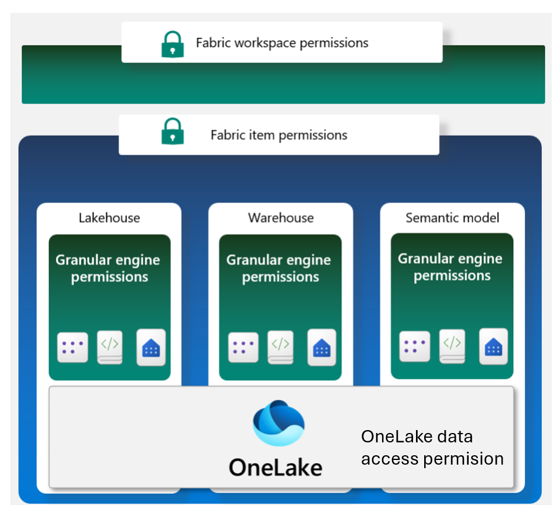

# Security In Microsoft Fabric

Fabric security is:

* **Always on**- Every interaction with Fabric is encrypted by default and authenticated using Microsoft Entra ID. All communication between Fabric experiences travels through the Microsoft backbone internet. _Data at rest is automatically stored encrypted_. 
* **Securable**- To regulate access to Fabric, you can add extra security features such as Private Links or Entra Conditional Access . Fabric can also connect to data protected by a firewall or a private network using trusted access.
* **Compliant** – Fabric has data sovereignty out of the box with multi geo capacities. Fabric also supports a wide range of compliance standards.
* **Governable** - Fabric comes with a set of governance tools such [data lineage](https://learn.microsoft.com/en-us/fabric/governance/lineage), [information protection labels](https://learn.microsoft.com/en-us/fabric/governance/information-protection), [data loss prevention](https://learn.microsoft.com/en-us/purview/dlp-learn-about-dlp) 

## 1. Authenticate: 
Microsoft Fabric is a SaaS platform, like many other Microsoft services such as Azure, Microsoft Office, OneDrive, and Dynamics. All these Microsoft SaaS services including Fabric, use Microsoft Entra ID as their cloud-based identity provider.

## 2. Data Encryption

### 2.1. Data at rest

All Fabric data stores are encrypted at rest by using Microsoft-managed keys. Fabric data includes customer data as well as system data and metadata. While data can be processed in memory in an unencrypted state, it's never persisted to permanent storage while in an unencrypted state

### 2.2. Data at Transit

Data in transit across the public internet between Microsoft services is always encrypted with at least TLS 1.2. Fabric negotiates to TLS 1.3 whenever possible.

## 3. Data Security

Fabric offers a multi-layer security model that provides both simplicity and flexibility in managing data access. Security can be set for an entire workspace, for individual items, or through granular permissions in each Fabric engine

**3.1. Fabric Workspace Permission:**

* Viewer - Can view all content in the workspace, but can't modify it.
* Contributor - Can view and modify all content in the workspace.
* Member - Can view, modify, and share all content in the workspace.
* Admin - Can view, modify, share, and manage all content in the 

**3.2. Fabric Item Permission:**

Item permissions are used to control access to individual Fabric items within a workspace. Different Fabric items have different permissions. Item permissions are confined to a specific item and don't apply to other items.

* [Semantic model](https://learn.microsoft.com/en-us/power-bi/connect-data/service-datasets-permissions)
* [warehouse](https://learn.microsoft.com/en-us/fabric/data-warehouse/share-warehouse-manage-permissions)
* [Lakehouse](https://learn.microsoft.com/en-us/fabric/data-engineering/lakehouse-sharing)
* [Data science](https://learn.microsoft.com/en-us/fabric/data-science/models-experiments-rbac)
* [Real-Time Analytics](https://learn.microsoft.com/en-us/azure/data-explorer/kusto/management/security-roles)

**3.3. Granular Engine Permissions:**

Many Fabric engines allow fine-grained access control such as table, column, and row-level security to be defined

* [Data warehouse Security and SQL Endpoint Security in Lakehouse](https://learn.microsoft.com/en-us/fabric/data-warehouse/security) 
    - object-level security
    - Column-level security
    - Row-level security
    - Dynamic Data Masking
* [Power BI security](https://learn.microsoft.com/en-us/fabric/data-factory/connector-lakehouse-overview)
* [Real Time Analytics Row Level Security](https://learn.microsoft.com/en-us/azure/data-explorer/kusto/management/row-level-security-policy)
* [OneLake Data Access Security](https://learn.microsoft.com/en-us/fabric/onelake/security/get-started-data-access-roles)

## 4. Network Security

Fabric's default security settings include:

* Microsoft Entra ID which is used to authenticate every request. Upon successful authentication, requests are routed to the appropriate backend service through secure Microsoft managed endpoints.
* Internal traffic between experiences in Fabric is routed over the Microsoft backbone.
* Traffic between clients and Fabric is encrypted using at least the Transport Layer Security (TLS) 1.2 protocol

### 4.1. Inbound Security ( traffic coming into Fabric from the internet)

Here are the 2 options that we have for securing inbound traffic to Fabric:

1. Entra Conditional Access - When a user authenticates access is determined based on a set of policies that might include IP address, location, and managed devices.
2. Private links - Fabric uses a private IP address from your virtual network. The endpoint allows users in your network to communicate with Fabric over the private IP address using private links.

    

### 4.2. Outbound Security ( different ways to import and connect to data from a secure network into fabric)

1. **Trusted workspace access:**

    **Applicable to:** Fabric connecting to Azure Data lake Storage (ADLS) Gen2

    

2. **Managed Virtual Network and Managed Private Endpoints**

    **Applicable to:** - spark compute in Data Engineering experience.

    

    * With a managed virtual network you get complete network isolation for the Spark clusters running your Spark jobs (which allow users to run arbitrary user code) while offloading the burden of managing the virtual network to Microsoft Fabric.
    * You don't need to create a subnet for the Spark clusters based on peak load, as this is managed for you by Microsoft Fabric.
    * A managed virtual network for your workspace, along with managed private endpoints, allows you to access data sources that are behind firewalls or otherwise blocked from public access.

3. **Data Gateway**

    1. [On-premises data gateway](https://learn.microsoft.com/en-us/power-bi/connect-data/service-gateway-onprem) - The gateway acts as a bridge between your on-premises data sources and Fabric. The gateway is installed on a server within your network, and it allows Fabric to connect to your data sources through a secure channel without the need to open ports or make changes to your network.

    **Applicable to** : Dataflow Gen2, Data Pipeline, Power BI Service directly connection to the datasource, 

    

    2.[ Virtual network (VNet) data gateway ](https://learn.microsoft.com/en-us/data-integration/vnet/overview)- The VNet gateway allows you to connect from Microsoft Cloud services to your Azure data services within a VNet, without the need of an on-premises data gateway.
    
     **Applicable to** : Dataflow Gen2, Power BI Service directly connection to the datasource, 
 
    

### 4.3 Common Network Security Scenarios:

| **Scenario** 	| **Tools** 	| **Direction** 	|
|--------------	|-----------	|---------------	|
|As an ETL developer, I aim to load large volumes of data into Fabric at scale from multiple source systems and tables.   The source data is on-premises or in other cloud environments, protected by firewalls and/or Azure data sources with private endpoints.  | Use [data pipeline copy activity](https://learn.microsoft.com/en-us/fabric/data-factory/data-factory-overview#data-pipelines) with [On Premises Data Gateway ](https://learn.microsoft.com/en-us/data-integration/gateway/service-gateway-onprem)       	| Outbound  |
|As a power user, I want to load data into Fabric from the source systems I have access to. Since I am not a developer,   I need to transform the data using a low-code interface. The source data is located on-premises or in another cloud environment and is behind firewalls.              	|    [Use on-premises data gateway](https://learn.microsoft.com/en-us/data-integration/gateway/service-gateway-onprem) with [Dataflow Gen 2](https://learn.microsoft.com/en-us/fabric/data-factory/data-factory-overview#dataflows)   	|      Outbound         	|
|As a power user, I want to load data into Fabric from the source systems I have access to. The source data is in Azure behind private endpoints,   and I do not want to install or maintain on-premises data gateway infrastructure.|Use a [VNet data gateway](https://learn.microsoft.com/en-us/data-integration/vnet/overview) with [Dataflow Gen 2](https://learn.microsoft.com/en-us/fabric/data-factory/data-factory-overview#dataflows).|Outbound|
|As a developer proficient in writing data ingestion code using Spark notebooks, I want to load data into Fabric from the source systems I have access to.   The source data is in Azure behind private endpoints, and I do not want to install or maintain on-premises data gateway infrastructure.|Use [Fabric notebooks](https://learn.microsoft.com/en-us/fabric/data-engineering/how-to-use-notebook) with [Azure private endpoints](https://learn.microsoft.com/en-us/azure/private-link/manage-private-endpoint?tabs=manage-private-link-powershell).|Outbound|
|I want to ensure that my Fabric endpoints are protected from the public internet.|As a SaaS service, the Fabric back end is already protected from the public internet.  For additional protection, use [Microsoft Entra conditional access policies](https://learn.microsoft.com/en-us/fabric/security/security-conditional-access) for Fabric and/or   enable [private links at tenant level](https://learn.microsoft.com/en-us/fabric/security/security-private-links-overview) for Fabric and block public internet access.|Inbound|
|I want to ensure that Fabric can be accessed from only within my corporate network   and/or from compliant devices.   Also, they should use the MFA authentication |Use [Microsoft Entra conditional access policies](https://learn.microsoft.com/en-us/fabric/security/security-conditional-access) for Fabric.| Inbound|
|I want to lock down my entire Fabric tenant from the public internet and allow access only from within my virtual networks.|[Enable private links at tenant level](https://learn.microsoft.com/en-us/fabric/security/security-private-links-overview) for Fabric and block public internet access.| Inbound|
|||
