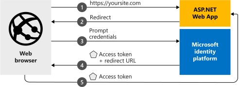

#### [prev](./readme.md) | [home](./readme.md)  | [next](./Final-Take-Aways.md)

# Modern Authentication

## Terminology & Concepts 

* Azure Active Directory for Applications Overview
* Authentication vs. Authorization
* Modern Authentication Protocols
* Single Tenant vs. Multi-Tenant
* Principals
* Microsoft Authentication Library (MSAL) vs. Microsoft Identity Web

## Azure Active Directory for Applications Overview

## Authentication vs. Authorization
Authentication and authorization seem like [similar concepts](https://docs.microsoft.com/en-us/azure/active-directory/develop/authentication-vs-authorization) and are commonly mistaken for each other. However, authentication is only the process of proving that you are who you say you are and is shortened to AuthN. The Microsoft identity platform can use the OpenID Connect or SAML 2.0 protocols to handle authentication. For this session, we will mainly focus on the more commonly used authentication protocol, OpenID Connect.

On the other hand, authorization is the act of granting an authenticated party permission to perform a certain action or access to certain data and is shortened to AuthZ. The Microsoft identity platform uses the OAuth 2.0 protocol to implement authorization.

## Modern Authentication Protocols
### OAuth 2.0

This [protocol](https://docs.microsoft.com/en-us/azure/active-directory/develop/active-directory-v2-protocols), which stands for “Open Authorization”, is a standard designed for implementing security token (JWT) based authorization in [web, mobile, desktop, and headless applications](https://docs.microsoft.com/en-us/azure/active-directory/develop/v2-app-types). OAuth 2.0 is an authorization protocol and NOT an authentication protocol. As such, it is designed primarily as a means of granting access to a set of resources, for example, remote APIs or protected data.

This protocol heavily uses the concept of [security tokens](https://docs.microsoft.com/en-us/azure/active-directory/develop/security-tokens) (JWT format). The two primary token types used are [access](https://docs.microsoft.com/en-us/azure/active-directory/develop/access-tokens) and [refresh tokens](https://docs.microsoft.com/en-us/azure/active-directory/develop/refresh-tokens). An access token is a piece of data that represents the level of access (authorization) a defined user or service principal has for specific resources. A refresh token is used to request a new access token after the access token has expired. Each of these tokens follow the JWT standard and must be fully validated before being accepted or used.

### OpenID Connect
This [protocol](https://docs.microsoft.com/en-us/azure/active-directory/develop/v2-protocols-oidc) is built on top of OAuth 2.0 and is used to sign-in users and provide data on who they are. OpenID Connect, also known as OIDC, extends the OAuth 2.0 authorization protocol for use strictly as an authentication protocol, which enables you to perform single sign-on (SSO) using OAuth 2.0. This protocol heavily uses the concept an [ID token](https://docs.microsoft.com/en-us/azure/active-directory/develop/id-tokens), a security token in JWT format, which is used to identify the user and provide data on who they are, data such as their basic username, email, object id, etc. This token and protocol allow client applications to verify the identity of the user to enable a secure authentication flow.

### SAML 2.0
[SAML 2.0](https://docs.microsoft.com/en-us/azure/active-directory/develop/active-directory-saml-protocol-reference) is an XML-based open-standard, only used for authentication, for transferring identity data between two parties, an identity provider (IdP) and a service provider (SP) and stands for Security Assertion Markup Language. 

### Protocol Comparison
* **OAuth versus OpenID Connect:** The Microsoft identity platform uses OAuth 2.0 for authorization and OpenID Connect (OIDC) for authentication. OpenID Connect is built on top of OAuth 2.0, so the terminology and flow are similar between the two. You can even both authenticate a user (through OpenID Connect) and get authorization to access a protected resource that the user owns (through OAuth 2.0) in one request.
* **OpenID Connect versus SAML:** The Microsoft identity platform can use either OpenID Connect or SAML 2.0 to authenticate a user and enable single sign-on (SSO). SAML 2.0 authentication is commonly used with on-prem or legacy identity providers such as Active Directory Federation Services (ADFS), after being federated to Azure AD, so it's often used in enterprise applications. On the other hand, OpenID Connect is more commonly used for applications that are more modern, such as cloud native applications.
  
### Legacy Authentication Protocols
In the past, ASP.Net web-based applications, such as web forms or MVC based projects, were mainly deployed to Microsoft Internet Information Server (IIS). This solution leveraged integrated Windows Authentication using the NT LAN Manager (NTLM) or Kerberos authentication protocols for authentication and authorization.

These protocols, Kerberos and Windows Authentication, are now considered legacy protocols and are not recommended when using the Microsoft identity platform or when migrating your applications to Azure.

## Single Tenant vs. Multi-Tenant
Azure Active Directory organizes objects, such as users and service principals, into logically isolated groups called tenants. Tenants allow owners or administrators the ability to define security and operational policies to enforce their organization's compliance and identity requirements. These policies can be applied to all users and applications that need to access resources from the tenant. 

When creating an application in Azure Active Directory, you must choose whether to allow only users from your tenant, [single-tenant](https://docs.microsoft.com/en-us/azure/active-directory/develop/single-and-multi-tenant-apps), or users from any tenant, [multi-tenant](https://docs.microsoft.com/en-us/azure/active-directory/develop/single-and-multi-tenant-apps). The main difference between the two is single-tenant applications are only available to users that exist in the same tenant the application was created in, while multi-tenant applications are available to users from both the same tenant the application was created in and other Azure Active Directory tenants. For this session, we will mainly focus on creating and managing single-tenant applications.

## Principals
To access resources that are secured by Azure Active Directory, a client must use and be represented by a [security principal](https://docs.microsoft.com/en-us/azure/active-directory/develop/app-objects-and-service-principals). The security principal defines the level of permissions a client has to one more Azure Active Directory tenant(s). This principal can exist as either a user account, service principal (also known as an app registration), or managed identity. For this session, we will mainly focus on covering two of these principals, [service principals and managed identities](https://docs.microsoft.com/en-us/azure/active-directory/develop/app-objects-and-service-principals#service-principal-object).

## Microsoft Authentication Library (MSAL) vs. Microsoft Identity Web
* **Microsoft Authentication Library (MSAL):** The [Microsoft Authentication Library (MSAL)](https://docs.microsoft.com/en-us/azure/active-directory/develop/msal-overview) enables developers to acquire tokens from the Microsoft identity platform in order to authenticate users and access secured web APIs. It can be used to provide secure access to Microsoft Graph, other Microsoft APIs, third-party web APIs, or your own web API. MSAL supports many different application architectures and platforms including .NET, JavaScript, Java, Python, Android, and iOS.
* **Microsoft Identity Web:** [Microsoft Identity Web](https://docs.microsoft.com/en-us/azure/active-directory/develop/microsoft-identity-web) is a set of ASP.NET Core libraries that simplifies adding authentication and authorization support to web apps and web APIs integrating with the Microsoft identity platform. It provides a single-surface API convenience layer that ties together ASP.NET Core, its authentication middleware, and the Microsoft Authentication Library (MSAL) for .NET.

#### [prev](./readme.md) | [home](./readme.md)  | [next](./Final-Take-Aways.md)