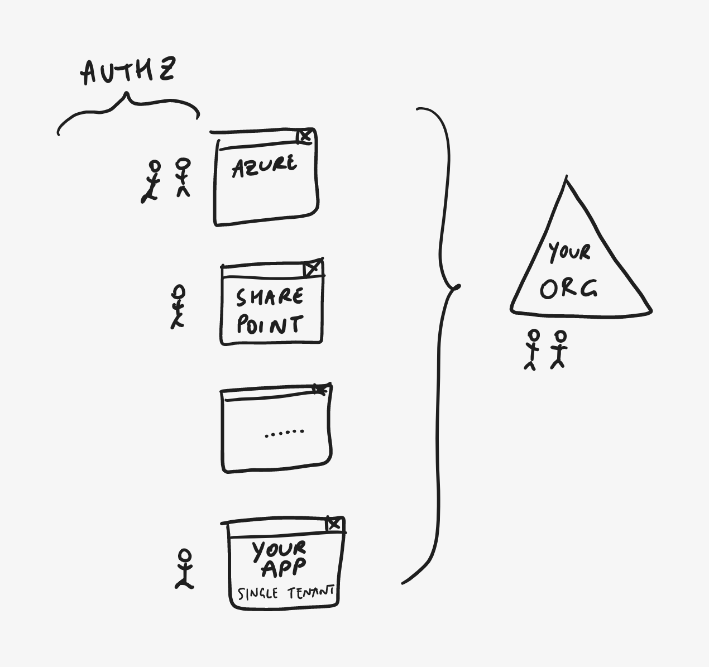

# Azure AD

> **[prev](01-identity-offerings-overview.md) | [home](readme.md)  | [next](03-azuread-authz.md)**

Azure AD is the central identity control plane for an individual organization. The organizational directory holds all your users and controls how they can sign in (that is, perform _authentication_) - including security and governance features like Conditional Access (CA), Multi-Factor Authentication (MFA), Privileged Access Management (PIM), etc.

Thousands of applications are natively integrated with Azure AD. This includes first party offerings like Microsoft 365 (SharePoint, Exchange, Teams, ...) and Azure, as well as third party offerings like Salesforce, ServiceNow and Box.

However, Azure AD is an open Identity Provider (IdP), which means you can also integrate your own line-of-business (LOB) applications with Azure AD and let your organizations' users sign in with their existing credentials (and taking full advantage of the governance features mentioned above). By adopting a fully externalized and cloud-scale platform (rather than a library or locally hosted identity solution), **you are no longer responsible for collecting, storing and securing any credentials for your application's users**.

> **DEMO - Azure AD single-tenant apps**
>
> - In Azure AD, **register a new application**.
> - Set the **Supported account types** to **Accounts in this organizational directory only** (single-tenant).
> - Set the **Redirect URI** to **[https://authr.biz](https://authr.biz)**.
> - Once registered, open the **Authentication** page and under **Implicit grant and hybrid flows**, make sure to allow **ID tokens** to be issued by the authorization endpoint.
> - In a separate tab, go to **[https://authr.biz](https://authr.biz)** which is a web app to easily test various authentication and authorization scenarios.
> - To see the end user sign-in experience of the app you just registered, use this **[direct link](https://authr.biz/?requesttype=OpenIdConnect&scope=openid+profile&responsetype=id_token&responsemode=form_post&additionalparameters=prompt%3dlogin&importtype=AzureAD&tenant=microsoft.onmicrosoft.com&clientid=your-client-id)** and replace the **Client ID** on the form with the correct **Application (client) ID** value from the app registration and ensure to use the right tenant.
> - Alternatively, configure the flow manually:
>   - Set the **Protocol Flow** to **OpenID Connect**.
>   - Click the **Import** button, select Azure AD, enter `microsoft.com` as the tenant (or use your own) and click **Import** to generate the right endpoints.
>   - Set the **Client ID** to the correct value from the app registration.
>   - Optionally, set the **Scope** to `openid profile` (by including `profile`, the token will include more information about the user).
>   - Optionally, if you want to *force* a login rather than using SSO, set **Additional Parameters** to `prompt=login`.
> - Click **Submit** to execute a standard sign-in flow for the single-tenant Azure AD application you just registered.
> - After the successful sign-in, the application shows the ID token that was issued by the directory, containing relevant claims about the signed-in user.

> **[prev](01-identity-offerings-overview.md) | [home](readme.md)  | [next](03-azuread-authz.md)**
