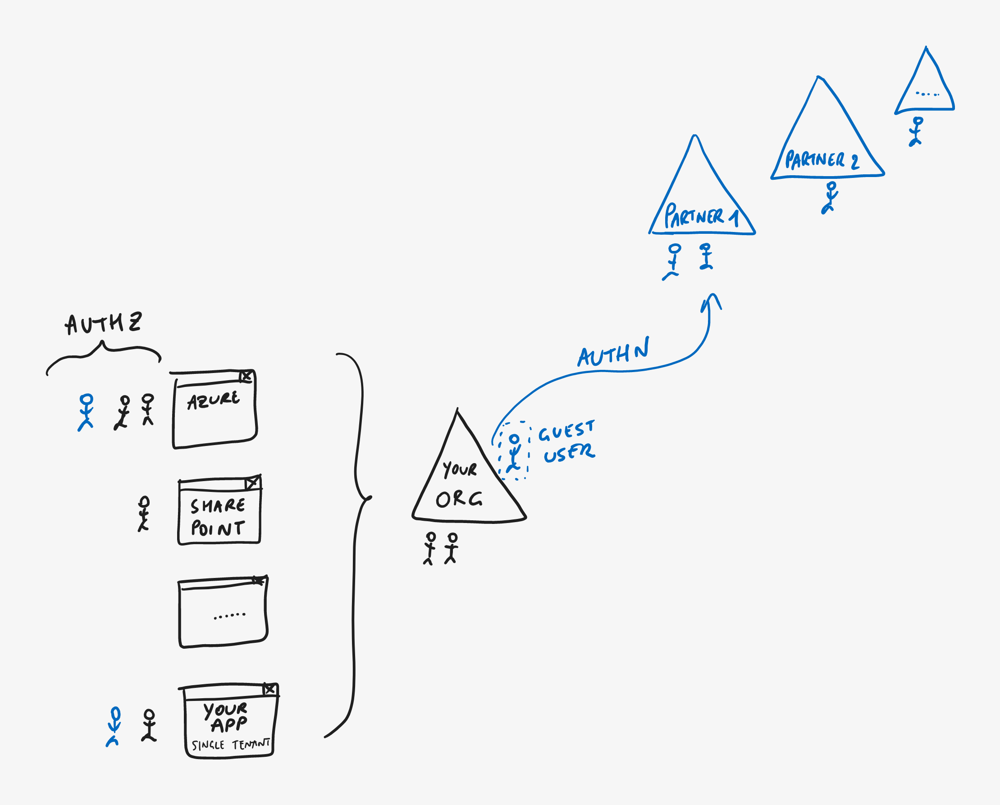

# Azure AD B2B Guest User Access

> **[prev](03-azuread-authz.md) | [home](readme.md)  | [next](05-azuread-multitenant.md)**

Allowing your own users to access these applications is great, but often you'll want to collaborate with external users as well. For example, you may want to grant a consultant access to your Azure subscriptions, or collaborate with a business partner by sharing files in a SharePoint library.

Rather than creating "fake" user accounts for those users in your own directory (and thereby making yourself responsible for managing the credentials and the user lifecycle of these external users), you can use Azure AD B2B features to invite them as guests into your own directory. This means a "shadow" account (indicated with a dotted box in the diagram) is created in your directory, but it will not hold any credentials. As a result, these **guest users still *authenticate* in their home directory (where their own policies like MFA are still applied), but you control *authorization* to your apps in your own directory**.

Typically, you don't need to do anything special in your own applications to work with [B2B guest users](https://docs.microsoft.com/azure/active-directory/external-identities/user-properties). If you want to know whether a user is a direct member or a guest, you can see this in the directory where the `UserType` property will be set to `Guest`.

Note that B2B guest user invitations work for any external IdP that supports [SAML or WS-Federation](https://docs.microsoft.com/azure/active-directory/external-identities/direct-federation), as well as Google, Facebook, Microsoft Accounts or (as an escape-hatch) any email address using [Email OTP](https://docs.microsoft.com/azure/active-directory/external-identities/one-time-passcode).

> **DEMO - Azure AD B2B guest users**
>
> - In Azure AD, **invite a new guest user**. You can invite a personal email address to the directory for example to see what the user experience looks like. Open the email that you should have received and accept the invitation.
> - Go back through the exact same flow in **[Authr](https://authr.biz)** as before but now sign in with the guest user account (especially here it can be useful to set **Additional Parameters** to `prompt=login` to avoid SSO with your main account).
> - **Inspect the ID token** and note that there are a few differences for guest users; for example that the issuer (`iss`) claim is different from the identity provider (`idp`) claim: the first one reflecting the directory where the app was registered and where the token was issued from, the second one being the (external) service which authenticated the user.
> - Note that the same features as before (like groups or app roles) also work fine with B2B guest users.

> **[prev](03-azuread-authz.md) | [home](readme.md)  | [next](05-azuread-multitenant.md)**
