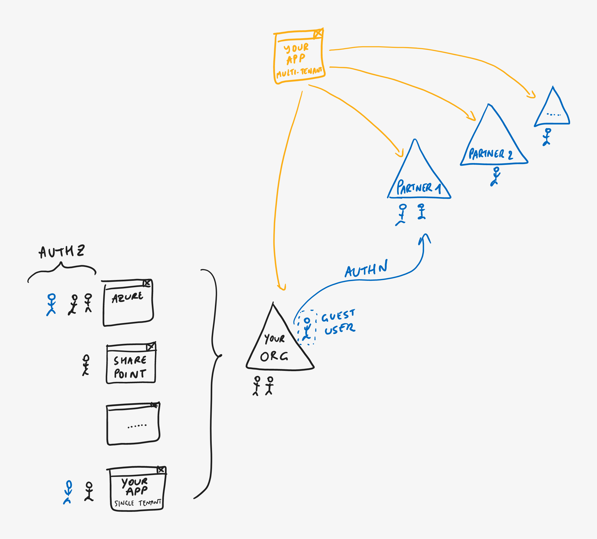

# Azure AD Multi-Tenant Apps

> **[prev](04-azuread-b2b.md) | [home](readme.md)  | [next](06-azuread-b2c.md)**

If your app isn't a traditional LOB app intended for a single organization (optionally including any guest users in that organization's directory), but rather an app that can be used directly by many organizations, or even a **Software-as-a-Service (SaaS) app for which you want to maximize the reach to the millions of organizations using Azure AD**, you can register it as a [multi-tenant app in Azure AD](https://docs.microsoft.com/azure/active-directory/develop/howto-convert-app-to-be-multi-tenant). Depending on your configuration, this can even include personal Microsoft accounts that are used to sign in to services like Xbox and Skype.

Your app can still use the same authorization features like groups and roles, and each organization using your app can manage its permissions separately because of the [distinction](https://docs.microsoft.com/azure/active-directory/develop/app-objects-and-service-principals) between the *app registration* (the central "blueprint" of the app definition as configured in *your* directory) and the *service principal* (the "instance" of the app in the *customer's* directory) on which permissions are defined.

> **DEMO - Azure AD multi-tenant apps**
>
> - In Azure AD, go back to the **Authentication** page of the app registration and change the **Supported account types** to **Accounts in any organizational directory** (multi-tenant).
> - Go back to **[Authr](https://authr.biz)** with this **[direct link](https://authr.biz/?requesttype=OpenIdConnect&scope=openid+profile&responsetype=id_token&responsemode=form_post&additionalparameters=prompt%3dlogin&importtype=AzureAD&tenant=common&clientid=your-client-id)** (again, make sure to replace the **Client ID** and tenant) or continue with the last request parameters but replace the tenant name in the Identity Service endpoints with `common` (for example, `https://login.microsoftonline.com/common/oauth2/v2.0/authorize`).
> - **Perform a new authentication** and note that you are now able to log in with *any* account in *any* directory.

> **[prev](04-azuread-b2b.md) | [home](readme.md)  | [next](06-azuread-b2c.md)**
