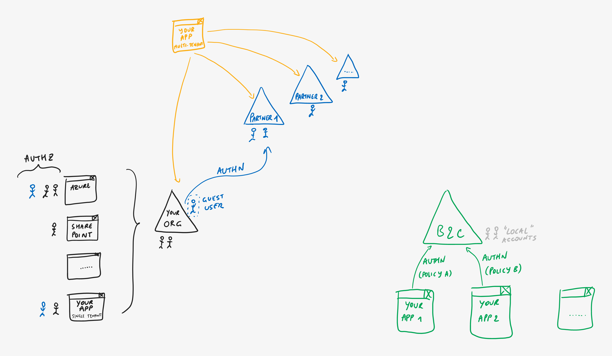

# Azure AD B2C

> **[prev](05-azuread-multitenant.md) | [home](readme.md)  | [next](07-azuread-b2c-social.md)**

The offerings discussed up to now have all been anchored on Azure AD, which targets organizations and provides collaboration features between them. If your app is intended to be used by external users not necessarily defined in Azure AD, but instead targets **individual consumers, customers or citizens**, you can use Azure AD B2C. This is internally still built upon the global cloud-scale Azure AD platform but enables unique features to provide your apps with Customer Identity Access Management (CIAM) capabilities.

Azure AD B2C is a logically separate environment, allowing you to keep your consumer users separated from your organizational directory. Your apps integrate with Azure AD B2C through user journeys ("user flows" or "policies") that can be fully customized to fit with your app or company branding. Different apps can use different policies for various reasons, and a single app can even use multiple policies for scenarios like sign-up or sign-in, profile editing, password reset, progressive user profiling, etc.

> **[prev](05-azuread-multitenant.md) | [home](readme.md)  | [next](07-azuread-b2c-social.md)**
