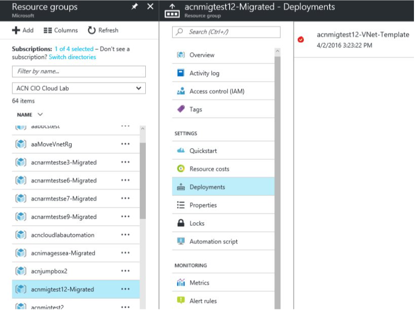

# Common Blockers and FAQ

#### [prev](./postmigration.md) | [home](./readme.md)  | [next](./resources.md)

## Handling Migration Errors​
- Errors can happen in Prepare and Commit phases​
- Look at the error message returned from Move-AzureRmVirtualNetwork​
- Find the new “-Migrated” resource group in ARM that halted migration (the cloud service that caused the error).​
- Look under Deployments for detail on the error.​
- Conflicts can happen. In many cases a retry will resolve and continue the migration. If not, open a support ticket.​
- Abort can be used to rollback a Prepare​

# Common Blockers for Virtual Machines
## What doesn’t exist in ARM​
- Affinity Groups​
- Load Balancers aren’t required​
    - You can likely eliminate load balancers after migration​
- Virtual Machine Endpoints​
    - NSGs replaces this​
- Virtual Machine Images​
    - Convert Storage Account to ARM​
    - Upgrade to Managed Disk Image

## VM State Problems​
- Provisioning Timed Out​
    - Ensure VMs are either in Shutdown (Deallocated) or Running state prior to migration​

- RoleStateUnknown​
    - Retry migration (prepare or commit). ​
    - Sometimes a VM’s role can’t be determined momentarily. Usually autocorrects.​
        - Example, removing a VM extension can put the VM in an Unknown state, waiting a few minutes will bring the VM back to a Running state.​

## Availability Sets​
- Rule: All classic VMs in a cloud service need to be in 1 AvSet, or 0 VMs in an AvSet. You cannot have 2 or more AvSets during migration.​
- Pre-work will be needed to resolve​

## Multiple Subnets​
- Rule: VMs should only reside on one subnet during migration.​
- This may require your to remove a secondary NIC and reattach after migration​
## ExpressRoute​
- Rule: All ExpressRoute circuits should be upgraded to ARM before IaaS Migration​
- Upgrade Classic ExpressRoute Circuits to ARM and Enable allowClassicOperations

## VM Extensions​
- XML VM Extensions are unsupported​
    - Remove XML VM extensions (BGInfo 1.*, Visual Studio Debugger, Web Deploy, and Remote Debugging) prior to migration or they will automatically be dropped​

- Azure Security Center/Defender for Cloud extension​
    - Disable the security center policy on the subscription which will remove the Security Center monitoring extension from the Virtual Machines​

​- Azure Backup Extension​
    - Stop Protection – Leave the data in the vault​
    - Remove VM Backup extension​
    - Migrate to ARM​
    - Protect the VM using a Recovery Services Vault
# Common Blockers for Cloud Services
## Mixed IaaS and PaaS
Cloud services with VMs and Cloud Services are unsupported for migration

## Old sku references
- Small, Medium, Large, ExtraLarge​. 
    - Change the sku size to use modern sku offerings (I.e., A2) prior to migration

## Empty Cloud Service
- Not supported​
    - If you have an empty cloud service, you can delete it.

## Cannot rename/move *–Migrated resource group for naming conventions
The -Migrated resource group name can be renamed after migration is completed. Also the resources in the RG can be moved following the guidance [here](https://learn.microsoft.com/en-us/azure/azure-resource-manager/management/move-limitations/cloud-services-extended-support).

## RBAC Roles​
Post migration, the URI of the resource changes from Microsoft.ClassicCompute to Microsoft.Compute RBAC policies needs to be updated after migration.​

## Items discarded during migration
- Alerts, Autoscale rules​
    - Add Alerts and Autoscale rules back manually post-migration

## Quotas
- Ensure you have ARM quota available for migration​
    - Request core quotas for new VM skus in ARM prior to migration

## Multiple staging slots
- Only one slot supported​
    - Migrate the production slot as an independent Cloud Service (extended support) in Azure Resource Manager. Then redeploy the staging environment as a new Cloud Service (extended support) and make it swappable with the first one.​
- When using reserved IP addresses​
    - Not supported today

## Virtual Networks
- Very old non-vnet enabled Cloud Services may fail during migration​
- Ensure non-explicit subnet mappings in csconfig need to be mapped prior to migration​
- Vnets with peering, App Service Environments, HDInsight, or affinity groups are unsupported​
- Vnets with Azure AD Domain Services​
    - Migrate Azure AD DS to a new network prior to migration​
- ExpressRoute Gateways or Circuits​
    - Migrate ExpressRoute Circuit to ARM prior to migration; Delete ExpressRoute Gateway, Migrate, and add back

