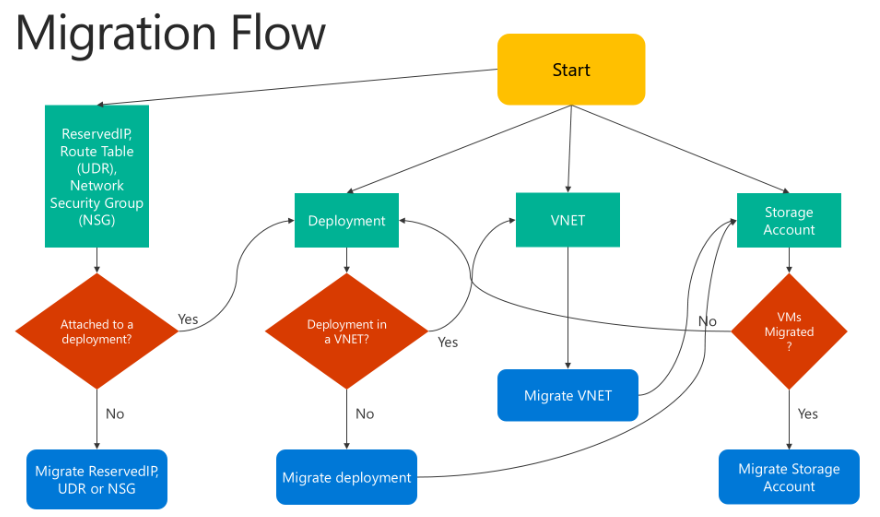
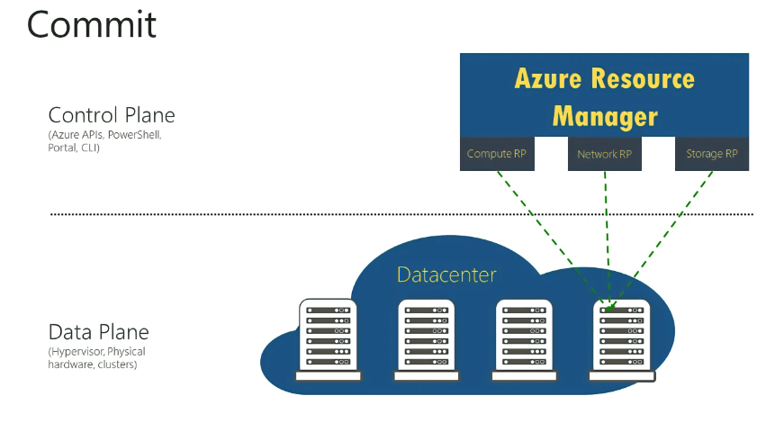
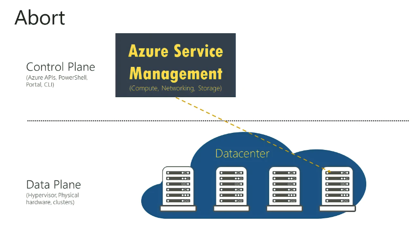

# Commit and Abort Stages

#### [prev](./prepare.md) | [home](./readme.md)  | [next](./postmigration.md)

Migration flowchart that shows how to proceed with migration:

## Commit

After you finish the validation, you can commit the migration. Resources do not appear anymore in the classic deployment model, and are available only in the Resource Manager deployment model. The migrated resources can be managed only in the new portal

## Abort
This is an optional step if you want to revert your changes to the classic deployment model and stop the migration. This operation deletes the Resource Manager metadata (created in the prepare step) for your resources.

