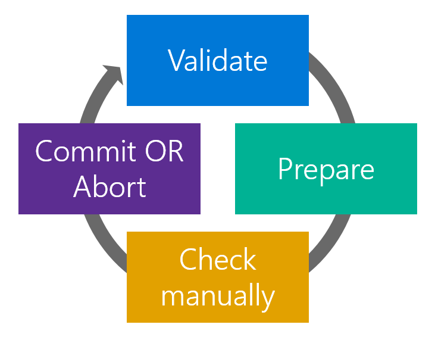

# Azure Classic Migration Overview

#### [prev](./readme.md) | [home](./readme.md)  | [next](./premigration.md)

## The Why? Of the Migration and Important Deadlines
- [Overview](https://learn.microsoft.com/en-us/azure/virtual-machines/classic-vm-deprecation) and Important Deadlines:
    - [On September 6, 2023](https://learn.microsoft.com/en-us/azure/virtual-machines/classic-vm-deprecation), customers will no longer be able to start IaaS VMs by using ASM. Any that are still running or allocated will be stopped and deallocated.
    - [On 31 August 2024](https://azure.microsoft.com/en-us/updates/cloud-services-classic-retirement-announcement/), we’ll retire the Cloud Services (classic) deployment model. Beginning 1st September 2024, your Cloud Service deployments would be stopped and deallocated, and data will be permanently lost.
        - Because [classic storage accounts](https://azure.microsoft.com/en-us/updates/classic-azure-storage-accounts-will-be-retired-on-31-august-2024/) are dependent on Azure Cloud Services (classic), they'll be retired on the same date of 31 August 2024.
        - Because [classic Azure Virtual Network, reserved IP addresses, Azure ExpressRoute gateway, Azure Application Gateway, and Azure VPN Gateway](https://azure.microsoft.com/en-us/updates/five-azure-classic-networking-services-will-be-retired-on-31-august-2024/) are dependent on Azure Cloud Services (classic), they’ll be retired on the same date of 31 August 2024.

# Infrastructure Migration

## [Pre-Migration Steps](./premigration.md)
Prior to migration, there are a few key steps that will lead to a smoother migration experience.
- Inventory your classic resource types
- Review [supported resources for migration](https://learn.microsoft.com/en-us/azure/virtual-machines/migration-classic-resource-manager-overview#supported-resources-for-migration)
- Review [unsupported features and configurations](https://learn.microsoft.com/en-us/azure/virtual-machines/migration-classic-resource-manager-overview#unsupported-features-and-configurations)
- Understand the [classic migration process](https://learn.microsoft.com/en-us/azure/virtual-machines/migration-classic-resource-manager-deep-dive)

## [Validate](./validate.md)
There are a few different options for running the platform-supported migration sequence. Whether using the Azure Portal, PowerShell, or the Azure CLI, you will need to run Validation on each of the following classic resources:
- Express Route Circuits 
- Virtual Networks
- Cloud Services
- Storage Accounts

The validate step will provide a list of **most** unsupported configurations you will need to address prior to migration. Capturing these lists and creating an inventory will help to sequence your migration. Some configurations can be removed without disruption immediately, others require a bit more planning and coordination.

**Key note here:** On occasion, the validate step [may not return all unsupported configurations](https://learn.microsoft.com/en-us/azure/virtual-machines/migration-classic-resource-manager-deep-dive#checks-not-done-in-the-validate-operation). For complex environments we recommend running validate, remediating low-impact items, and rerunning the validate step to catch additional blockers for migration.

## [Prepare](./prepare.md)
The Prepare stage simulates the transformation of IaaS resources between Classic and Resource Manager (ARM). In [the portal](https://learn.microsoft.com/en-us/azure/virtual-machines/migration-classic-resource-manager-deep-dive#prepare), both classic and resource manager resources will appear. **Resources will appear in a resource group with the name of the Virtual Network or Cloud Service with "-Migrated" appended to the name.**

More details later, but the purpose of this stage is to understand the ARM equivalent resources post-migration.

## [Commit and Abort](./migrate.md)
During these steps, the Azure platform will either Commit the changes presented in the Prepare stage, or Abort the changes and remove the ARM resources. 
- Migration is a one-way operation.
- The operation is idempotent. On failure, re-run the operation again. 

## [Post-Migration Activities](./postmigration.md)
After the Commit operation, your resources will be migrated successfully migrate to the ARM management plane. We recommend a number of steps post-migration that are not strictly migration, but highly recommended as part of the newer ARM platform. 

# Platform as a Service Migration
Along with Azure Classic infrastructure, there are various Azure PaaS services impacted by Azure Service Management retirement. Below is the list of most common impacted services.

## [Azure Cloud Services web/worker roles](https://learn.microsoft.com/en-us/azure/cloud-services-extended-support/in-place-migration-overview). 
The first compute service introduced as part of Azure was called Cloud Service web/worker roles. Sometimes called "legacy PaaS" or "PaaS 1.0", these are Windows VMs that can deploy and execute code and run in redundant clusters. A web role runs IIS and is used for IIS hosted apps, and a worker role is used for back-end processing code. Migrating web/worker roles follows the same approach as VMs with the validate, prepare/abort, commit process. Azure has introduced a new ARM based Cloud Service Extended Support service to allow web/workers to run in ARM. The in-place migration will migrate individual cloud services over to ARM, or a vnet of multiple services over to ARM.
- Cloud Services can be migrated both individually or as part of a classic virtual network (for cloud services deployed to a vnet). In both cases, the process is identical to the VM migration scenario and can be done through the Azure Portal or from PowerShell.
- If a virtual network container both web/worker role Cloud Services and classic VMs, the web/worker roles should first be moved out of the virtual network to a separate classic virtual network, then both virtual networks can be migrated individually.
- If migrating individual Cloud Services not part of a vnet, or a set of Cloud Services deployed to a vnet, the Cloud Service will not be stopped or rebooted as part of the migration. The change over to ARM is control plane change and doesn't affect the data plane (the actual VM). 
- Public IP addresses and the cloud service domain names should stay the same through the migration process over to ARM. 
- For very old cloud services that use tee-shirt sized VMs, these tee-shirt sku sizes should first be upgraded to currently supported sku sizes before migrating to Cloud Service Extended Support. For example, S, M, L, XL tee-shirt VM sizes are not supported by the migration utility. 
- Deployment slots are not available in the ARM Cloud Service Extended Support. If your cloud service uses slots, please remove the staging slot before migration, then migrate the production slot over to ARM. 
- Ensure you have confirmed ARM quota before migrating. If additional quota is needed for ARM resources, this can be obtained through a support ticket through the portal. 
- Sometimes odd behavior can happen during the commit phase of the migration. For example, an error message saying the created KeyVault in ARM does not have valid access privileges and the deployment failed. Retrying the commit phase results in the same error. In this particular case, the deployment can be aborted and re-run, and should work fine. The point is that sometimes transient errors happen and the simple fix is to just run it again. If a deployment becomes permanently stuck in the final commit phase or in any phase, a support ticket will be needed to complete the migration.  
- For more technical details and exception cases, please read the documentation [here](https://learn.microsoft.com/en-us/azure/cloud-services-extended-support/in-place-migration-technical-details). In some cases, VM extensions will need to be re-added after the migration. The documentation explains more. 
## [Azure App Services Environment v1 and v2 migration to v3](https://learn.microsoft.com/en-us/azure/app-service/environment/migrate). 
Azure App Service Environment (ASE) v1 and v2 platforms is built on Azure Cloud Services and is subsequently being retired on Aug 31, 2024. 
- A [migration utility](https://learn.microsoft.com/en-us/azure/app-service/environment/migrate) has been built to automate the migration of ASEv1 and ASEv2 to the new ASEv3. This is the best approach for moving an App Service Environment to a supported state if some downtime can be tolerated. 
- If ASE downtime is an issue, there is an alternative manual migration option outlined [here](https://learn.microsoft.com/en-us/azure/app-service/environment/migration-alternatives#guidance-for-manual-migration).
- Another option for migrating an app from ASEv1/v2 over to v3 is to clone the app. This is supported for Windows only scenarios and outlined [here](https://learn.microsoft.com/en-us/azure/app-service/environment/migration-alternatives#clone-your-app-to-an-app-service-environment-v3).
## [Azure Logic App Integrated Service Environment migration to Logic Apps Standard](https://learn.microsoft.com/en-us/azure/logic-apps/ise-manage-integration-service-environment). 
The Azure Logic App Integrated Service Environment (ISE) platform is built on Azure Cloud Services and is subsequently being retired on Aug 31, 2024. There is no automated migration at this time; however, we currently have a preview capability to [export ISE workflows and import them into Logic Apps Standard](https://learn.microsoft.com/en-us/azure/logic-apps/export-from-ise-to-standard-logic-app). This is being further refined with new capabilities likely coming in the BUILD timeframe.  
## [Azure Redis Cache v1 have a dependency on Cloud Services](https://learn.microsoft.com/en-us/azure/azure-cache-for-redis/cache-faq#caches-with-a-dependency-on-cloud-services--classic)
Any v1 Azure Redis Cache service instance will need to be migrated to the latest version of the Redis Cache service on Azure. Azure Advisor should notify you if you fall into this scenario. For migration guidance [here](https://learn.microsoft.com/en-us/azure/azure-cache-for-redis/cache-faq#how-do-i-migrate-cloud-services--classic--caches-to-azure-virtual-machine-scale-sets). 
