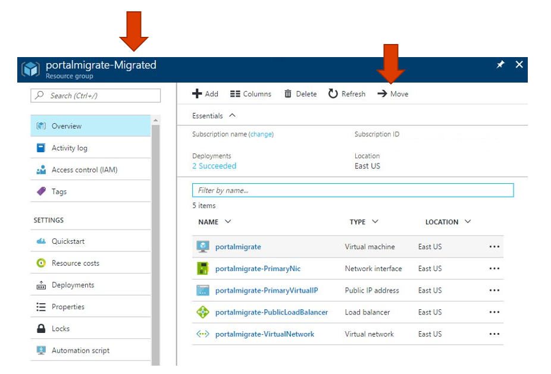

# Post-Migration Activities

#### [prev](./migrate.md) | [home](./readme.md)  | [next](./blockers.md)

# Common Steps
- Reorganize Resources into new Resource Groups.
- Reestablish Peering and any temporarily removed features which required downtime.
- Reconfigure Backup solution and any removed extensions.
- Deprecate any old Azure scripts in place of new Az PowerShell or Az CLI scripts.
- Remove old Resource Groups and clean up any remaining artifacts.

# ARM Optimization
- [Migrate .vhds to Managed Disks](https://learn.microsoft.com/en-us/azure/virtual-machines/unmanaged-disks-deprecation)
    - Stop-Deallocate the VM (Stop-AzureRmVM)​
    - Call the conversion operation (ConvertTo-AzureRmVMManagedDisk)​
    - The Virtual Machine automatically starts after the conversion​
    
- Reevaluate application architecture for modernization opportunities.