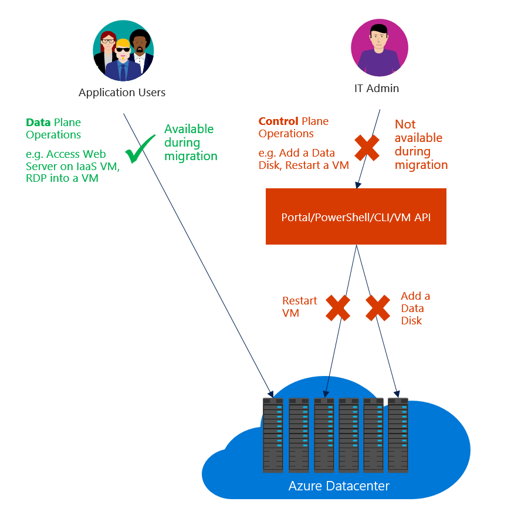

# Pre-Migration Planning

#### [prev](./overview.md) | [home](./readme.md)  | [next](./validate.md)

Prior to migration, there are a few key steps that will lead to a smoother migration experience.

# Inventory your Classic Environment
1. Classic Express Route Circuits
2. Classic VMs within a Classic Virtual Network
3. Classic VMs within a Cloud Service
4. Linked Classic Storage Accounts containing .vhd files for VM Disks
5. Stand-alone Classic Storage Accounts without VM Disk .vhd files
6. Classic Network Security Groups
7. Classic Reserved IP Addresses
8. Classic OS images and VM images
9. Auxiliary scripts which may use the "Azure" PowerShell Module or the Az CLI's classic extension. _Note: AzureRM and Az Powershell modules reference ARM resources in contrast to Azure referencing ASM (Classic) resources._

# Review Supported and Unsupported Features and Resources
[Supported resources for migration](https://learn.microsoft.com/en-us/azure/virtual-machines/migration-classic-resource-manager-overview#supported-resources-for-migration)
[Unsupported features and configurations](https://learn.microsoft.com/en-us/azure/virtual-machines/migration-classic-resource-manager-overview#unsupported-features-and-configurations)

# Build Migration Plan
Understanding the [classic migration process](https://learn.microsoft.com/en-us/azure/virtual-machines/migration-classic-resource-manager-deep-dive) with the context of what will be supported is key to building out a [plan for migration](https://learn.microsoft.com/en-us/azure/virtual-machines/migration-classic-resource-manager-plan#plan).

Step | Example(s)
---|---
Identify resources which may be no longer needed. | Sometimes VMs may be deallocated and no longer in use.
Prune any stand-alone classic resources with minimal or no dependencies. | A classic storage account no longer in use.
Group resource to-be-migrated by type, complexity, and number of dependencies. | You may have a VNET (type) with only 2 VMs (complexity) peered to a single VNET (dependency).
Stage groups understanding the general sequencing of migration. | A classic Express Route Circuit should migrate first, then migrate a classic VNET, then migrate the VM Storage Account(s). **Sorting from low to high complexity may helpful.**
Leverage the [Validate](./validate.md) stage to plan additional steps between migration stages and refine your staging. | You might need to temporarily disable a Peering between two classic VNETs, migrate both VNETs in sequence, then re-establish the VNET Peer.
Ensure stand-alone or independent resources are addressed. | A single classic storage account without .vhds may be migrated near the beginning or end of the migration to simplify the plan.
Prepare any future changes that may be needed [Post-Migration](./postmigration.md). | Azure scripts that may need updating, Resource re-organization, Conversion to Managed Disks [see more](./postmigration.md)
Increase any ARM Subscription Quotas that may prevent a successful [Prepare](stage). | You may need to increase the number of vCPU cores available for VM Families in ARM.