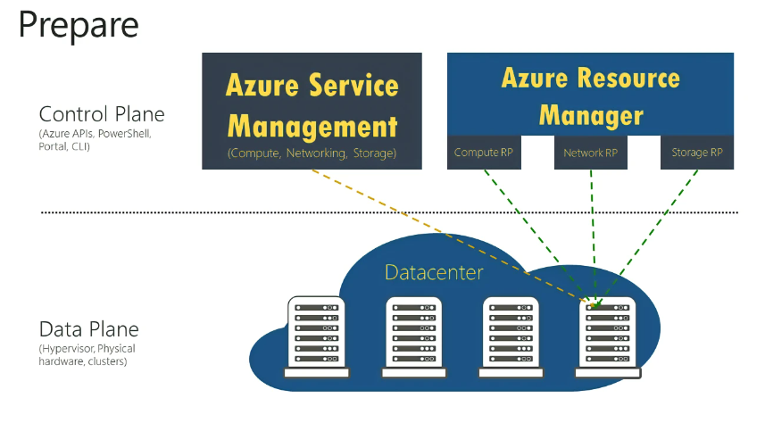
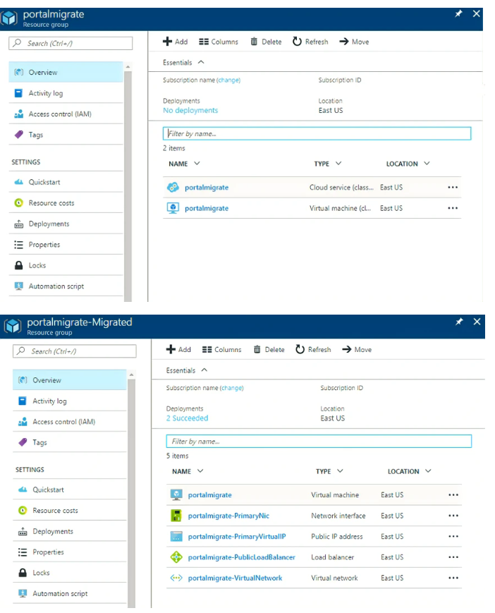

# Prepare Stage

#### [prev](./validate.md) | [home](./readme.md)  | [next](./migrate.md)

Once you have removed any blockers for migration in the Validate stage, the next step is the Prepare stage. When resources are Prepared, Azure will create a side-by-side representation of your Classic resources and their newer Resource Manager equivalents. In this stage, the Management plane (portal functionality) will be temporarily locked while the underlying Data plane remains unaffected. The purpose of the Prepare phase is to visualize and review the target environment and ensure no hidden blockers will prevent the migration from taking place.

A sample side-by-side representation of resources can be visualized below:

# Notable Changes
- Most resource types will have an enhanced Settings Blade as newer configuration options are available in ARM that were unavailable in the classic deployment model.
- Classic Virtual Machines in a Virtual Network will be broken into constituent networking and compute components (e.g. Load Balancer, Public IP, Key Vault, Virtual Machine).
