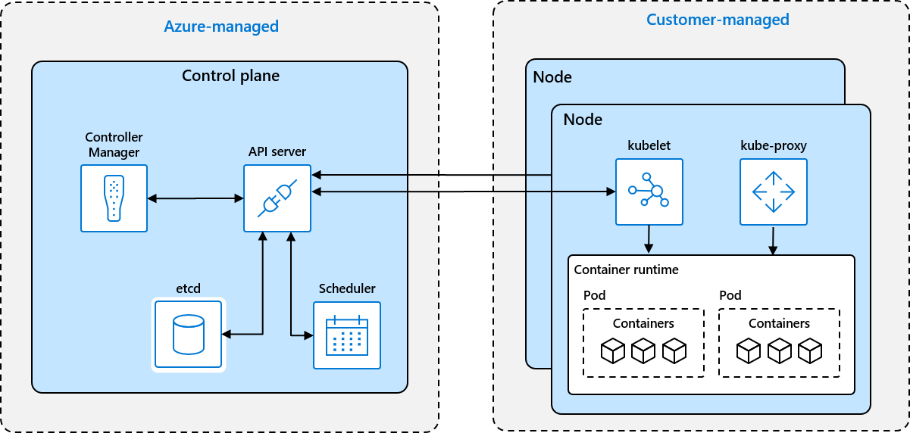

# AKS Operations

## Introduction

As a managed Kubernetes service in Azure, the control plane of an AKS cluster is managed by Azure, which offloads quite significant operational overheads from you as an AKS customer. However, unlike other Azure PaaS services such as App Service, keeping an ASK cluster up and running is a shared responsibility between you and Azure. While the control plane is managed by Azure, the agent nodes are managed by you. You need to ensure the cluster is up to date so that it would not fall out of support. You also need to manage the workloads running in the cluster so that the business can be well served while the performance, availability and cost can be balanced.

In this session, we will discuss some of the key operational areas of AKS that are often asked by our customers. We will cover them by using general guidance, best practices, tools, and demos. And hopefully with this session, we can help the administrators and engineers who need to manage their AKS clusters in their day-to-day work better understand what they need to do with the AKS clusters from the operational perspective.

This is not a session for the introduction, or the design and deployment of AKS clusters. We assume you have the basic understanding to the concepts of Kubernetes and know how to interact with it by using tools like `kubectl`.

As a side note, the 3rd party open source tools that we use in the session are outside of Microsoft technical support, as it is indicated in the [Support policies for AKS](https://docs.microsoft.com/azure/aks/support-policies).

## Agenda

- [Resource Management](./articles/resource-management.md)
- [Patching and Upgrade](./articles/patching-upgrade.md)
- [Business Continuity and Disaster Recovery](./articles/bcdr.md)

## Feedback

We'd love to know if you have any feedback regarding the content and the delivery of the session, especially if there are any other areas that you want us to cover in future sessions. Please feel free to raise an issue in this repo.

## About FastTrack for Azure

FastTrack for Azure is a technical enablement program that helps with rapid and effective design and deployment of cloud solutions. It includes tailored guidance from Azure engineers to provide proven practices and architectural guidance. For more information, please see [Microsoft FastTrack for Azure](https://azure.microsoft.com/programs/azure-fasttrack/).
