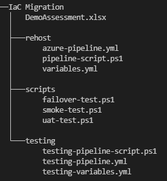

# Milestone: Redeployment/Rehosting of Migration Waves

#### [prev](./devops-iac-redeployment.md) | [home](./welcome.md)  | [next](./devops-iac-testing.md)
 
## Overview
This section outlines the steps needed in order to setup an Azure DevOps Pipeline with the appropriate tasks needed for VM Redeployment/Rehosting. This implementation provides a baseline method of executing lift-and-shift IaaS migrations using Infrastructure as Code and Azure DevOps to track migration waves and progress.

The sample pipeline takes the output of an Azure Migrate Assessment and creates new VMs based on the configuration from the exported assessment output. The VMs that will be created via this sample pipeline are empty Marketplace images, ready for configuration and app installation.

## 1 Pre-Requisites

To get started, the assumption is the following:
* The [discovery](https://github.com/Azure/fta-liftandshift-dcmigration/blob/main/doc/scan.md) is completed for the scoped VMs for migration
* The [assessment](https://github.com/Azure/fta-liftandshift-dcmigration/blob/main/doc/assess.md) for the environment is created within Azure Migrate. Waves of migration are also defined for execution.
* The assessment was exported as an Excel file to your local machine.
* An [Azure DevOps Organization](https://docs.microsoft.com/en-us/azure/devops/organizations/accounts/organization-management?view=azure-devops) is created and linked to your subscriptions in Azure.
* The [src folder](../src/) is cloned on your local machine.
* [PowerShell](https://docs.microsoft.com/en-us/powershell/scripting/install/installing-powershell?view=powershell-7.2) and Excel are installed on your local machine.


### 1.1\. Convert the XSLX Assessment into a CSV
* On your local machine, transfer the Azure Migrate Assessment excel file to the local `pipelines` folder and navigate to the folder.
* Using the [provided PowerShell script](../src/convert-xlsx-to-csv.ps1)
* Open a PowerShell session in terminal, navigate to the folder and run with the command: 

```azurepowershell
.\convert-xlsx-to-csv.ps1 -fullFilePath "<file-path>"
```

* The expected output is 2 CSV sheets from the assessments: `All_Assessed_Machines.csv` and `All_Assessed_Disks.csv`.

## 2 Redeployment/Rehosting Tools - Planning and Implementation

### 2.1\. Create a project in Azure DevOps
* Create an [Azure Repos](https://docs.microsoft.com/en-us/azure/devops/repos/get-started/?view=azure-devops) repository within the project to use for hosting the files from the [pipeline folder](../src)
    * Here is where you will also add the two CSVs that were the output of the provided script, `All_Assessed_Machines.csv` and `All_Assessed_Disks.csv` into the repository within Azure Repos.

* Create an [Azure Pipeline](https://docs.microsoft.com/en-us/azure/devops/pipelines/get-started/pipelines-get-started?view=azure-devops) where it is sourced from the Azure Repo that hosts the templates.

### 2.2\. In the Azure DevOps Project Settings, allocate the appropriate permissions for users and Service Principals using least privilege principles.
* Create [a service connection](https://docs.microsoft.com/en-us/azure/devops/pipelines/library/connect-to-azure?view=azure-devops#:~:text=In%20TFS%2C%20open%20the%20Services%20page%20from%20the,to%20use%20when%20referring%20to%20this%20service%20connection.) to use within your Azure DevOps environment for resource deployment purposes.
* In the Azure portal, create a resource group (named based on the migration wave/app that is being deployed) within your Azure environment for your resources to be hosted in
    * Ensure that the Service principal that is created with this service connection (with the naming convention `<organization>-<project-name>-<subscription-id>`) has the appropriate permissions (listed below) in order to create resources within Azure.
        * **Roles:** [Virtual Machine Contributor](https://docs.microsoft.com/en-us/azure/role-based-access-control/built-in-roles#virtual-machine-contributor), [Network Contributor](https://docs.microsoft.com/en-us/azure/role-based-access-control/built-in-roles#network-contributor)

### 2.3\. Create the appropriate repository for scripts storage, CSV files and version control using guidance outlined below:
* This file structure will be auto created for you within the repo (can also be found under the pipelines folder)
> Note: With the virtual machines that are created in the script, the default for Linux machines are Ubuntu OS.

Recommended folder structure:



Details:
- `All_Assessed_Machines.csv` and `All_Assessed_Disks.csv`: CSV files extracted from Azure Migrate Assessement excel file
- `scripts`: folder to store powershell files for executing different test and validation scripts
    > Note: Test scripts are to be developed based on needs for your migration environment. (Recommendation is to develop them in PowerShell)
- `testing` folder: used for test migration purposes
    - `testing-pipeline-script.ps1`: script that deploys test environment resourcs
    - `testing-pipeline.yml`: file for testing in an isolated or migration VNet
    - `testing-variables.yml`: variables used in powershell and pipeline yaml
- `rehost` folder: used for rehosting migration resources
    - `azure-pipeline.yml`: file for rehosting VMs in a specified migration VNet
    - `pipeline-script.ps1`: script that deploys migration resources
    - `variables.yml`: variables used in powershell and pipeline yaml
        - Manually populate the `variables.yml` using CSV recommended values and what is expected in Azure.
