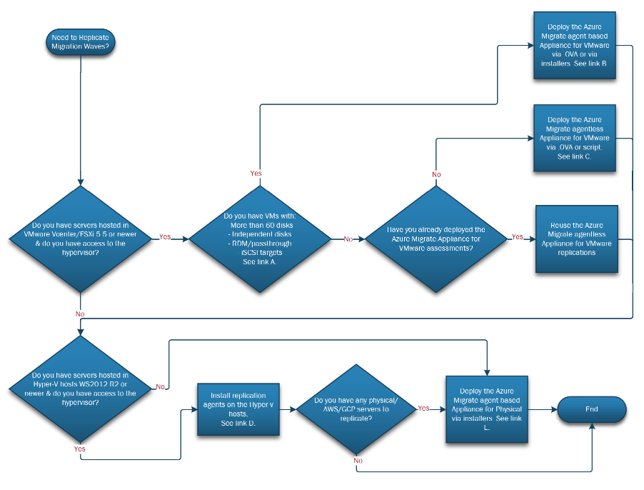

# Milestone: Replication of Migration Waves

#### [prev](./landingzone.md) | [home](./readme.md)  | [next](./testing.md)

The following content can be used as a checklist to incorporate within your migration project plan to ensure best practices.

**CAF Reference:** [Adopt - Replicate Assets](https://docs.microsoft.com/en-us/azure/cloud-adoption-framework/migrate/migration-considerations/migrate/replicate)

## **1 Capacity Planning for cores quotas** 

### &nbsp;&nbsp;&nbsp;&nbsp;1.1\. Ensure subscription quotas has been increased for target VM SKU sizes and Azure resources needed to be created for the specific region.

## **2 Replication Tools Planning and Implementation** 
### &nbsp;&nbsp;&nbsp;&nbsp;2.1\.  Plan for replication agents/appliances that will be needed to replicate the migration waves. 

- &nbsp;&nbsp;&nbsp;&nbsp;Reference Link A: https://docs.microsoft.com/en-us/azure/migrate/migrate-support-matrix-vmware-migration#vm-requirements-agentless
- &nbsp;&nbsp;&nbsp;&nbsp;Reference Link B: https://docs.microsoft.com/en-us/azure/migrate/tutorial-migrate-vmware-agent
- &nbsp;&nbsp;&nbsp;&nbsp;Reference Link C: https://docs.microsoft.com/en-us/azure/migrate/tutorial-migrate-vmware-powershell
- &nbsp;&nbsp;&nbsp;&nbsp;Reference Link D: https://docs.microsoft.com/en-us/azure/migrate/tutorial-migrate-hyper-v
- &nbsp;&nbsp;&nbsp;&nbsp;Reference Link E: 
    - &nbsp;&nbsp;&nbsp;&nbsp;Physical/Other hypervisors: https://docs.microsoft.com/en-us/azure/migrate/tutorial-migrate-physical-virtual-machines
    - &nbsp;&nbsp;&nbsp;&nbsp;AWS: https://docs.microsoft.com/en-us/azure/migrate/tutorial-migrate-aws-virtual-machines
    - &nbsp;&nbsp;&nbsp;&nbsp;GCP: https://docs.microsoft.com/en-us/azure/migrate/tutorial-migrate-gcp-virtual-machines

### &nbsp;&nbsp;&nbsp;&nbsp;2.2\. Ensure hypervisor infrastructure has enough resources to handle additional load from replication appliances.

## **3 Replication** 

### &nbsp;&nbsp;&nbsp;&nbsp;3.1\. Enable initial replication for a subset of the migration waves based on available bandwidth.
- &nbsp;&nbsp;&nbsp;&nbsp;Initial replication takes more bandwidth vs. delta replications.
- &nbsp;&nbsp;&nbsp;&nbsp;For each server configured for initial replication, monitor replication progress closely until successful before enabling initial replication for remaining servers.
- &nbsp;&nbsp;&nbsp;&nbsp;For each server with ongoing replication, monitor replication closely before enabling initial replication for remaining servers.

### &nbsp;&nbsp;&nbsp;&nbsp;3.2\. Based on the observed initial and ongoing replications, tune your replication plans based on the below considerations:

- &nbsp;&nbsp;&nbsp;&nbsp;How much bandwidth is needed and available for replications?
- &nbsp;&nbsp;&nbsp;&nbsp;How many VMs can be initially replicated at the same time?
- &nbsp;&nbsp;&nbsp;&nbsp;How many VMs can be left replicating at the same time?
- &nbsp;&nbsp;&nbsp;&nbsp;Is there a need to throttle replication within the replication appliance? 
 