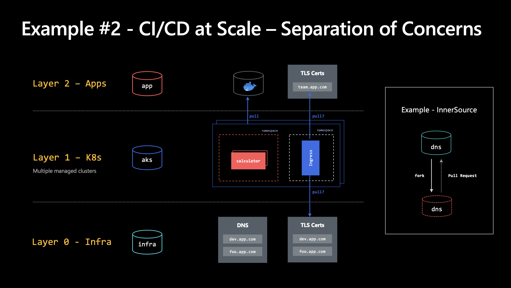

[&larr; Security Best Practices](./2-security-best-practices.md) | Part 3 of 6 | Operations &rarr;

# Automating Cluster Deployments

Overview

- Why use AKS?
- Why Automate Cluster Deployment?
- AKS Cluster Configuration
  - Portal Demo
  - Azure CLI & Shell Script
- Infrastructure as Code Walkthrough
  - ["Stamp"](https://docs.microsoft.com/en-us/azure/architecture/patterns/deployment-stamp) or "Cookie Cutter" Deployments
  - Configuration Management
  - Key Vault Integration
  - Ingress Controller, TLS and DNS 
- Landing Zone Considerations
- Workload Considerations
- Resource Lifecycles
- Versioning
 
## "Realistic" IaC Examples for AKS

Complete Open Source Infrastructure as Code examples for AKS

- [Azure Kubernetes Service (AKS) Baseline Cluster](https://github.com/mspnp/aks-baseline/)  
  ARM templates and shell scripts with documentation by Microsoft Patterns and Practices Team
  
- [cloudkube.io AKS Clusters (demo)](https://github.com/julie-ng/cloudkube-aks-clusters)  
  Terraform example of IaC for multiple environments, including Managed Identity and Key Vault integration for example scenario described below.
  
- [Infrastructure as Code (IaC) Comparison](https://github.com/Azure/FTALive-Sessions/tree/main/content/devops/cicd-infra#infrastructure-as-code-iac-comparison) - ARM, Bicep vs Terraform comparison table from the [FTA Live for Infra as Code Handout](https://github.com/Azure/FTALive-Sessions/tree/main/content/devops/cicd-infra#infrastructure-as-code-iac-comparison)

### Key Vault Integration

- [Azure Docs: Use the Azure Key Vault Provider for Secrets Store CSI Driver in an AKS cluster](https://docs.microsoft.com/en-us/azure/aks/csi-secrets-store-driver) - how to enable and use as addon
- [CSI Driver Homepage](https://azure.github.io/secrets-store-csi-driver-provider-azure/docs/) - more technical details, manual installation via Helm chart, etc.

## Scenario - AKS as an Application Platform

The following concepts and structure are a simplified version from **[Cloud Adoption Framework: Compare common cloud operating models](https://docs.microsoft.com/en-us/azure/cloud-adoption-framework/operating-model/compare)**

### Operating Models

- Decentralized Operations
- Centralized Operations
- Enterprise Operations

#### Concerns

- Workload 
- Platform 
- Landing Zone 
- Cloud Foundation

#### Diagram

Example Implementation of above concepts with Azure Kubernetes Service (AKS) as Application Platform

## Reference Links

Important Links

- [Azure Architecture Center >  Reference Architecture > Secure AKS Baseline](https://docs.microsoft.com/en-us/azure/architecture/reference-architectures/containers/aks/secure-baseline-aks)

Miscellaneous links from 23 August 2022 session 

- Ingress Controllers
  - [Traefik (open source)](https://doc.traefik.io/traefik/providers/kubernetes-ingress/)
  - [nginx (open source)](https://kubernetes.github.io/ingress-nginx/)
  - [App Gateway Ingress Controller (MSFT)](https://docs.microsoft.com/en-us/azure/application-gateway/ingress-controller-overview)
- Demo Related Terraform Files
  - [shared infra](https://github.com/julie-ng/cloudkube-shared-infra) for Azure DNS, Role Assignments for TLS Certificates in Key Vault 
  - [workload infrastructure.tf](https://github.com/julie-ng/cloud-architecture-review/blob/main/infrastructure.tf) meant to be run by admin (Julie) to
    - create workload specific Azure Container Registry (ACR)
    - give cluster kubelets pull access to our ACR
    - create service principles for GitHub Workflows deployments to its own *namespace*
