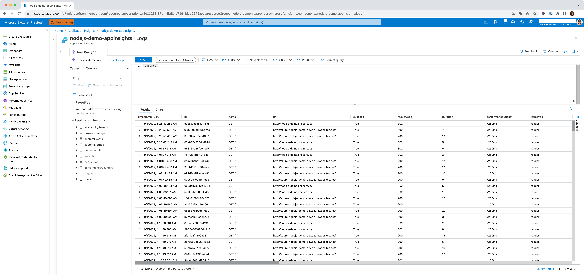

[&larr; Monitoring](./5-monitoring.md) | Part 6 of 6

# Automating Workload Deployments 

### Agenda

- Application Logging (parked from part 5) - 5 min.
- Pod Identity and Workload Identity (parked from part 2) - 15 min.
- Key Vault Integration (parked from part 2) - 10 min.
- Workload Deployments - 25 min.
  - Push Model (traditional CI/CD)
  - Pull Model (GitOps)
- Versioning & Releases - 5 min.
  - Image promotion
  - Distribution vs Configuration Management

## Parked Topics

### Application Logging 

_This topic was parked from part 5_

- [Azure Docs: How Application Insights works](https://docs.microsoft.com/en-us/azure/azure-monitor/app/app-insights-overview#how-application-insights-works)
- Demo with Node.js
  - [Monitor your Node.js services and apps with Application Insights](https://docs.microsoft.com/en-us/azure/azure-monitor/app/nodejs)
  - Example Middleware Code: [app/middleware/monitor.js](https://github.com/julie-ng/azure-nodejs-demo/blob/main/app/middleware/monitor.js)
  - Screenshot of Results in Azure Portal  
		
- Legacy Apps Logging to File System? Try [Tailing Sidecars Pattern (learnk8s.io)](https://learnk8s.io/sidecar-containers-patterns#tailing-logs)

### Pod Identity and Workload Identity 

_This topic was parked from part 2_

- [Azure AD Workload Identity](https://azure.github.io/azure-workload-identity/docs/) - successor to pod identity
- [Azure AD Pod Identity](https://azure.github.io/aad-pod-identity/) - not recommended for _new_ projects, see [announcement](https://cloudblogs.microsoft.com/opensource/2022/01/18/announcing-azure-active-directory-azure-ad-workload-identity-for-kubernetes/).
  
### Key Vault Integration (end to end)

_This topic was parked from part 2_

- [Key Vault Provider for Secrets Store CSI Driver](https://github.com/Azure/secrets-store-csi-driver-provider-azure) - for self-installation via [Helm](https://azure.github.io/secrets-store-csi-driver-provider-azure/docs/getting-started/installation/#deployment-using-helm)
- [Use the Azure Key Vault Provider for Secrets Store CSI Driver in an AKS cluster](https://docs.microsoft.com/en-us/azure/aks/csi-secrets-store-driver) - as Azure managed add-on

## Automating Workload Deployments

### Pull Model (GitOps)

- [Flux CD](https://fluxcd.io/) - the GitOps family of projects
- [Argo CD](https://argoproj.github.io/cd/) - Declarative continuous delivery with a fully-loaded UI

### Push Model (traditional CI/CD)

- [Demo Node.js App with GitHub Workflows](https://github.com/julie-ng/cloud-architecture-review/tree/main/.github/workflows)
  
### Building Images

Relevant for both Push and Pull Models

- Walkthrough [`.github/workflows/_docker.yaml`](
https://github.com/julie-ng/cloud-architecture-review/blob/main/.github/workflows/_docker.yaml)
- Example Tagging Convetnion (how neutrotic Julie does it)
  | Trigger | Example Tag | Details |
	|:--|:--|:--|
	| Push to `main` branch | `dev-e6c52a4` | git sha is appended to image name |
	| Push to `staging` branch | `staging-e6c52a4` | pull existing dev image, re-tag prefix to `staging-` and push back to registry.|
	| Push tag, e.g. `v0.1.0` | `0.1.0` | Follows semver. Will use git sha to promote staging image via re-tagging (to be implemented) |
 
Note: Best Practice is to [lock production images](https://docs.microsoft.com/en-us/azure/container-registry/container-registry-image-lock) for immutability and to prevent deletion.

### Versioning & Releases

- [Semantic Versioning 2.0.0 Specification](https://semver.org/)
- [Helm](https://helm.sh/) - the package manager for Kubernetes
  - Example: [csi-secrets-store-provider-azure](https://github.com/Azure/secrets-store-csi-driver-provider-azure/tree/master/charts/csi-secrets-store-provider-azure) Helm Chart
- [Kustomize](https://kustomize.io/) - Kubernetes native configuration management

### Pod Termination

- [Kubernetes Docs > Concepts > Pod Lifecycle > Termination](https://kubernetes.io/docs/concepts/workloads/pods/pod-lifecycle/#pod-termination)
- [Example from Demo: close server or db connection](https://github.com/julie-ng/cloud-architecture-review/blob/main/server/express.js#L35)

## Misc. References

### Azure Container Registry

- [Best practices for Azure Container Registry](https://docs.microsoft.com/en-us/azure/container-registry/container-registry-best-practices)
- [Recommendations for tagging and versioning container images](https://docs.microsoft.com/en-us/azure/container-registry/container-registry-image-tag-version)
- [Push and pull Helm charts to an Azure container registry](https://docs.microsoft.com/en-us/azure/container-registry/container-registry-helm-repos)  
- [Automatically purge images from an Azure container registry](https://docs.microsoft.com/en-us/azure/container-registry/container-registry-auto-purge)

### kubelogin - authenticating to AAD Integrated AKS clusters

Relevant when Kubernetes local accounts are [disabled](https://docs.microsoft.com/en-us/azure/aks/managed-aad#disable-local-accounts)

- [kubelogin](https://github.com/azure/kubelogin) plugin that [replaced Kubernetes in-tree provider authencation](https://kubernetes.io/blog/2019/04/17/the-future-of-cloud-providers-in-kubernetes/#in-tree-out-of-tree-providers), which was announced in 2019
- [GitHub Action - Azure Kubernetes set context](https://github.com/marketplace/actions/azure-kubernetes-set-context)
- Azure Pipelines - no out of the box (OOTB) solution.
  See long [azure/kubelogin/issues/20](https://github.com/Azure/kubelogin/issues/20#issuecomment-922023848) thread for strategies and caveats

### Misc. Application Logging

- [Azure Cloud Computing Dictionary - What is middleware?](https://azure.microsoft.com/en-us/resources/cloud-computing-dictionary/what-is-middleware/)
- Log Formatting  
	Node.js best practice is to log in JSON format for easier and faster downstream consumption. 
  - [Example: Apache](https://httpd.apache.org/docs/2.4/logs.html)
  - [npm module: natural json logger](https://github.com/pinojs/pino)
  - [npm module: pino-pretty](https://github.com/pinojs/pino-pretty) - pipe your logs in local dev to be human readable