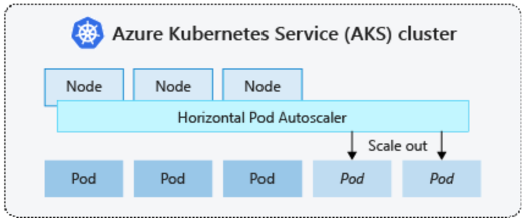

# Scaling Options in AKS 

When running applications in Azure Kubernetes Service (AKS), you may need to increase or decrease the amount of compute resources. As you change the number of application instances you have, you may need to change the number of underlying Kubernetes nodes. You also may need to provision a large number of additional application instances.

- Manually scale pods or nodes
- Horizontal pod autoscaler
Kubernetes uses the horizontal pod autoscaler (HPA) to monitor the resource demand and automatically scale the number of pods. By default, the HPA checks the Metrics API every 15 seconds for any required changes in replica count, and the Metrics API retrieves data from the Kubelet every 60 seconds. So, the HPA is updated every 60 seconds. When changes are required, the number of replicas is increased or decreased accordingly. The HPA works with AKS clusters that have deployed the Metrics Server for Kubernetes 1.8+.

- Kubernetes horizontal pod autoscaling

When you configure the HPA for a given deployment, you define the minimum and maximum number of replicas that can run. You also define the metric to monitor and base any scaling decisions on, such as CPU usage.

To get started with the horizontal pod autoscaler in AKS, see Autoscale pods in AKS.

- Cluster Autoscaler 

To respond to changing pod demands, the Kubernetes cluster autoscaler adjusts the number of nodes based on the requested compute resources in the node pool. By default, the cluster autoscaler checks the Metrics API server every 10 seconds for any required changes in node count. If the cluster autoscaler determines that a change is required, the number of nodes in your AKS cluster is increased or decreased accordingly. The cluster autoscaler works with Kubernetes RBAC-enabled AKS clusters that run Kubernetes 1.10.x or higher.

The cluster autoscaler is typically used alongside the horizontal pod autoscaler. When combined, the horizontal pod autoscaler increases or decreases the number of pods based on application demand, and the cluster autoscaler adjusts the number of nodes to run additional pods.

To get started with the cluster autoscaler in AKS, see Cluster autoscaler on AKS.

- Scale out events
- Scale in events

# Burst to Azure Container Instances (ACI)
To rapidly scale your AKS cluster, you can integrate with Azure Container Instances (ACI). Kubernetes has built-in components to scale the replica and node count. However, if your application needs to rapidly scale, the horizontal pod autoscaler may schedule more pods than can be provided by the existing compute resources in the node pool. If configured, this scenario would then trigger the cluster autoscaler to deploy additional nodes in the node pool, but it may take a few minutes for those nodes to successfully provision and allow the Kubernetes scheduler to run pods on them.

# KEDA (GA as of Nov 07 2023)
 Kubernetes Event-driven Autoscaling (KEDA) is a single-purpose and lightweight component that strives to make application autoscaling simple and is a CNCF Graduate project.

It applies event-driven autoscaling to scale your application to meet demand in a sustainable and cost-efficient manner with scale-to-zero.

https://learn.microsoft.com/en-us/azure/aks/keda-about
https://azure.microsoft.com/en-us/updates/ga-kubernetes-eventdriven-autoscaling-keda-addon-for-aks/

