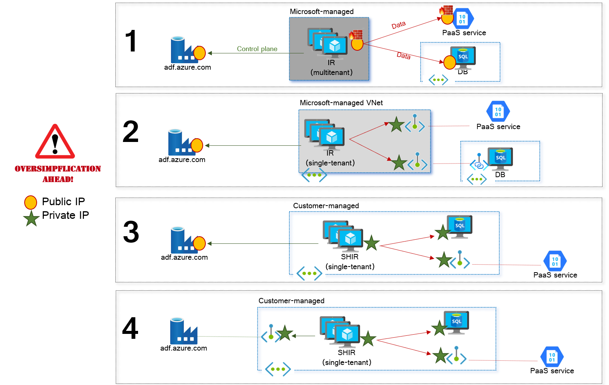
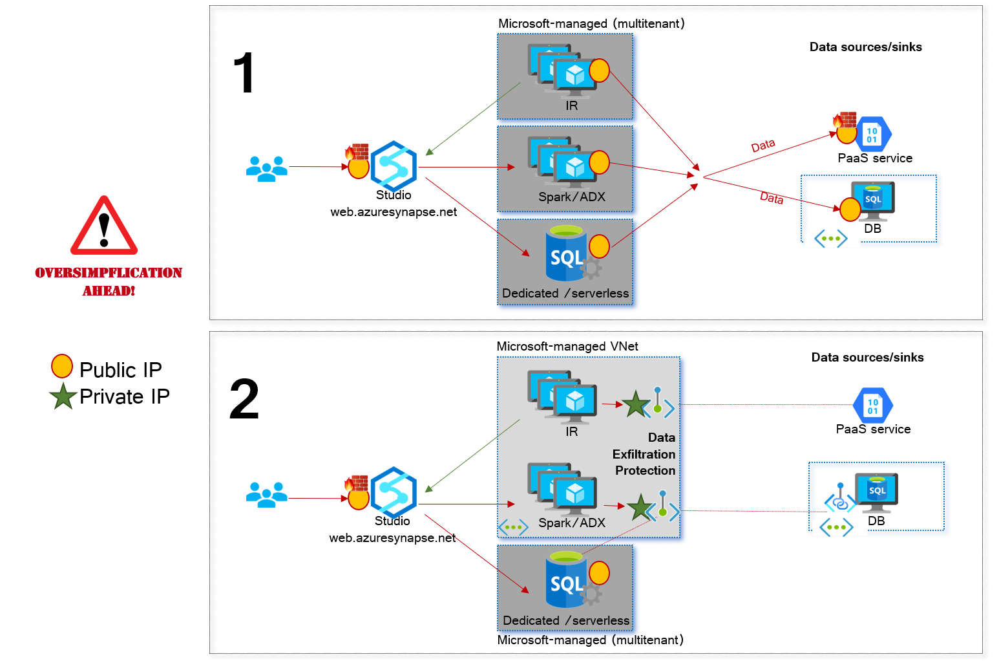
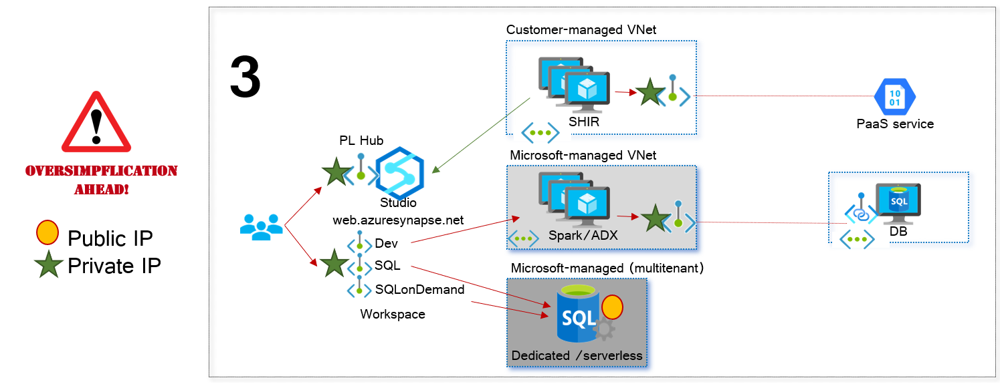
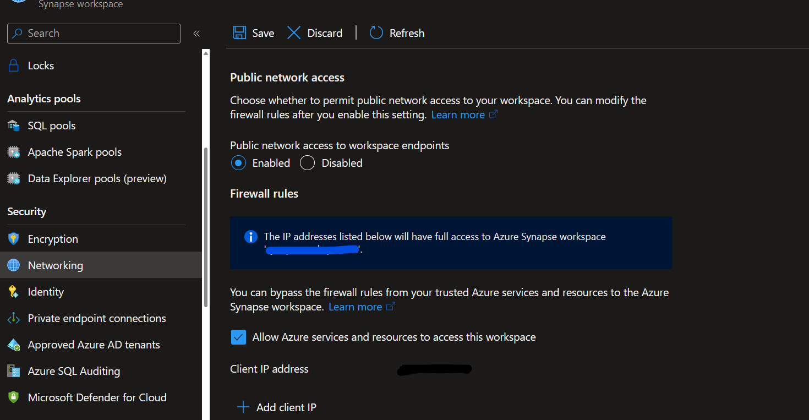
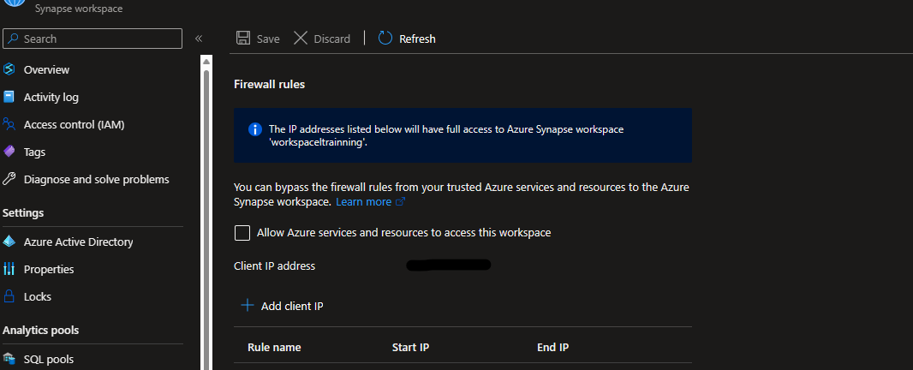
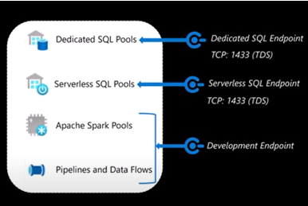
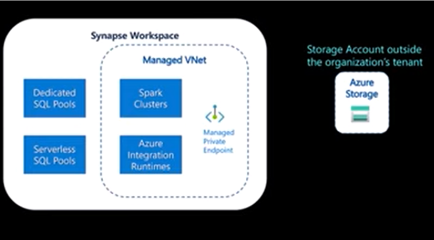
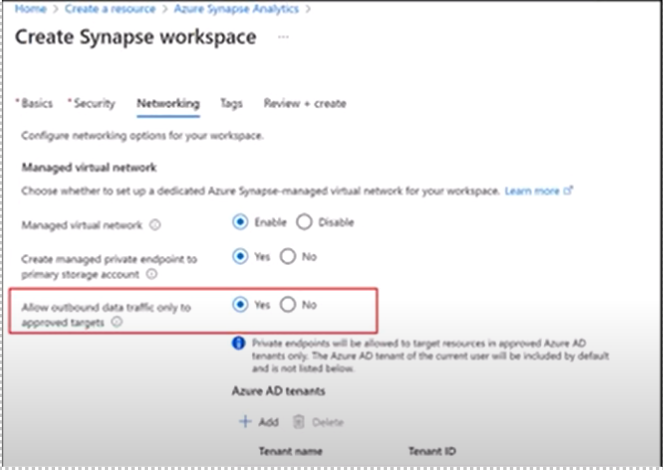

## Workspace overview

### Security overview

[<Back](https://github.com/LiliamLeme/FTALive-Sessions_Synapse_SQL/blob/main/content/data/Synapse_SQL/Building_on_top_Datalake/Workspace.md) - [Next>](https://github.com/LiliamLeme/FTALive-Sessions_Synapse_SQL/blob/main/content/data/ModernDatawarehouse-Security/Workspace.md)

The network mechanisms that can be used to increase security in Azure Synapse and Azure Data Factory depend on the characteristics of each component of those services. As an introduction, we can start with the networking options of ADF, since its architecture is much simpler than the one of Synapse.

In ADF 4 security options exist:

Note the following:

- A data plane (integration runtime) and a control plane (studio) exist
- Three options exist for the data plane:
  - Multi-tenant
  - Single-tenant, Microsoft-managed (managed VNet)
  - Single-tenant, customer-managed (Self-Hosted Integration Runtime)
- The data plane can be secured as well with private endpoints.

The architecture of Synapse is more complex, however there is still two primary components:

- A data plane (Synapse Studio)
- A control plane (the workspace), with 4 elements:
  - Integration Runtime, Spark pools and Data Explorer, which can be placed in a single-tenant managed VNet
  - Dedicated and serverless SQL pools

The Integration Runtime component for pipelines can be deployed in a customer-managed VNet as well, and inbound access to the studio and the workplace can be securized with private endpoints:

#### Workspace - Connection

Connection Security refers to how you restrict and secure connections to your database using firewall rules and connection encryption. you can use the portal page under network to configure the IPs that can access the workspace:

Managed Vnet:

Non managed 

Dedicated SQL pool (formerly SQL DW) are encrypted by default. Modifying connection settings to disable encryption are ignored.

#### Public network access
You can use the public network access feature to allow incoming public network connectivity to your Azure Synapse workspace.

        When public network access is disabled, you can connect to your workspace only using private endpoints.
        When public network access is enabled, you can connect to your workspace also from public networks. You can manage this feature both during and after your workspace creation.
  
Note:
This feature is only available to Azure Synapse workspaces associated with Azure Synapse Analytics Managed Virtual Network. However, you can still open your Synapse workspaces to the public network regardless of its association with managed VNet.<figure above>

#### Manage VNet
 
When you create your Azure Synapse workspace, you can choose to associate it to a Microsoft Azure Virtual Network. The Virtual Network associated with your workspace is managed by Azure Synapse. This Virtual Network is called a *Managed workspace Virtual Network*. Creating a workspace with a Managed workspace Virtual Network associated with it ensures that your workspace is network isolated from other workspaces. 

If your workspace has a Managed workspace Virtual Network, Data integration and Spark resources are deployed in it. A Managed workspace Virtual Network also provides user-level isolation for Spark activities because each Spark cluster is in its own subnet.

Dedicated SQL pool and serverless SQL pool are multi-tenant capabilities and therefore reside outside of the Managed workspace Virtual Network. Intra-workspace communication to dedicated SQL pool and serverless SQL pool use Azure private links. These private links are automatically created for you when you create a workspace with a Managed workspace Virtual Network associated to it.

 

Private endpoints can be accessed from only within the same virtual network and from other virtual networks that are globally or regionally peered to the VNET that contains these private endpoints and from customer on prem network using express route or VPN gateway

Private endpoints are mapped to an instance of PaaS resource instead of the entire service. In the event of a security incident within a network, only mapped resource instance is exposed, minimizing the exposure and data leakage from other instances

#### Connecting to the Storage

Azure storage provides a layered security model that enables you to secure and control access to your storage accounts. You can configure IP firewall rules to grant traffic from selected public IP address ranges access to your storage account. You can also configure network rules to grant traffic from selected virtual networks access to your storage account.

If you enabled **Managed virtual network** when you created the workspace, then your workspace is associated with a dedicated virtual network managed by Azure Synapse. These virtual networks are not created in your customer subscription. Therefore, you will not be able to grant traffic from these virtual networks access to your secured storage account using network rules. Analytic capabilities such as **Dedicated SQL pool and Serverless SQL pool use multi-tenant infrastructure that is not deployed into the managed virtual network**. In order for traffic from these capabilities to access the secured storage account, you must configure access to your storage account based on the workspace's system-assigned managed identity

#### Data Extra filtration (DEP)

Azure Synapse Analytics workspaces support enabling data exfiltration protection for workspaces. With exfiltration protection, you can guard against malicious insiders accessing your Azure resources and exfiltrating sensitive data to locations outside of your organization’s scope. At the time of workspace creation, you can choose to configure the workspace with a managed virtual network and additional protection against data exfiltration. Workspaces with data exfiltration protection, resources within the managed virtual network always communicate over [managed private endpoints](https://learn.microsoft.com/en-us/azure/synapse-analytics/security/synapse-workspace-managed-private-endpoints) and the Synapse SQL resources can only connect to authorized Azure resources (targets of approved managed private endpoint connections from the workspace). The main ideas is to prevent malicious users with high permission such as Contributor RBAC role from using SQL or Spark pools to write data out to remote servers, Azure-based or not.

**Limitations:**

Users can provide an environment configuration file to install Python packages from public repositories like PyPI. In data exfiltration protected workspaces, connections to outbound repositories are blocked. 

 DEP enables you to limit connections from Synapse Pipelines to a service in specified Azure AD Tenants connecting through managed private endpoints, when using the Azure Integration Runtime.
 
When using the Azure Integration Runtime with DEP enabled, Linked Service connection (that is to say connections to other services) must occur through managed private endpoints. The services which are supported within Azure Synapse Analytics managed private endpoints (at the time of) are:

         Azure Storage (including Blob, Data Lake Storage Gen 2, Queue, Table and File)
         Azure SQL Database
         Azure SQL Managed Instance (in preview)
         Azure Cosmos DB (SQL and Mongo API)
         Azure Key Vault
         Azure Search
         Azure Database for PostgreSQL
         Azure Database for MariaDB
         Azure Database for MySQL
         Azure Functions
         Azure Cognitive Services
 

#### Reference
[Managed virtual network - Azure Synapse Analytics | Microsoft Learn](https://learn.microsoft.com/en-us/azure/synapse-analytics/security/synapse-workspace-managed-vnet)

[What is a private endpoint? - Azure Private Link | Microsoft Learn](https://learn.microsoft.com/en-us/azure/private-link/private-endpoint-overview)

[Configure IP firewall rules - Azure Synapse Analytics | Microsoft Learn](https://learn.microsoft.com/en-us/azure/synapse-analytics/security/synapse-workspace-ip-firewall)

[Connect to a secure storage account from your Azure Synapse workspace - Azure Synapse Analytics | Microsoft Learn](https://learn.microsoft.com/en-us/azure/synapse-analytics/security/connect-to-a-secure-storage-account)

[(428) Synapse Security Deep Dive: Outbound Network Security - YouTube](https://www.youtube.com/watch?v=vwScocYyeyk)

[Create a workspace with data exfiltration protection enabled - Azure Synapse Analytics | Microsoft Learn](https://learn.microsoft.com/en-us/azure/synapse-analytics/security/how-to-create-a-workspace-with-data-exfiltration-protection)

[How Data Exfiltration Protection (DEP) impacts Azure Synapse Analytics Pipelines - Microsoft Community Hub](https://techcommunity.microsoft.com/t5/azure-synapse-analytics-blog/how-data-exfiltration-protection-dep-impacts-azure-synapse/ba-p/3676146)

[Grant permissions to managed identity in Synapse workspace - Azure Synapse Analytics | Microsoft Learn](https://learn.microsoft.com/en-us/azure/synapse-analytics/security/how-to-grant-workspace-managed-identity-permissions)

[Managed identities for Azure resources - Microsoft Entra | Microsoft Learn](https://learn.microsoft.com/en-us/azure/active-directory/managed-identities-azure-resources/overview)

[Gateway Region](https://learn.microsoft.com/en-us/azure/azure-sql/database/connectivity-architecture?view=azuresql#gateway-ip-addresses)

[Synapse Connectivity Series Part #1 - Inbound SQL DW connections on Public Endpoints - Microsoft Community Hub](https://techcommunity.microsoft.com/t5/azure-synapse-analytics-blog/synapse-connectivity-series-part-1-inbound-sql-dw-connections-on/ba-p/3589170)
        
[Synapse Connectivity Series Part #2](https://techcommunity.microsoft.com/t5/azure-synapse-analytics-blog/synapse-connectivity-series-part-2-inbound-synapse-private/ba-p/3705160)
        
[Connect to workspace resources in Azure Synapse Analytics Studio from a restricted network - Azure Synapse Analytics | Microsoft Learn](https://learn.microsoft.com/en-us/azure/synapse-analytics/security/how-to-connect-to-workspace-from-restricted-network)
        

[Connect to a Synapse Studio using private links - Azure Synapse Analytics | Microsoft Learn](https://learn.microsoft.com/en-us/azure/synapse-analytics/security/synapse-private-link-hubs)

[Connect to a secure network design]( https://techcommunity.microsoft.com/t5/azure-data-blog/azure-data-components-network-architecture-with-secure/ba-p/3141331)
