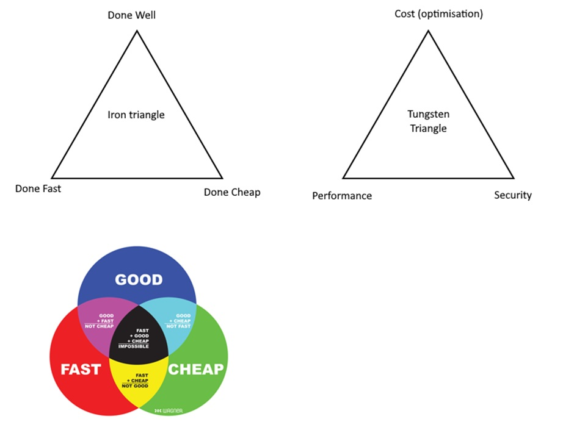

####  [Home](./readme.md) | [Next (Identity)](./02-identity.md)

# Setting the Stage
* Risk of compromise - In our network connected world, hackers can attack IT systems from any country on the planet. On top of that, there are increasing numbers of bad actors.
* Cost of compromise - a credential is worth $1-$50USD depending on information available.
  * Costs can be reputational, financial, business, and even loss of life.
  * Non-compliance could result in sanctions (GDPR example), or complete removal of licenses or ability to operate in a market - effectively ending your business (NRA/ATF example).
* Example(s):
  * Question: Can you think of any major data breaches?
  * September 2022, 9.8 million customers had their names, DOB, phone numbers, passport, drivers license, medical records and government IDs exposed through large Telco hack. ~40% of Australian population.
  * At least 141 hospitals victim of **reported** ransomware attacks in 2023.
  * Large password manager breach in 2022, result of stolen *credentials* from a DevOps engineer on their Home PC, because they had another service installed that had unpatched vulnerability.
  * Midnight Blizzard (group with links to a state sponser) attack against Microsoft, exposing executives emails.
    * [Expanding Microsoft's Secure Future Initiative](https://www.microsoft.com/en-us/security/blog/2024/05/03/security-above-all-else-expanding-microsofts-secure-future-initiative/?msockid=193cd5d95af6667200d7c1b35b1b67ee) - Even *we* are doubling down on security. This demonstrates how we as large corproate are still working on security, and we are all individually and collectively responsible for security.
    * 

FUD (fear, uncertainty, distrust) isn't a good reason to do security. It's a risk/cost based decision, not an emotional one.
* Don't let perfect be the enemy of good (enough). => *You don’t have to be perfect, you just don’t have to be terrible.*
* If people/team's dont want to accept the difficulty of implementing security, look at registering those issues on the company risk register, assign it to someone high enough in the company & get them to accept ownership of the risk.
  * Don't be afraid to weaponise risk.

As data professionals - we are responsible for the [Confidentiality, Integrity and Availability](https://learn.microsoft.com/en-us/azure/well-architected/security/principles) of the data.

---
# Introduction
* Welcome Data Engineers, Database Administrators and anyone else who is tasked with protecting your organisations data!
* Question: Do you fall into this mindset?  
*Security is the responsibility of the Security team. Network security is the responsibility of the Networking team. Azure is the responsibility of the infrastructure team & Microsoft. We dont have to worry about security, the platform is secured & no-one will get to our data.*
* Goal for today is for us to collectively figure out whether this is ok.
* Some may feel session is too simple -> but I would like you to stick around to help with the others for whom this may be new.
* Security is not a 1-and-done activity - it's an ongoing endeavour in your environment & life.
* This session is purely an introduction of **must knows and must dos**

---
# What is Defence in Depth
This is a super high-level introduction:
* **Zero Trust** in practical terms is a transition from implicit trust, assuming that everything inside a corporate network is safe, to the model that *assumes breach* and *explicitly verifies* the security status of identity, endpoint, network, and other resources based on all available signals and data. 
* **Assume Breach Mindset**: Assumes cyber-attacks will happen, are happening and have happened. Legacy "Wall & Moat" mindset no longer applies - "hostile actors already in the keep & can poison the water".
* **Secure By Design**: This is why we are having this session!
* **Principle of least priviliege**: Gives access for the *right identities*, with the *right set of permissions*, for the *right duration*, and to the *right assets*. Limiting permissions helps keep attackers from abusing permissions that legitimate users don't even need.

---
# Doesn't Microsoft protect me?
## Shared responsibility
* [Shared responsibility in the cloud - Microsoft Azure | Microsoft Learn](https://learn.microsoft.com/en-us/azure/security/fundamentals/shared-responsibility)
* [Microsoft Incident Response and shared responsibility for cloud computing | Microsoft Azure Blog](https://azure.microsoft.com/en-us/blog/microsoft-incident-response-and-shared-responsibility-for-cloud-computing/)

# Cost vs Security vs Complexity (Is this the right triangle?)
* Discuss the Tungsten Triangle - Cost vs Security vs Performance (where performance is CPU/latency and/or administrative overheads/operational latency/operational costs)

"Never enough time to do it right the first time, but always enough time (and budget) to do it again later [After a security breach]."

####  [Home](./readme.md) | [Next (Identity)](./02-identity.md)
