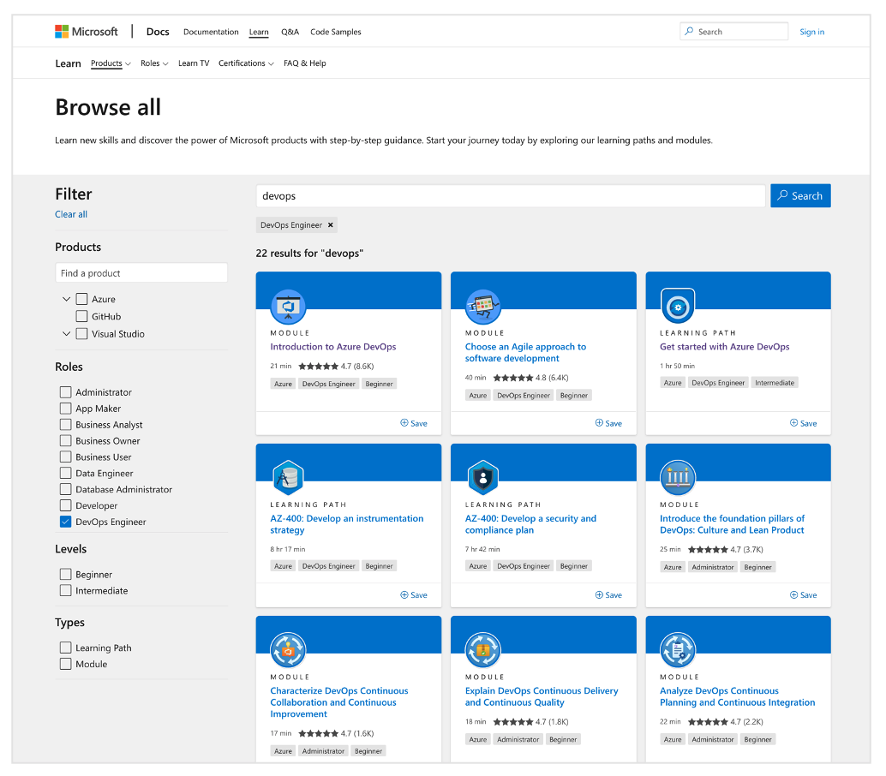

# FTA Live - CI/CD for Applications

_This handout was prepared in advance and generic. Actual session content may differ based on discussion. Please refer to your own personal notes._

---

## Learn DevOps on MS Learn Platform

[Microsoft Learn and Search for “DevOps” and “DevOps Engineer” Role](https://docs.microsoft.com/learn/browse/?terms=devops&roles=devops-engineer)

## DevOps Workflow

- [Cloud Adoption Framework - End-to-end governance from DevOps to Azure](https://aka.ms/caf-e2e-devops)
- [GitOps](https://www.gitops.tech/#push-based-deployments) - push vs pull deployments

## Git 

### Git Branching

- [GitFlow (2010)](https://nvie.com/posts/a-successful-git-branching-model/) - the first, but not a standard
- [GitHub Flow (2011)](https://guides.github.com/introduction/flow/) - start simple
- [Gitlab Flow (2014)](https://docs.gitlab.com/ee/topics/gitlab_flow.html) - building on simple
- [Patterns for Managing Source Code Branches (2020)](https://martinfowler.com/articles/branching-patterns.html) - team experiences and what happens when you apply _all_ the Best Practices
- [Azure Docs - Adopt a Git branching strategy](https://docs.microsoft.com/azure/devops/repos/git/git-branching-guidance?view=azure-devops)

### Git Workflows

- [Branch policies](https://docs.microsoft.com/azure/devops/repos/git/branch-policies?view=azure-devops)

## Azure Pipelines

### Concepts, Classic vs YAML

- [Key concepts for new Azure Pipelines users](https://docs.microsoft.com/azure/devops/pipelines/get-started/key-pipelines-concepts?view=azure-devops)
- [YAML and Classic pipelines](https://docs.microsoft.com/azure/devops/pipelines/get-started/pipelines-get-started?view=azure-devops)
  - [Define your Classic pipeline](https://docs.microsoft.com/azure/devops/pipelines/release/define-multistage-release-process?view=azure-devops) - for reference, comparison
- [Feature Availability – YAML vs Classic Pipelines](https://docs.microsoft.com/azure/devops/pipelines/get-started/pipelines-get-started?view=azure-devops#feature-availability)

### Anatomy of DevOps Pipelines

- [Add stages, dependencies, & conditions](https://docs.microsoft.com/azure/devops/pipelines/process/stages?view=azure-devops&tabs=yaml)
- [Azure Pipelines ecosystem support](https://docs.microsoft.com/azure/devops/pipelines/ecosystems/ecosystems?view=azure-devops)
- [Add & use variable groups](https://docs.microsoft.com/azure/devops/pipelines/library/variable-groups?view=azure-devops&tabs=yaml)

### Example Pipelines

- [Build, test, and deploy JavaScript and Node.js apps](https://docs.microsoft.com/azure/devops/pipelines/ecosystems/javascript?view=azure-devops&tabs=example)
- [MSFT Learn – Multistage Pipelines – Promotion](https://docs.microsoft.com/learn/modules/create-multi-stage-pipeline/6-promote-staging)
- [Node.js Web App](https://github.com/julie-ng/azure-nodejs-demo) - example, not fixed recommendation
  - Architecture: Docker, App Service, Static Assets on Blob Storage + CDN
  - Document Your Pipelines
  - Separate Pipelines per Environment (dev, production)

## Versioning Releases

- [Specfication - Semantic Versioning](https://semver.org/)
- [Specification - Conventional Commits](https://www.conventionalcommits.org/en/v1.0.0/) - a specification for adding human and machine readable meaning to commit messages
- [Standard Version](https://github.com/conventional-changelog/standard-version) - a utility for versioning using semver and CHANGELOG generation powered by Conventional Commits.
- Examples
  - [Azure Kubernetes Service Releases Page](https://github.com/Azure/AKS/releases) - manual, note categories - release by date
  - [Azure Pod Identity Helm Chart](https://github.com/Azure/aad-pod-identity/tree/master/charts/aad-pod-identity) - example of correlating multiple versions because of a dependency
  - [Node.js Web App from demo above](https://github.com/julie-ng/azure-nodejs-demo/blob/main/CHANGELOG.md) - uses Standard Version

## Publishing Packages

- [GitHub Actions - Publishing Node.js packages](https://docs.github.com/en/actions/guides/publishing-nodejs-packages)
- [Azure Docs - Publish npm packages (YAML/Classic)](https://docs.microsoft.com/azure/devops/pipelines/artifacts/npm?view=azure-devops&tabs=yaml)

