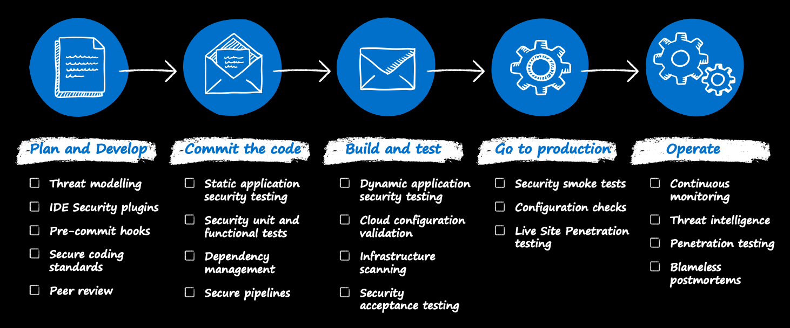
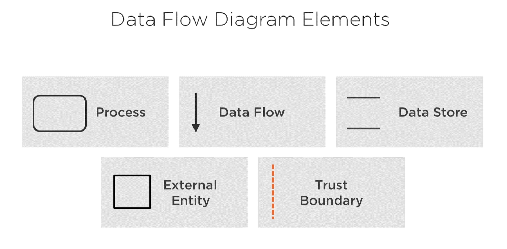

# Plan and Develop

[Home](./readme.md) | [Next >](./2-commit.md)

## Threat Modelling

Threat modeling is a process by which potential threats, such as structural vulnerabilities or the absence of appropriate safeguards, can be identified, enumerated, and mitigations can be prioritized. The purpose of threat modeling is to provide defenders with a systematic analysis of what controls or defenses need to be included, given the nature of the system, the probable attacker's profile, the most likely attack vectors, and the assets most desired by an attacker. Threat modeling answers questions like “Where am I most vulnerable to attack?”, “What are the most relevant threats?”, and “What do I need to do to safeguard against these threats?”.

Reference: [Wikipedia](https://en.wikipedia.org/wiki/Threat_model)

### Common threat modeling approaches

1. Asset Centric - Focuses on the infrastructure components in an Organization.
2. Attacker Centric - Focuses on the types of attacks that can take place based on organizational profile.
3. Application Centric - Focuses on what vulnerabilities exist in the application.

The most common approach is Application centric threat modelling.

### Who should perform threat modelling?

1. Asset Centric - Infrastructure, Application and Security team.
2. Attacker Centric - Security team.
3. Application Centric - Application architect and Application Security team.

### When to perform threat modelling?

1. At the design phase of a project.
2. Whenever there is a major change.
3. Periodically, like on a schedule.

### Getting Started with application centric approach

1. [The approach](https://docs.microsoft.com/en-us/security/compass/applications-services#top-down-approach-through-threat-modeling)
1. [Simple Questions Method](https://docs.microsoft.com/en-us/security/compass/applications-services#simple-questions-method)
1. [STRIDE](https://en.wikipedia.org/wiki/STRIDE_(security)) and [OWASP](https://owasp.org/www-community/Threat_Modeling) approaches.
1. [Getting started with the threat modelling tool](https://docs.microsoft.com/en-us/azure/security/develop/threat-modeling-tool-getting-started).

Additional resources:
- [Cloud Security Alliance - Cloud Threat Modelling](https://cloudsecurityalliance.org/artifacts/cloud-threat-modeling/)
- [A Guide to Threat Modelling for Developers](https://martinfowler.com/articles/agile-threat-modelling.html)

## IDE Security plugins

IDE security plug-ins identify different security issues during the development process in the developer's comfort zone, which is their IDE environment. Plug-ins can provide immediate feedback if there's a potential security risk in the developer's written code, or the third-party library or package included.

- [DevSkim](https://github.com/Microsoft/DevSkim#devskim) - a framework of IDE extensions and language analyzers that provide inline security analysis in the dev environment as the developer writes code.
- [Tools from Visual Studio marketplace](https://marketplace.visualstudio.com/search?term=tag%3ASecurity&target=VS&category=All%20categories&vsVersion=vs15&sortBy=Relevance)
- [Tools from Visual Studio Code marketplace](https://marketplace.visualstudio.com/search?term=tag%3Asecurity&target=VSCode&category=All%20categories&sortBy=Relevance)

## Pre-commit hooks

Another step worth considering is to introduce a pre-commit framework if the version control system allows it. A pre-commit framework provides Git hook scripts that enable identification issues before submitting code for code review. One example is [Git Hooks](https://git-scm.com/book/en/v2/Customizing-Git-Git-Hooks) that can be implemented in git.

## Secure coding standards

Secure coding practice guidelines help developers learn essential secure coding principles and how they should be applied. There are secure coding practices such as [OWASP](https://owasp.org/www-project-secure-coding-practices-quick-reference-guide) secure coding practices available and incorporated with the general coding practices.

## Peer review

Pull requests are standard in the development process. Part of the pull request process is peer reviews that allow detecting uncovered defects, bugs, or issues related to human mistakes. It's a good practice to have a security champion or knowledgeable security teammate who can incorporate and guide the developer during the peer review before creating a pull request.

[Home](./readme.md) | [Next >](./2-commit.md)
