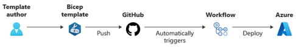
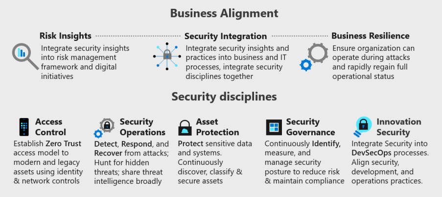

# Build and test

[< Previous](./2-commit.md) | [Home](./readme.md) | [Next >](./4-goto-production.md)

## Dynamic Application Security Testing

### OWASP Zed Attack Proxy (ZAP)

In a classical waterfall development model, security was typically introduced on the last stop, right before going to production. One of the most popular security approaches is penetration testing or pen test. The penetration test is an important step, which allows looking at the application from the black-box security perspective, closest to the attacker mindset. You can use an open-source [OWASP Zed Attack Proxy (ZAP)](https://owasp.org/www-project-zap/), which finds vulnerabilities in the running web application, to perform the test. [An extension of OWASP ZAP can be obtained from the VS marketplace. The extension can be utilised to run in a Build or Release Pipeline. Full instructions provided in this link.](https://marketplace.visualstudio.com/items?itemName=CSE-DevOps.zap-scanner)

### Container scanning

When creating containerized workloads, you can be susceptible to additional security threads. There are additional security tools you can use to protect your workloads:
- [Microsoft Defender for Containers](https://docs.microsoft.com/azure/defender-for-cloud/defender-for-containers-introduction?tabs=defender-for-container-arch-aks#architecture-overview)
- [Identify vulnerable container images in your CI/CD workflows](https://docs.microsoft.com/azure/defender-for-cloud/defender-for-container-registries-cicd)
- [Enhance your CI/CD deployment by using Vulnerability Assessments from Microsoft Defender for ACR](https://techcommunity.microsoft.com/t5/microsoft-defender-for-cloud/enhance-your-ci-cd-deployment-by-using-vulnerability-assessments/ba-p/2102516)

Also take a look at the [end to end setups](./6-end-to-end.md), which contains extra info for AKS workloads.

## Cloud configuration validation and Infrastructure scanning

When deploying to a cloud environment like Azure, and especially when applying Infrastructure as Code (IaC), it becomes important to check that any configuration made in your cloud environment complies with overall security and governance principles.

When utilizing Infrastructure as Code you can run these checks beforehand by using specific tooling, however, it is more common to have your cloud platform flag any incompliance to you with the tooling that is build into the platform.

### Pre-deployment checks

Depending on which IaC tooling you use, you will have different tools available to you to run checks before deployment happens.

In case you want to learn more about IaC and how to build a secure process, we also advise you to take a look at the [FTA Live sessions on DevOps for infrastructure](https://github.com/Azure/FTALive-Sessions/tree/main/content/devops/cicd-infra). You can sign up for these session on the [FTA Live site](https://aka.ms/ftalive).

#### ARM and Bicep

For both JSon and Bicep ARM templates, you can add template scanning by using the [arm-ttk](https://github.com/Azure/arm-ttk) toolkit. The [Bicep Linter](https://docs.microsoft.com/azure/azure-resource-manager/bicep/linter) is the more up to date version of arm-ttk for Bicep templates. 

A full run-through of how to test Bicep code can be found in this [learn module for Azure Pipelines](https://docs.microsoft.com/learn/modules/test-bicep-code-using-azure-pipelines/) and this one for [GitHub Actions](https://docs.microsoft.com/learn/modules/test-bicep-code-using-github-actions/). It also covers steps like validating, linting, previewing changes and approving deployment. Both modules are part of a larger set of [learn paths on Bicep](https://docs.microsoft.com/azure/azure-resource-manager/bicep/learn-bicep). There are also recordings of these modules availabe [here](https://learn.microsoft.com/en-us/events/learn-events/learnlive-iac-and-bicep/) and [here](https://learn.microsoft.com/en-us/events/learn-events/learnlive-automate-azure-deployments-bicep-github-actions/).

#### Terraform

For Terraform, there is [tfsec](https://aquasecurity.github.io/tfsec/v1.4.2/). This [article](https://www.winopsdba.com/blog/azure-cloud-terraform-validate-and-sast.html) describes how you can use tf validate and tfsec in a pipeline for pre-analysis.

Even though testing IaC templates before deployment is an option, a better way of making sure you comply with all governance and security rules, is by utilizing your cloud platforms' built-in governance controls. These will provide you with the most up-to-date set of governance controls.

### Build-in governance controls

The [Cloud Adoption Framework](https://docs.microsoft.com/azure/cloud-adoption-framework/) defines cloud security as a journey where you work towards a [secure end state](https://docs.microsoft.com/azure/cloud-adoption-framework/secure/). 

This end state can be enforced by utilizing [Azure Policies](https://docs.microsoft.com/azure/governance/policy/overview). We provide multiple [build-in Azure Policy initiatives](https://docs.microsoft.com/azure/governance/policy/samples/built-in-initiatives) and [landing zones](https://docs.microsoft.com/azure/cloud-adoption-framework/ready/landing-zone/implementation-options) that utilize these built-in Azure Policy definitions to enforce governance controls. [Enterprise scale landing zone (ESLZ)](https://docs.microsoft.com/azure/cloud-adoption-framework/ready/enterprise-scale/) is one of these predefined landing zone setups.

Depending on how you configure Azure Policy you can opt for a no-deploy of a resource in case it does not comply with the standards you have set. As an alternative you can opt for a flagging of a incompliant state.

We provide an [FTA Live session on Azure Governance](https://aka.ms/ftalive) for which there is also a recording available [here]([https://fasttrack.azure.com/live/category/Governance](https://learn.microsoft.com/shows/learn-live/fasttrack-for-azure-season-1-ep03-azure-governance?WT.mc_id=learnlive-20220929A))

### Post-deployment checks

You could also utilize checks post-deployment. These are less common, but we mention these for completeness.

In an Azure environment, you can use the [resource graph](https://docs.microsoft.com/azure/governance/resource-graph/samples/advanced?tabs=azure-cli) to test what has been deployed and how.

## A different way of designing your code

Some of the above tools are also targetted at scanning your code for credentials. These should indeed not leak into your source code. By utilizing a different way of designing your applications, you can avoid needing to store credentials in your source code altogether. For Azure workloads, you want to consider: 

- [Azure Key Vault](https://docs.microsoft.com/azure/key-vault/general/overview)
- [Add Key Vault to your web application](https://docs.microsoft.com/azure/key-vault/general/vs-key-vault-add-connected-service)
- [Use Key Vault references for App Service and Azure Functions](https://docs.microsoft.com/azure/app-service/app-service-key-vault-references)
- [Managed Identity](https://docs.microsoft.com/azure/active-directory/managed-identities-azure-resources/overview)
- [How to use managed identities for App Service and Azure Functions](https://docs.microsoft.com/azure/app-service/overview-managed-identity?tabs=portal%2Chttp)

## Useful Links

- [Open Source Security Foundation](https://openssf.org/)
- [Securing your software supply chain](https://docs.github.com/en/code-security/supply-chain-security)
- [SANS Top 25](http://cwe.mitre.org/top25/archive/2021/2021_cwe_top25.html)

[< Previous](./2-commit.md) | [Home](./readme.md) | [Next >](./4-goto-production.md)
