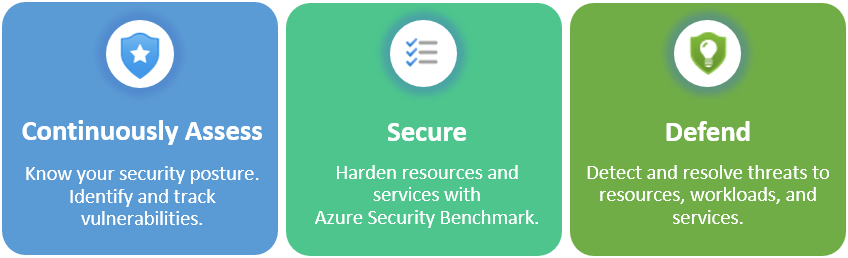

# Operate

[< Previous](./4-goto-production.md) | [Home](./readme.md) | [Next >](./6-end-to-end.md)

Once you start operating your workloads, you need a means to continuously assess, secure and defend them.

## Continuous monitoring

This is where [Microsoft Defender for Cloud](https://docs.microsoft.com/azure/defender-for-cloud/defender-for-cloud-introduction) steps in. Here as well, there is a dedicated [FTA Live session](https://aka.ms/ftalive).

## Threat intelligence

Additionaly you can make use of [Azure threat protection](https://docs.microsoft.com/azure/security/fundamentals/threat-detection), which is an additional offering on top of Azure Active Directory and Microsoft Defender for Cloud. 

Protect your workloads:

* [Defender for DevOps (Preview)](https://learn.microsoft.com/en-us/azure/defender-for-cloud/defender-for-devops-introduction)
* [Defender for Resource Manager](https://learn.microsoft.com/en-us/azure/defender-for-cloud/defender-for-resource-manager-introduction)
* [Defender for Containers](https://learn.microsoft.com/en-us/azure/defender-for-cloud/defender-for-containers-introduction)
* [Defender for App Service](https://learn.microsoft.com/en-us/azure/defender-for-cloud/defender-for-app-service-introduction)

## Penetration testing

Perform [penetration testing](https://docs.microsoft.com/azure/security/fundamentals/pen-testing) regularly.

[< Previous](./4-goto-production.md) | [Home](./readme.md) | [Next >](./6-end-to-end.md)
