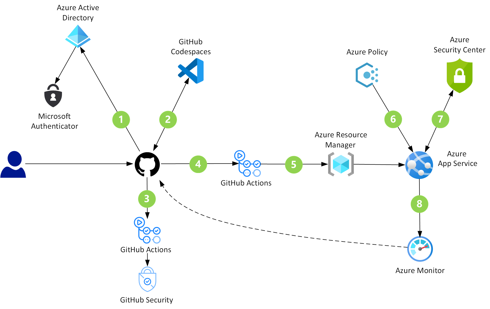
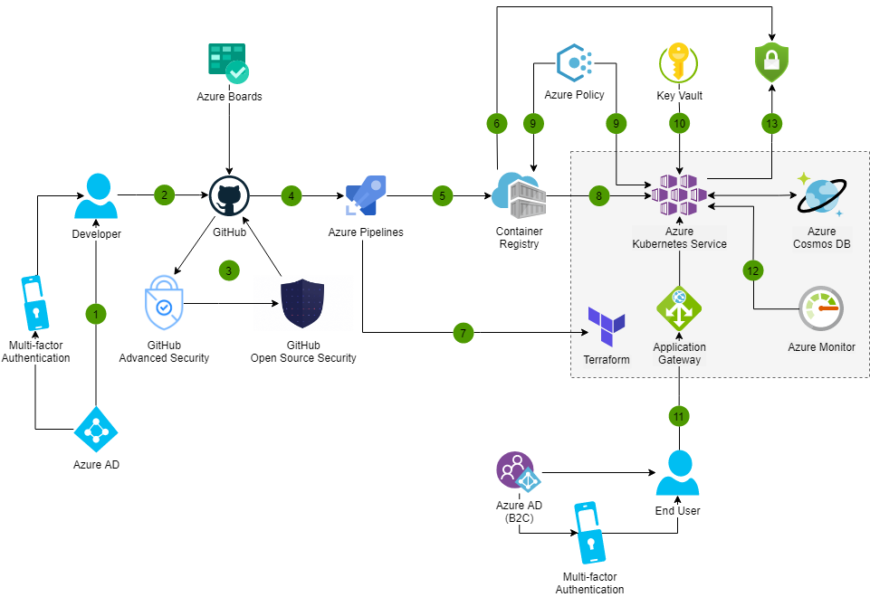
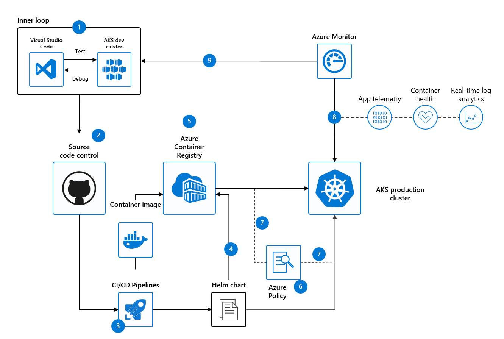

# End to End Control

[< Previous](./5-operate.md) | [Home](./readme.md)

Below we add additional resources and workflows on how to bring all the previous DevSecOps controls together. 

Keep the following in mind: 

- What is the security experience on your devops team?
- What tooling is available?
    - Depending on your context, look for practices that make the difference.
    - Few things – High Impact

Focus on: 
- Static code Analysis
- Dependency Management & Scanning
- Dynamic Analysis
- Security Scanning

Allow time to learn: 
- Start in "Detection Mode"
- Then move to "Prevention" (a.k.a. break pipelines)

## DevSecOps in GitHub

[DevSecOps in GitHub](https://docs.microsoft.com/azure/architecture/solution-ideas/articles/devsecops-in-github).
[About code scanning](https://docs.github.com/en/code-security/code-scanning/automatically-scanning-your-code-for-vulnerabilities-and-errors/about-code-scanning).

## DevSecOps in Azure

[DevSecOps in Azure](https://docs.microsoft.com/azure/architecture/solution-ideas/articles/devsecops-in-azure)
[Understand Azure Policy for Kubernetes clusters](https://docs.microsoft.com/azure/governance/policy/concepts/policy-for-kubernetes)

## Secure DevOps for AKS

- [Secure DevOps for Kubernetes](https://docs.microsoft.com/azure/architecture/solution-ideas/articles/secure-devops-for-kubernetes)
- [Understand Azure Policy for Kubernetes clusters](https://docs.microsoft.com/azure/governance/policy/concepts/policy-for-kubernetes)
- [Secure your cluster with Azure Policy](https://docs.microsoft.com/azure/aks/use-azure-policy?toc=/azure/governance/policy/toc.json&bc=/azure/governance/policy/breadcrumb/toc.json)
- [Azure Policy built-in definitions for Azure Kubernetes Service](https://docs.microsoft.com/azure/aks/policy-reference)

### GitOps

- [GitOps for Azure Kubernetes Service](https://docs.microsoft.com/azure/architecture/example-scenario/gitops-aks/gitops-blueprint-aks)
- [Build and deploy apps on AKS using DevOps and GitOps](https://learn.microsoft.com/azure/architecture/example-scenario/apps/devops-with-aks)
- [GitOps Flux v2 configurations with AKS and Azure Arc-enabled Kubernetes](https://learn.microsoft.com/azure/azure-arc/kubernetes/conceptual-gitops-flux2)

[< Previous](./5-operate.md) | [Home](./readme.md)
