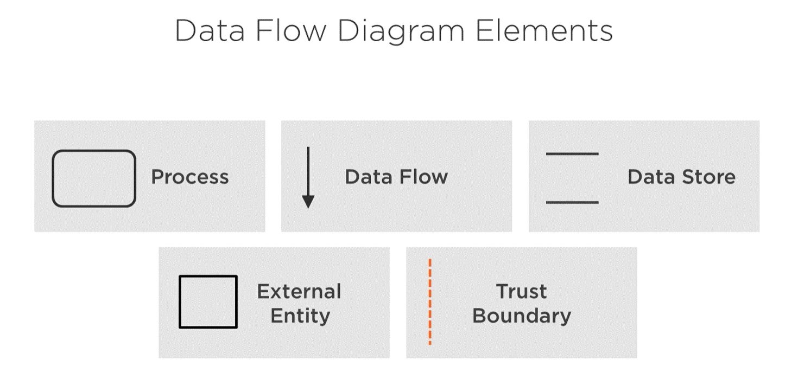

# Overview

| Plan and Develop | Commit the Code | Build and Test | Go to Production | Operate |  
|---|---|---|---|---|
|_**[Threat Modelling](./ThreatModelling.md)**_| [Static application security testing](./CodeAnalysis.md)| [Dynamic application security testing](./CodeAnalysis.md) | Security smoke tests | [Continuous monitoring](Operate.md)
|[IDE Security plugins](./CodeAnalysis.md)| Security Unit and Functional tests | [Cloud configuration validation](CloudConfigValidation.md) | [Configuration checks](CloudConfigValidation.md) | [Threat intelligence](Operate.md)
|[Pre commit hooks](https://git-scm.com/book/en/v2/Customizing-Git-Git-Hooks)| [Dependency management](./CodeAnalysis.md) | [Infrastructure scanning](CloudConfigValidation.md) | [Live Site Penetration testing](https://docs.microsoft.com/azure/security/fundamentals/pen-testing) | [Penetration testing](https://docs.microsoft.com/azure/security/fundamentals/pen-testing)
|[Secure coding standards](https://owasp.org/www-project-secure-coding-practices-quick-reference-guide/migrated_content) | [Securing the CI/CD workflow](./securingCICD.md) | Security acceptance testing | Blameless postmortems
|[Peer review](https://docs.github.com/en/pull-requests/collaborating-with-pull-requests/proposing-changes-to-your-work-with-pull-requests/about-pull-requests)||||

# Description

Threat modeling is a process by which potential threats, such as structural vulnerabilities or the absence of appropriate safeguards, can be identified, enumerated, and mitigations can be prioritized. The purpose of threat modeling is to provide defenders with a systematic analysis of what controls or defenses need to be included, given the nature of the system, the probable attacker's profile, the most likely attack vectors, and the assets most desired by an attacker. Threat modeling answers questions like “Where am I most vulnerable to attack?”, “What are the most relevant threats?”, and “What do I need to do to safeguard against these threats?”.

Reference: [Wikipedia](https://en.wikipedia.org/wiki/Threat_model)

## Common threat modelling approaches

1. Asset Centric - Focuses on the infrastructure components in an Organization.
2. Attacker Centric - Focuses on the types of attacks that can take place based on organizational profile.
3. Application Centric - Focuses on what vulnerabilities exist in the application.

The most common approach is Application centric threat modelling.

## Who should perform threat modelling?

1. Asset Centric - Infrastructure, Application and Security team.
2. Attacker Centric - Security team.
3. Application Centric - Application architect and Application Security team.

## When to perform threat modelling?

1. At the design phase of a project.
2. Whenever there is a major change.
3. Periodically, like on a schedule.

## Getting Started with application centric approach

1. [The approach](https://docs.microsoft.com/en-us/security/compass/applications-services#top-down-approach-through-threat-modeling)
1. [Simple Questions Method](https://docs.microsoft.com/en-us/security/compass/applications-services#simple-questions-method)
1. [STRIDE](https://en.wikipedia.org/wiki/STRIDE_(security)) and [OWASP](https://owasp.org/www-community/Threat_Modeling) approaches.
1. [Getting started with the threat modelling tool](https://docs.microsoft.com/en-us/azure/security/develop/threat-modeling-tool-getting-started).

Additional resources:
- [Cloud Security Alliance - Cloud Threat Modelling](https://cloudsecurityalliance.org/artifacts/cloud-threat-modeling/)
- [A Guide to Threat Modelling for Developers](https://martinfowler.com/articles/agile-threat-modelling.html)

