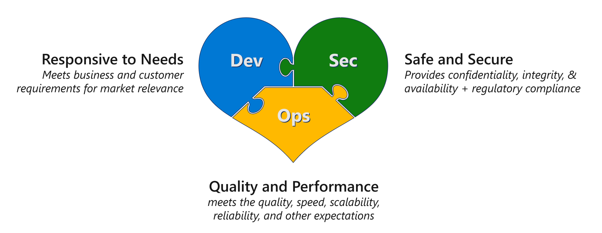

# DevSecOps

Instead of going through the traditional Software Development Lifecycle (SDLC) of passing the appropriate work tasks from one team to the next, transformational change is needed to obtain the goal of “develop with security team(s)”. Compare this to the traditional process of validation of an architected / designed solution ready for deployment and later, collaborate with your security team to ensure it aligns with your various business requirements. This traditional collaboration model usually results in changes to architecture and/or design due to the security team’s feedback.

Information Security has always been a complex subject that evolves quickly with the creative ideas and implementations of attackers and security researchers. Historically, security vulnerabilities started with identifying and exploiting common programming errors and unexpected edge cases, but the attack surface that an attacker may explore and exploit has now expanded well beyond that. Attackers are now freely exploiting vulnerabilities in system configurations, operational practices, and the social habits of the systems' users. As systems' complexity, connectedness, and the variety of users increase, attackers have more opportunities to identify unprotected edge cases and to “hack” systems into doing things they were not designed to do. More information can be found within [Well Architected Framework's role of security](https://docs.microsoft.com/azure/architecture/framework/security/overview)

Starting with the first steps of “development with your security team(s)”, DevSecOps adheres to security best practices. By using a shift-left strategy, DevSecOps redirects the security focus by moving the security thinking from something that is only for production, to something that’s relevant from the early stages of planning and development. With DevSecOps, security becomes a central part of the entire lifecycle of the application, and it’s required that every team and person working on an application considers security. In this session, we'll discuss key strategies and frameworks that you can adopt to make security a part of your architectural design.

As mentioned within [innovation security](https://docs.microsoft.com/azure/cloud-adoption-framework/secure/innovation-security), innovation is required for organizational change to support a true DevSecOps “shift-left” process, the following personas with your organization must collaborate as early as possibly, ideally within the solution ideation phase:

 - Application Development Architect(s) / Lead(s)
 - Infrastructure Architect(s) / Lead(s)
 - Security Architect(s) / Lead(s)

## The frameworks

There are many secure software development frameworks being used out in the world but two of them are most popular:
1. [Microsoft Secure Development Lifecycle](https://www.microsoft.com/securityengineering/sdl/practices).
1. [SafeCode fundamental practices for Secure Software Development](https://safecode.org/uncategorized/fundamental-practices-secure-software-development).

## DevSecOps controls

This document doesn't discuss any specific framework out of the above but general practices involved in developing a Secure Software Development Lifecycle, based on the [Cloud Adoption Framework](https://docs.microsoft.com/azure/cloud-adoption-framework/secure/devsecops-controls).

1. [Plan and Develop](./1-plan-develop.md)
1. [Commit the Code](./2-commit.md)
1. [Build and Test](./3-build-test.md)
1. [Go to Production](./4-goto-production.md)
1. [Operate](./5-operate.md)

## End to End DevSecOps

How do you bring all of the above together in a pipeline or workflow for your team. Find out [here](EndToEnd.md).

## Additional resources

- [Cryptography Strategy](./CryptographyStrategy.md)
- [Overview of the Azure Security Benchmark (v3)](https://docs.microsoft.com/security/benchmark/azure/overview)
  - [Security Control v3: DevOps Security](https://docs.microsoft.com/security/benchmark/azure/security-controls-v3-devops-security)
- [Security in DevOps (DevSecOps)](https://docs.microsoft.com/devops/operate/security-in-devops)
- [Awesome DevSecOps - An authoritative list of awesome devsecops tools with the help from community experiments and contributions](https://github.com/devsecops/awesome-devsecops)
- [Security Baseline tools in Azure](https://docs.microsoft.com/azure/cloud-adoption-framework/govern/security-baseline/toolchain)
- [DevSecOps tools and Services](https://azure.microsoft.com/solutions/devsecops/#overview)
- [Microsoft OSS Security](https://www.microsoft.com/securityengineering/opensource/?activetab=security+analysis%3aprimaryr3)
- [Microsoft SDL practices](https://www.microsoft.com/securityengineering/sdl/practices)
- [Build secure apps with collaborative DevSecOps practices](https://myignite.microsoft.com/sessions/0c2b0490-1e47-4144-a569-20632ea53661?source=sessions)
- [Ask the Experts: Build secure apps with collaborative DevSecOps practices](https://myignite.microsoft.com/sessions/114eeb34-9bb8-4798-bc3c-f179ec2d05e2?source=sessions)
- [6 tips to integrate security into your DevOps practice](https://azure.microsoft.com/mediahandler/files/resourcefiles/6-tips-to-integrate-security-into-your-devops-practices/DevSecOps_Report_Tips_D6_fm.pdf)
- [DevSecOps: bringing security into your DevOps practice on Azure](https://docs.microsoft.com/shows/Azure-Enablement/DevSecOps-bringing-security-into-your-DevOps-practice-on-Azure)
