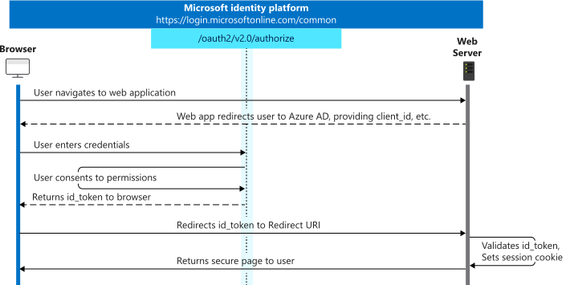

# Application Integration

#### [home](./readme.md) | [prev](./user-flows.md) | [next](./api-connectors.md)

- You can create many user flows, or custom policies of different types in your tenant and use them in your applications as needed
- Can be reused across applications

- Application initiates a request to a user flow provided endpoint
- The user flow defines and controls the user’s experience
- B2C generates a token and redirects the user back to the application
