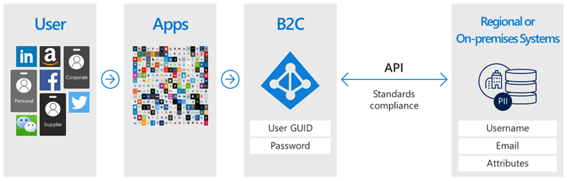

# Azure AD B2C Capabilities

#### [home](./readme.md) | [prev](./what-is-azure-ad-b2c.md) | [next](./azure-ad-b2c-tenant.md)

## Single sign-on access with a user provided identity

- Uses standards-based authentication protocols such as OpenID Connect, OAuth 2.0, and SAML
- Integrates with most modern applications and off-the-shelf software
- Serves as a central authentication and authorization authority for all your apps
- Enables you to build a single sign-on solution for all of them

## Integrate with external user stores

- Provides a directory that can hold 100 custom attributes per user
- Can also integrate with external systems
- Have Azure AD B2C handle the authentication for your application, but integrate with an external system that stores user profile or personal data
- Facilitate collecting the information from the user during registration or profile editing, then hand that data off to the external system via API
- During future authentications, Azure AD B2C can retrieve the data from the external system and, if needed, include it as a part of the authentication token response it sends to your application

## Custom-branded identity solution

- Customize every page displayed by Azure AD B2C
- Sign Up, Sign In, and Profile Modification
- Customize the HTML, CSS, and JavaScript
- Looks and feels like it’s a native part of your application
