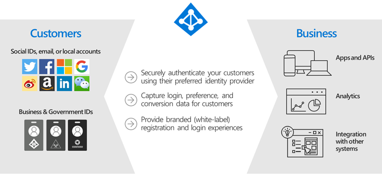

# What is Azure AD B2C?

#### [home](./readme.md) | [prev](./readme.md) | [next](./azure-ad-b2c-capabilities.md)

- Azure AD B2C provides business-to-customer identity as a service
- Customers use their preferred social, enterprise, or local account identities to get single sign-on access to your applications and APIs
- Capable of supporting millions of users and billions of authentications per day
- Takes care of the scaling and safety of the authentication platform, monitoring, and automatically handling threats like denial-of-service, password spray, or brute force attacks
- Built on the same technology as Azure AD but for a different purpose
- Has its roots in similar on premises Active Directory offerings such as Active Directory Application Mode (ADAM) and Active Directory Lightweight Directory Services (AD-LDS)