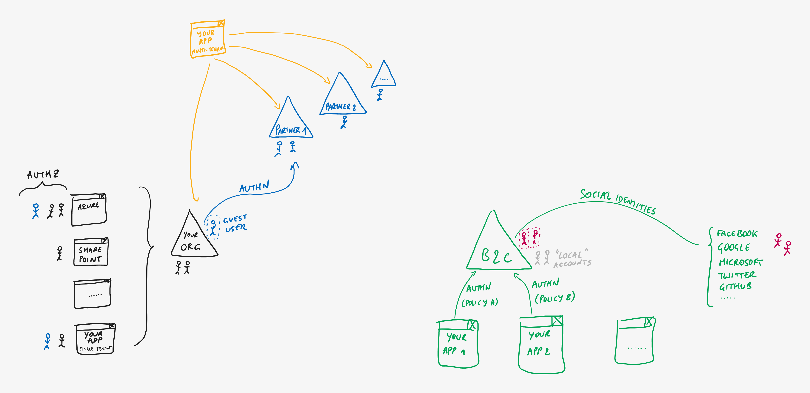

# Azure AD B2C - Social Identities

> **[prev](06-azuread-b2c.md) | [home](readme.md)  | [next](08-azuread-b2c-enterprise.md)**

By default, consumer users can create an account within the directory itself (commonly referred to as "local accounts"). However, you can also **allow users to sign in with an identity they already have from social providers** such as Facebook, Google, Microsoft, and *many* others supported natively by Azure AD B2C.

Somewhat similar to B2B guest users, this means a "shadow" account is created in the directory so that authentication happens with the social provider, but the directory doesn't hold the user's credentials and your app doesn't need be aware of all the possible providers that are added - it only asks the directory to authenticate users through a certain policy which is managed outside of the app itself.

> **[prev](06-azuread-b2c.md) | [home](readme.md)  | [next](08-azuread-b2c-enterprise.md)**
