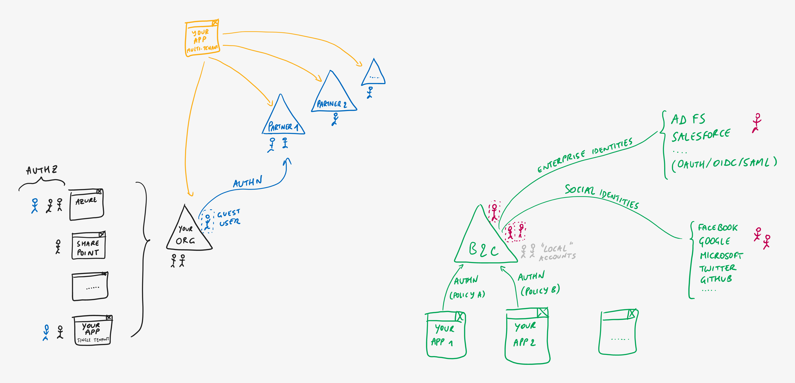

# Azure AD B2C - Enterprise Identities

> **[prev](07-azuread-b2c-social.md) | [home](readme.md)  | [next](09-azuread-b2c-azuread.md)**

In certain cases, you may also want to **allow users from external organizations** to sign in. This can be done by setting up federation towards an enterprise Identity Provider such as AD FS, Salesforce, or any IdP which supports OAuth, OpenID Connect or SAML. This can be useful for B2B-type scenarios where your business partners may not have Azure AD themselves or where the Azure AD B2B guest user access features aren't suitable.

> **[prev](07-azuread-b2c-social.md) | [home](readme.md)  | [next](09-azuread-b2c-azuread.md)**
