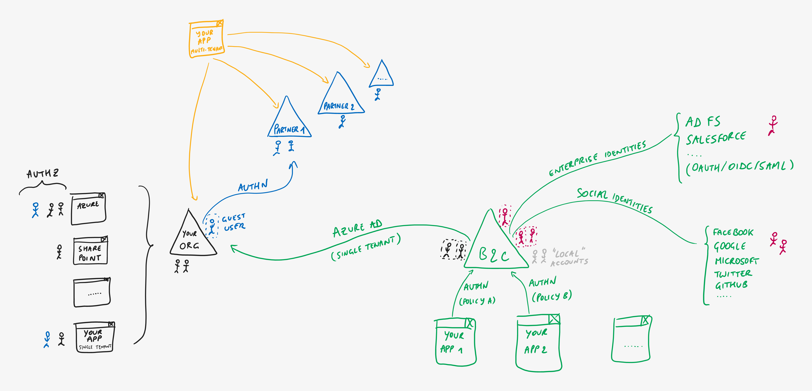
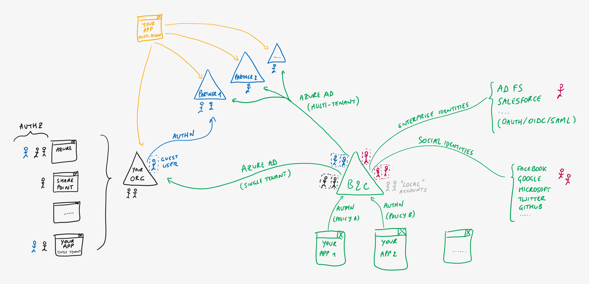

# Azure AD B2C - Azure AD Identities

> **[prev](08-azuread-b2c-enterprise.md) | [home](readme.md)  | [next](10-identity-offerings-choice.md)**

As a special case of the previous federation option, it's quite common that your consumer facing app may want to **allow users *from your own organization* to sign in** (for example, for administration tasks within the app itself). This can be easily achieved by [setting up federation towards your Azure AD tenant](https://docs.microsoft.com/azure/active-directory-b2c/identity-provider-azure-ad-single-tenant).

Similarly, you may want to **allow access to your app to *all (or multiple) Azure AD organizations***, in which case you can set up [federation towards multi-tenant Azure AD](https://docs.microsoft.com/azure/active-directory-b2c/identity-provider-azure-ad-multi-tenant) as well.

> **[prev](08-azuread-b2c-enterprise.md) | [home](readme.md)  | [next](10-identity-offerings-choice.md)**
