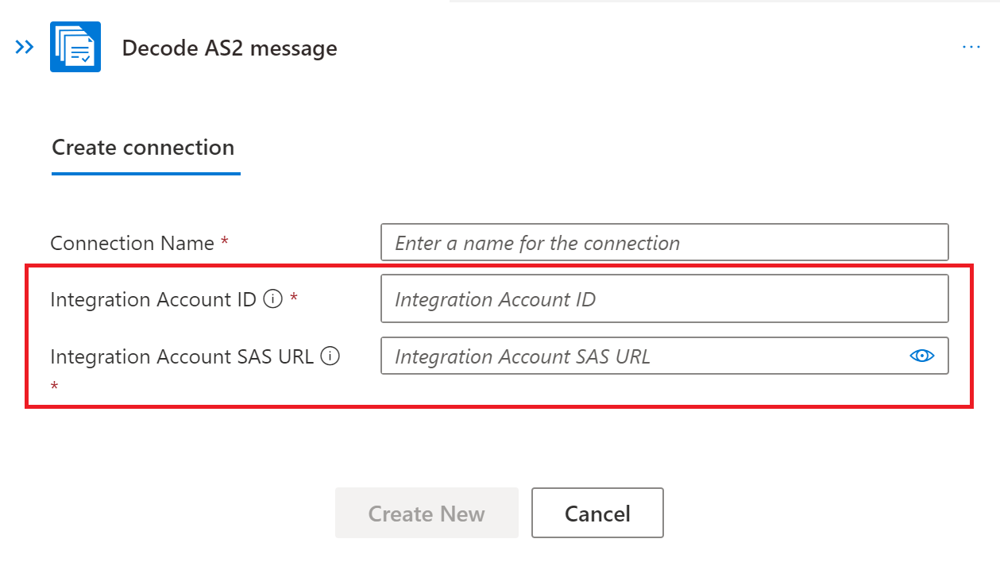
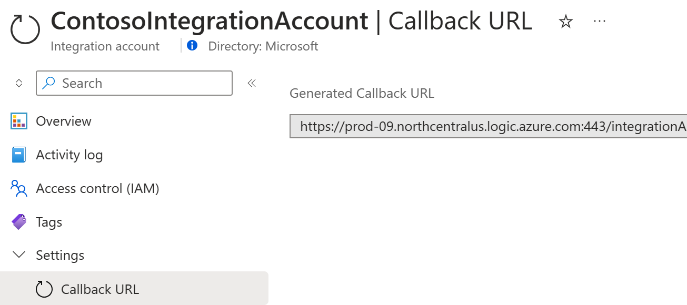

# Connect an Integration Account to a Workflow

#### [home](./readme.md) | [prev](./migrate-integration-account.md) | [next](./deploy.md)

Once you have migrated your integration account from an ISE instance to another SKU and exported a workflow that needs to connect to that integration account, you can follow these steps to link your new integration account to your Logic Apps Standard project and connect the integration account to a workflow.

1. Link your integration account to your Logic Apps Standard project by following the procedure documenteed [here](https://learn.microsoft.com/en-us/azure/logic-apps/logic-apps-enterprise-integration-create-integration-account?tabs=azure-portal%2Cstandard#link-to-logic-app).
1. Open up your workflow in the designer.
1. Select a step in the workflow that needs a connection to your integration account.
1. Choose the option to create a new connection for your integration account.
1. A dialog box will prompt you to provide the integration account ID, which is the full Azure resource ID for the integration account, and the integration account SAS Url.



6. The Integration Account ID can be obtained by running the following Azure PowerShell command and copying the value of the ResourceId property from the output.

```
Get-AzResource -Name yourintegrationaccountname -ResourceGroupName yourintegrationaccountresourcegroupname
```

7. The Integration Account SAS Url is actually the Callback Url of the Integration Account and can be obtained from the Callback Url blade of the integration account in the Azure portal.



8. Once you have provided the Integration Account ID and Integration SAS Url make sure to enter a Connection Name and click Create New.