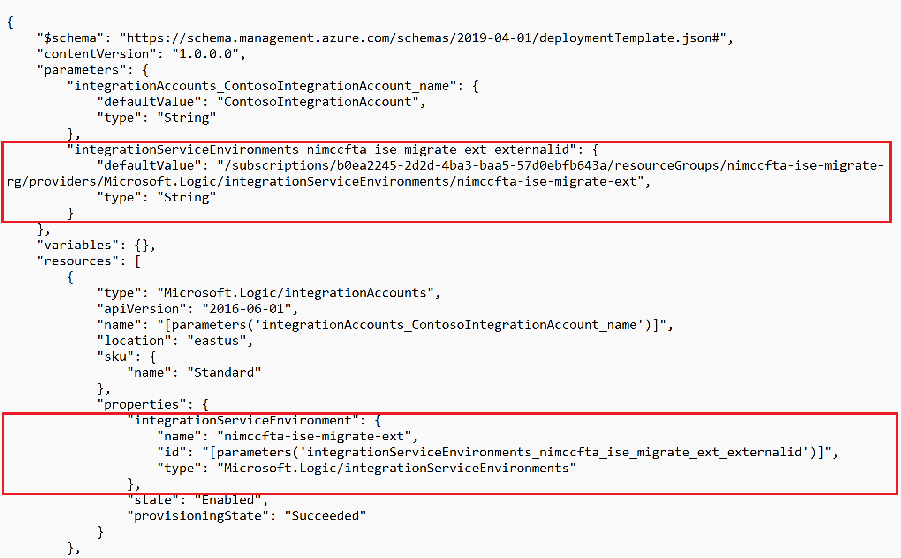

# Migrate an Integration Account from ISE to another SKU

#### [home](./readme.md) | [prev](./debug-local.md) | [next](./migrate-integration-account.md)

When Integration Service Environments are retired on August 31, 2024 any integration accounts associated with an ISE instance will also be removed. Prior to that date you must migrate any integration account associated with an ISE instance to another integration account SKU.

You can use the following approach to migrate an existing integration account associated with an ISE instance to another SKU and preserve all of the schemas, trading partners, agreements, etc. without having to manually recreate them.

1. Navigate to the Integration Account you wish to migrate in the Azure portal.
1. Select Export Template from the left-hand navigation menu under the Automation section.
1. Once the ARM template has been generated, download it and open it in a text editor of your choice.
1. Remove the following references to the Integration Service Environment and save the file.

5. You can now use the ARM template to redeploy your integration account to another SKU.
5. If you redeploy to the same region as the original integration account, you will need to use a different name to avoid a conflict.