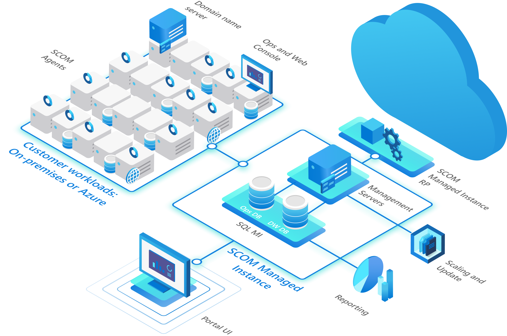

# Introduction to SCOM Managed Instance

In this module, you will learn about SCOM Managed Instance (SCOM MI) and how it differs from SCOM.

## What is SCOM MI?

SCOM MI is a new deployment option for System Center Operations Manager (SCOM) that allows you to run SCOM in Azure. SCOM MI is a managed service that is fully managed by Microsoft. This means that Microsoft is responsible for the infrastructure, availability, and performance of the SCOM MI service. You are responsible for configuring and managing the SCOM MI service.

## Diagram

[Next: Setup](setup.md)
[Previous: Welcome](readme.md)
