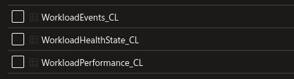

# New Features

### [Previous](setup.md) | [Home](readme.md) | [Next](migration.md)

## Agent Configuration

- Infrastructure
- Add agents from the portal
- Gateway servers

## Workbooks

- Alerts
- 
## Grafana Integration

## Log Analytics

https://learn.microsoft.com/en-us/system-center/scom/configure-log-analytics-for-scom-managed-instance?view=sc-om-2022

## Power BI

https://learn.microsoft.com/en-us/system-center/scom/configure

### [Previous](setup.md) | [Home](readme.md) | [Next](migration.md)
